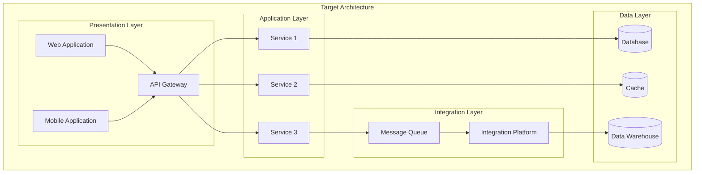

# Architecture Strategy: [INITIATIVE_NAME]

> **Template Status**: Beta | **Version**: [VERSION] | **Command**: `/arckit.strategy`

## Document Control

| Field | Value |
|-------|-------|
| **Document ID** | ARC-[PROJECT_ID]-STRAT-v[VERSION] |
| **Document Type** | Architecture Strategy |
| **Project** | [PROJECT_NAME] (Project [PROJECT_ID]) |
| **Classification** | [PUBLIC / OFFICIAL / OFFICIAL-SENSITIVE / SECRET] |
| **Status** | [DRAFT / IN_REVIEW / APPROVED / PUBLISHED / SUPERSEDED / ARCHIVED] |
| **Version** | [VERSION] |
| **Created Date** | [YYYY-MM-DD] |
| **Last Modified** | [YYYY-MM-DD] |
| **Review Cycle** | [Monthly / Quarterly / Annual / On-Demand] |
| **Next Review Date** | [YYYY-MM-DD] |
| **Owner** | [OWNER_NAME_AND_ROLE] |
| **Reviewed By** | [REVIEWER_NAME] on [DATE] or [PENDING] |
| **Approved By** | [APPROVER_NAME] on [DATE] or [PENDING] |
| **Distribution** | [DISTRIBUTION_LIST] |
| **Strategic Horizon** | [N] Years (FY [START_YEAR] - FY [END_YEAR]) |
| **Approver** | [Chief Architect / CTO / Digital Director] |

## Revision History

| Version | Date | Author | Changes | Approved By | Approval Date |
|---------|------|--------|---------|-------------|---------------|
| [VERSION] | [DATE] | ArcKit AI | Initial creation from `/arckit.strategy` command | [PENDING] | [PENDING] |

---

## Executive Summary

### Strategic Vision

[2-3 paragraphs articulating the strategic vision for this initiative. What transformation are we enabling? What will success look like? How does this align with organisational strategy?]

### Strategic Context

| Aspect | Summary |
|--------|---------|
| **Business Challenge** | [Primary challenge being addressed] |
| **Strategic Opportunity** | [Opportunity this strategy captures] |
| **Investment Horizon** | [N] years, £[AMOUNT] total investment |
| **Expected ROI** | [ROI_PERCENTAGE]% by FY [YEAR] |
| **Risk Appetite** | [LOW / MEDIUM / HIGH] |

### Key Strategic Decisions

| Decision | Choice | Rationale |
|----------|--------|-----------|
| Build vs Buy | [Build / Buy / Hybrid] | [Brief rationale] |
| Cloud Strategy | [Cloud-Native / Hybrid / On-Premises] | [Brief rationale] |
| Vendor Strategy | [Single / Multi / Platform] | [Brief rationale] |
| Integration Approach | [API-First / Event-Driven / Hybrid] | [Brief rationale] |

### Strategic Outcomes

1. **[Outcome 1]**: [Measurable outcome statement]
2. **[Outcome 2]**: [Measurable outcome statement]
3. **[Outcome 3]**: [Measurable outcome statement]
4. **[Outcome 4]**: [Measurable outcome statement]
5. **[Outcome 5]**: [Measurable outcome statement]

---

## Strategic Drivers

> *Synthesised from: ARC-[PROJECT_ID]-STKE-v*.md*

### Business Drivers

| Driver ID | Driver | Stakeholder | Intensity | Strategic Goal |
|-----------|--------|-------------|-----------|----------------|
| SD-1 | [Driver statement] | [Stakeholder] | CRITICAL | [Goal] |
| SD-2 | [Driver statement] | [Stakeholder] | HIGH | [Goal] |
| SD-3 | [Driver statement] | [Stakeholder] | HIGH | [Goal] |
| SD-4 | [Driver statement] | [Stakeholder] | MEDIUM | [Goal] |
| SD-5 | [Driver statement] | [Stakeholder] | MEDIUM | [Goal] |

### External Drivers

| Driver | Source | Impact | Strategic Response |
|--------|--------|--------|-------------------|
| [Regulatory change] | [Source] | [Impact] | [Response] |
| [Market shift] | [Source] | [Impact] | [Response] |
| [Technology trend] | [Source] | [Impact] | [Response] |
| [Competitive pressure] | [Source] | [Impact] | [Response] |

### Stakeholder Alignment

```
                          INTEREST
              Low                         High
        +-----------------------+-----------------------+
        |                       |                       |
        |   KEEP SATISFIED      |   MANAGE CLOSELY      |
   High |                       |                       |
        |   [Stakeholders]      |   [Stakeholders]      |
        |                       |                       |
 P      +-----------------------+-----------------------+
 O      |                       |                       |
 W      |      MONITOR          |    KEEP INFORMED      |
 E      |                       |                       |
 R Low  |   [Stakeholders]      |   [Stakeholders]      |
        |                       |                       |
        +-----------------------+-----------------------+
```

---

## Guiding Principles

> *Synthesised from: ARC-000-PRIN-v*.md*

The following architecture principles guide all strategic and design decisions:

### Foundational Principles

| ID | Principle | Statement | Strategic Implication |
|----|-----------|-----------|----------------------|
| P-01 | [Principle Name] | [Statement] | [How this shapes strategy] |
| P-02 | [Principle Name] | [Statement] | [How this shapes strategy] |
| P-03 | [Principle Name] | [Statement] | [How this shapes strategy] |

### Technology Principles

| ID | Principle | Statement | Strategic Implication |
|----|-----------|-----------|----------------------|
| P-04 | [Principle Name] | [Statement] | [How this shapes strategy] |
| P-05 | [Principle Name] | [Statement] | [How this shapes strategy] |
| P-06 | [Principle Name] | [Statement] | [How this shapes strategy] |

### Governance Principles

| ID | Principle | Statement | Strategic Implication |
|----|-----------|-----------|----------------------|
| P-07 | [Principle Name] | [Statement] | [How this shapes strategy] |
| P-08 | [Principle Name] | [Statement] | [How this shapes strategy] |

### Principles Compliance Summary

| Principle Category | Current Compliance | Target Compliance | Gap |
|-------------------|-------------------|-------------------|-----|
| Foundational | [%]% | 100% | [%]% |
| Technology | [%]% | 100% | [%]% |
| Governance | [%]% | 100% | [%]% |
| **Overall** | **[%]%** | **100%** | **[%]%** |

---

## Current State Assessment

### Technology Landscape

[Overview of current technology estate, platforms, and systems]

**Key Systems**:

| System | Purpose | Technology | Age | Technical Debt | Strategic Fit |
|--------|---------|------------|-----|----------------|---------------|
| [System 1] | [Purpose] | [Tech stack] | [Years] | [HIGH/MED/LOW] | [RETAIN/REPLACE/RETIRE] |
| [System 2] | [Purpose] | [Tech stack] | [Years] | [HIGH/MED/LOW] | [RETAIN/REPLACE/RETIRE] |
| [System 3] | [Purpose] | [Tech stack] | [Years] | [HIGH/MED/LOW] | [RETAIN/REPLACE/RETIRE] |

### Capability Maturity Baseline

| Capability Domain | Current Maturity | Assessment |
|-------------------|------------------|------------|
| [Domain 1] | Level [1-5] | [Brief assessment] |
| [Domain 2] | Level [1-5] | [Brief assessment] |
| [Domain 3] | Level [1-5] | [Brief assessment] |
| [Domain 4] | Level [1-5] | [Brief assessment] |
| [Domain 5] | Level [1-5] | [Brief assessment] |

**Maturity Levels**: L1 (Initial), L2 (Repeatable), L3 (Defined), L4 (Managed), L5 (Optimised)

### Technical Debt Summary

- **Total Technical Debt**: £[AMOUNT] or [N] person-months
- **High Priority Items**: [Count]
- **Impact on Delivery**: [Description of how debt affects velocity]

### Strengths, Weaknesses, Opportunities, Threats (SWOT)

| Strengths | Weaknesses |
|-----------|------------|
| [Strength 1] | [Weakness 1] |
| [Strength 2] | [Weakness 2] |
| [Strength 3] | [Weakness 3] |

| Opportunities | Threats |
|---------------|---------|
| [Opportunity 1] | [Threat 1] |
| [Opportunity 2] | [Threat 2] |
| [Opportunity 3] | [Threat 3] |

---

## Target State Vision

### Future Architecture

[Description of the target architecture and how it differs from current state]

**Target State Characteristics**:
- [Characteristic 1, e.g., "Cloud-native architecture on [platform]"]
- [Characteristic 2, e.g., "API-first integration strategy"]
- [Characteristic 3, e.g., "Event-driven microservices where appropriate"]
- [Characteristic 4, e.g., "Automated CI/CD pipelines with IaC"]
- [Characteristic 5, e.g., "Security by design with zero-trust principles"]
- [Characteristic 6, e.g., "Data-driven decision making with self-service analytics"]

### Capability Maturity Targets

| Capability Domain | Current | Target | Gap | Priority |
|-------------------|---------|--------|-----|----------|
| [Domain 1] | L[N] | L[N] | +[N] | HIGH |
| [Domain 2] | L[N] | L[N] | +[N] | HIGH |
| [Domain 3] | L[N] | L[N] | +[N] | MEDIUM |
| [Domain 4] | L[N] | L[N] | +[N] | MEDIUM |
| [Domain 5] | L[N] | L[N] | +[N] | LOW |

### Architecture Vision Diagram



---

## Technology Evolution Strategy

> *Synthesised from: ARC-[PROJECT_ID]-WARD-*.md (if available)*

### Strategic Positioning

| Component | Current Position | Target Position | Evolution Strategy |
|-----------|------------------|-----------------|-------------------|
| [Component 1] | Genesis | Custom Build | Innovate in-house |
| [Component 2] | Custom Build | Product | Move to COTS/SaaS |
| [Component 3] | Product | Commodity | Standardise on cloud |
| [Component 4] | Commodity | Utility | Consume as service |

### Build vs Buy Decisions

| Capability | Decision | Rationale | Timeline |
|------------|----------|-----------|----------|
| [Capability 1] | BUILD | [Core differentiator, no suitable product] | FY [YEAR] |
| [Capability 2] | BUY | [Commodity, mature market, faster time to value] | FY [YEAR] |
| [Capability 3] | PARTNER | [Specialist domain, strategic alliance] | FY [YEAR] |
| [Capability 4] | CONSUME | [Utility, SaaS available, no customisation needed] | FY [YEAR] |

### Technology Radar Summary

| Ring | Technologies |
|------|--------------|
| **Adopt** (Use now) | [Tech 1], [Tech 2], [Tech 3] |
| **Trial** (Evaluate) | [Tech 4], [Tech 5] |
| **Assess** (Watch) | [Tech 6], [Tech 7] |
| **Hold** (Avoid) | [Tech 8], [Tech 9] |

---

## Strategic Themes & Investment Areas

### Theme 1: [THEME_NAME] (e.g., Cloud Migration)

**Strategic Objective**: [What business value does this theme deliver?]

**Investment**: £[AMOUNT] over [N] years ([%]% of total)

**Key Initiatives**:
1. [Initiative 1.1]: [Description]
2. [Initiative 1.2]: [Description]
3. [Initiative 1.3]: [Description]

**Success Criteria**:
- [ ] [Measurable criterion 1]
- [ ] [Measurable criterion 2]
- [ ] [Measurable criterion 3]

**Principles Alignment**: P-01, P-04, P-07

---

### Theme 2: [THEME_NAME] (e.g., Data Modernisation)

**Strategic Objective**: [What business value does this theme deliver?]

**Investment**: £[AMOUNT] over [N] years ([%]% of total)

**Key Initiatives**:
1. [Initiative 2.1]: [Description]
2. [Initiative 2.2]: [Description]
3. [Initiative 2.3]: [Description]

**Success Criteria**:
- [ ] [Measurable criterion 1]
- [ ] [Measurable criterion 2]
- [ ] [Measurable criterion 3]

**Principles Alignment**: P-02, P-05, P-08

---

### Theme 3: [THEME_NAME] (e.g., Security & Compliance)

**Strategic Objective**: [What business value does this theme deliver?]

**Investment**: £[AMOUNT] over [N] years ([%]% of total)

**Key Initiatives**:
1. [Initiative 3.1]: [Description]
2. [Initiative 3.2]: [Description]
3. [Initiative 3.3]: [Description]

**Success Criteria**:
- [ ] [Measurable criterion 1]
- [ ] [Measurable criterion 2]
- [ ] [Measurable criterion 3]

**Principles Alignment**: P-03, P-06

---

### Theme 4: [THEME_NAME] (e.g., Integration & Interoperability)

**Strategic Objective**: [What business value does this theme deliver?]

**Investment**: £[AMOUNT] over [N] years ([%]% of total)

**Key Initiatives**:
1. [Initiative 4.1]: [Description]
2. [Initiative 4.2]: [Description]
3. [Initiative 4.3]: [Description]

**Success Criteria**:
- [ ] [Measurable criterion 1]
- [ ] [Measurable criterion 2]
- [ ] [Measurable criterion 3]

**Principles Alignment**: P-01, P-05

---

## Delivery Roadmap Summary

> *Synthesised from: ARC-[PROJECT_ID]-ROAD-v*.md (if available)*

### Strategic Timeline

```mermaid
gantt
    title Architecture Strategy Timeline FY [START] - FY [END]
    dateFormat YYYY-MM-DD

    section Foundation
    Strategy and Assessment          :done, s1, [START_DATE], 90d
    Architecture Principles          :done, s2, after s1, 60d
    Governance Framework             :active, s3, after s2, 90d

    section Transformation
    Theme 1 Delivery                 :t1, after s3, 365d
    Theme 2 Delivery                 :t2, after s3, 365d
    Theme 3 Delivery                 :t3, after t1, 365d
    Theme 4 Delivery                 :t4, after t2, 365d

    section Optimisation
    Continuous Improvement           :o1, after t3, 180d
    Benefits Realisation             :o2, after o1, 180d

    section Governance Gates
    Alpha Gate                       :milestone, g1, after s3, 0d
    Beta Gate                        :milestone, g2, after t1, 0d
    Live Gate                        :milestone, g3, after t3, 0d
```

### Phase Summary

| Phase | Timeline | Focus | Investment | Key Deliverables |
|-------|----------|-------|------------|------------------|
| Foundation | FY [YEAR] Q[N]-Q[N] | Establish baseline, strategy | £[AMOUNT] | Principles, governance, assessment |
| Transformation | FY [YEAR]-FY [YEAR] | Deliver strategic themes | £[AMOUNT] | Themes 1-4 capabilities |
| Optimisation | FY [YEAR] Q[N]-Q[N] | Realise benefits, optimise | £[AMOUNT] | KPIs met, continuous improvement |

### Key Milestones

| Milestone | Date | Theme | Gate |
|-----------|------|-------|------|
| Strategy Approved | FY [YEAR] Q[N] | Foundation | Strategy Gate |
| Alpha Assessment | FY [YEAR] Q[N] | Theme 1 | Alpha |
| Beta Assessment | FY [YEAR] Q[N] | Theme 2 | Beta |
| Live Assessment | FY [YEAR] Q[N] | Theme 3 | Live |
| Benefits Realised | FY [YEAR] Q[N] | All | Closeout |

---

## Investment Summary

> *Synthesised from: ARC-[PROJECT_ID]-SOBC-v*.md (if available)*

### Total Investment

| Category | Amount | % of Total |
|----------|--------|------------|
| **Capital Expenditure (CAPEX)** | £[AMOUNT] | [%]% |
| **Operational Expenditure (OPEX)** | £[AMOUNT] | [%]% |
| **Total Investment** | **£[AMOUNT]** | **100%** |

### Investment by Financial Year

| Financial Year | CAPEX (£) | OPEX (£) | Total (£) | % of Budget |
|----------------|-----------|----------|-----------|-------------|
| FY [YEAR] | [AMOUNT] | [AMOUNT] | [AMOUNT] | [%]% |
| FY [YEAR+1] | [AMOUNT] | [AMOUNT] | [AMOUNT] | [%]% |
| FY [YEAR+2] | [AMOUNT] | [AMOUNT] | [AMOUNT] | [%]% |
| FY [YEAR+3] | [AMOUNT] | [AMOUNT] | [AMOUNT] | [%]% |
| **Total** | **[AMOUNT]** | **[AMOUNT]** | **[AMOUNT]** | **100%** |

### Investment by Theme

| Theme | Investment (£) | % of Total | Expected Benefit |
|-------|----------------|------------|------------------|
| Theme 1: [Name] | [AMOUNT] | [%]% | [Benefit summary] |
| Theme 2: [Name] | [AMOUNT] | [%]% | [Benefit summary] |
| Theme 3: [Name] | [AMOUNT] | [%]% | [Benefit summary] |
| Theme 4: [Name] | [AMOUNT] | [%]% | [Benefit summary] |

### Business Case Summary

| Metric | Value |
|--------|-------|
| **Net Present Value (NPV)** | £[AMOUNT] |
| **Internal Rate of Return (IRR)** | [%]% |
| **Payback Period** | [N] years |
| **Benefit-Cost Ratio** | [N]:1 |

### Benefits Realisation

| Benefit Category | FY [YEAR] | FY [YEAR+1] | FY [YEAR+2] | FY [YEAR+3] | Total |
|------------------|-----------|-------------|-------------|-------------|-------|
| Cost Savings | £[AMOUNT] | £[AMOUNT] | £[AMOUNT] | £[AMOUNT] | £[TOTAL] |
| Cost Avoidance | £[AMOUNT] | £[AMOUNT] | £[AMOUNT] | £[AMOUNT] | £[TOTAL] |
| Revenue Enablement | £[AMOUNT] | £[AMOUNT] | £[AMOUNT] | £[AMOUNT] | £[TOTAL] |
| Productivity Gains | [%]% | [%]% | [%]% | [%]% | [AVG]% |

---

## Strategic Risks & Mitigations

> *Synthesised from: ARC-[PROJECT_ID]-RISK-v*.md (if available)*

### Top Strategic Risks

| Risk ID | Risk Description | Impact | Probability | Mitigation Strategy | Owner |
|---------|------------------|--------|-------------|---------------------|-------|
| R-001 | [Risk description] | HIGH | HIGH | [Mitigation] | [Owner] |
| R-002 | [Risk description] | HIGH | MEDIUM | [Mitigation] | [Owner] |
| R-003 | [Risk description] | MEDIUM | HIGH | [Mitigation] | [Owner] |
| R-004 | [Risk description] | MEDIUM | MEDIUM | [Mitigation] | [Owner] |
| R-005 | [Risk description] | LOW | HIGH | [Mitigation] | [Owner] |

### Risk Heat Map

```
                    PROBABILITY
              Low         Medium        High
        +------------+------------+------------+
        |            |            |            |
   High |   R-005    |   R-002    |   R-001    |
        |            |            |            |
 I      +------------+------------+------------+
 M      |            |            |            |
 P Medium|           |   R-004    |   R-003    |
 A      |            |            |            |
 C      +------------+------------+------------+
 T      |            |            |            |
   Low  |            |            |            |
        |            |            |            |
        +------------+------------+------------+
```

### Assumptions & Constraints

**Critical Assumptions**:
1. [Assumption 1, e.g., "Funding will be approved as per SOBC"]
2. [Assumption 2, e.g., "Key skills can be recruited or procured"]
3. [Assumption 3, e.g., "Vendor support will continue for migration period"]
4. [Assumption 4, e.g., "Executive sponsorship will be maintained"]

**Constraints**:
1. [Constraint 1, e.g., "Budget capped at £[AMOUNT]"]
2. [Constraint 2, e.g., "Must achieve [milestone] by [DATE] for compliance"]
3. [Constraint 3, e.g., "Cannot disrupt [critical system] during [period]"]

---

## Success Metrics & KPIs

### Strategic KPIs

| KPI | Baseline | Year 1 Target | Year 2 Target | Year 3 Target | Measurement |
|-----|----------|---------------|---------------|---------------|-------------|
| [KPI 1] | [Value] | [Target] | [Target] | [Target] | [How measured] |
| [KPI 2] | [Value] | [Target] | [Target] | [Target] | [How measured] |
| [KPI 3] | [Value] | [Target] | [Target] | [Target] | [How measured] |
| [KPI 4] | [Value] | [Target] | [Target] | [Target] | [How measured] |
| [KPI 5] | [Value] | [Target] | [Target] | [Target] | [How measured] |

### Leading Indicators

| Indicator | Frequency | Target | Escalation Threshold |
|-----------|-----------|--------|---------------------|
| [Indicator 1] | Monthly | [Target] | [Threshold] |
| [Indicator 2] | Quarterly | [Target] | [Threshold] |
| [Indicator 3] | Monthly | [Target] | [Threshold] |

### Lagging Indicators

| Indicator | Frequency | Target | Review Forum |
|-----------|-----------|--------|--------------|
| [Indicator 1] | Quarterly | [Target] | [Forum] |
| [Indicator 2] | Annual | [Target] | [Forum] |
| [Indicator 3] | Quarterly | [Target] | [Forum] |

---

## Governance Model

### Governance Structure

| Forum | Frequency | Purpose | Participants |
|-------|-----------|---------|--------------|
| **Strategy Board** | Quarterly | Strategic direction, investment decisions | Exec Sponsor, CTO, CFO, Programme Director |
| **Architecture Review Board** | Monthly | Architecture decisions, standards | Chief Architect, Enterprise Architects, Tech Leads |
| **Programme Board** | Monthly | Delivery progress, risk escalation | SRO, Programme Manager, Theme Leads |
| **Working Groups** | Fortnightly | Theme-specific delivery | Theme Leads, Delivery Teams |

### Decision Rights

| Decision Type | Authority | Escalation |
|---------------|-----------|------------|
| Strategic direction change | Strategy Board | Executive Committee |
| Architecture standards | ARB | Strategy Board |
| Budget variance > 10% | Programme Board | Strategy Board |
| Risk acceptance (High) | SRO | Strategy Board |
| Technology selection | ARB | Programme Board |

### Review Cadence

| Review Type | Frequency | Purpose | Output |
|-------------|-----------|---------|--------|
| Strategy Review | Quarterly | Validate strategic direction | Strategy refresh |
| Progress Review | Monthly | Track delivery against plan | Status report |
| Benefits Review | Quarterly | Track benefits realisation | Benefits report |
| Risk Review | Monthly | Update risk register | Risk report |
| Annual Review | Annually | Refresh strategy for next FY | Updated strategy |

---

## Traceability

### Source Documents

This strategy synthesises insights from the following architecture artifacts:

| Document | Document ID | Key Contributions |
|----------|-------------|-------------------|
| Architecture Principles | ARC-000-PRIN-v[N].md | Guiding principles, decision framework |
| Stakeholder Analysis | ARC-[PID]-STKE-v[N].md | Drivers, goals, outcomes |
| Risk Register | ARC-[PID]-RISK-v[N].md | Strategic risks, mitigations |
| Strategic Business Case | ARC-[PID]-SOBC-v[N].md | Investment, benefits, ROI |
| Architecture Roadmap | ARC-[PID]-ROAD-v[N].md | Timeline, phases, milestones |
| Wardley Maps | ARC-[PID]-WARD-*.md | Technology evolution, build vs buy |

### Traceability Matrix

| Strategic Driver | Goal | Outcome | Theme | Principle | KPI |
|------------------|------|---------|-------|-----------|-----|
| SD-1 | G-1 | O-1 | Theme 1 | P-01 | KPI-1 |
| SD-2 | G-2 | O-2 | Theme 2 | P-04 | KPI-2 |
| SD-3 | G-3 | O-3 | Theme 3 | P-06 | KPI-3 |
| SD-4 | G-4 | O-4 | Theme 1 | P-02 | KPI-4 |
| SD-5 | G-5 | O-5 | Theme 4 | P-05 | KPI-5 |

---

## Next Steps & Recommendations

### Immediate Actions (Next 30 Days)

1. **[Action 1]**: [Description] - Owner: [Name]
2. **[Action 2]**: [Description] - Owner: [Name]
3. **[Action 3]**: [Description] - Owner: [Name]

### Short-Term Actions (Next 90 Days)

1. **[Action 4]**: [Description] - Owner: [Name]
2. **[Action 5]**: [Description] - Owner: [Name]
3. **[Action 6]**: [Description] - Owner: [Name]

### Recommended Follow-On Artifacts

| Artifact | Command | Purpose | Priority |
|----------|---------|---------|----------|
| Detailed Requirements | `/arckit.requirements` | Capture detailed BR/FR/NFR/INT/DR | HIGH |
| Detailed Roadmap | `/arckit.roadmap` | Expand timeline with initiatives | HIGH |
| Project Plan | `/arckit.plan` | Create delivery plan for Phase 1 | HIGH |
| Data Model | `/arckit.data-model` | Define data architecture | MEDIUM |
| Architecture Diagrams | `/arckit.diagram` | Visualise target architecture | MEDIUM |
| Product Backlog | `/arckit.backlog` | Create prioritised user stories | MEDIUM |

---

## Appendices

### Appendix A: Glossary

| Term | Definition |
|------|------------|
| [Term 1] | [Definition] |
| [Term 2] | [Definition] |
| [Term 3] | [Definition] |

### Appendix B: Acronyms

| Acronym | Expansion |
|---------|-----------|
| [Acronym 1] | [Expansion] |
| [Acronym 2] | [Expansion] |
| [Acronym 3] | [Expansion] |

### Appendix C: Related Documents

| Document | Purpose | Location |
|----------|---------|----------|
| [Document 1] | [Purpose] | [Path/URL] |
| [Document 2] | [Purpose] | [Path/URL] |
| [Document 3] | [Purpose] | [Path/URL] |

## External References

| Document | Type | Source | Key Extractions | Path |
|----------|------|--------|-----------------|------|
| *None provided* | — | — | — | — |

---

**Generated by**: ArcKit `/arckit.strategy` command
**Generated on**: [DATE]
**ArcKit Version**: [VERSION]
**Project**: [PROJECT_NAME]
**Model**: [AI_MODEL]
