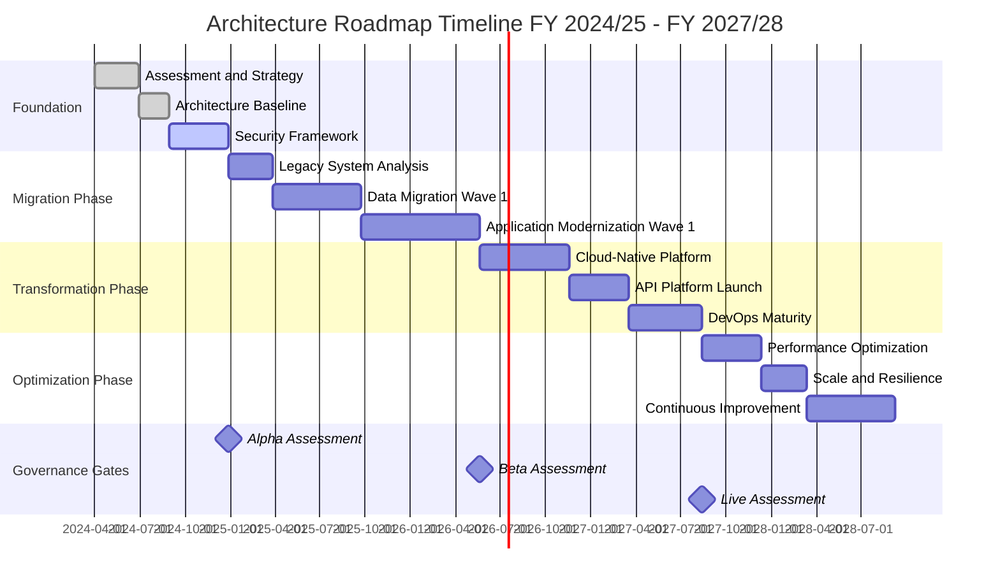
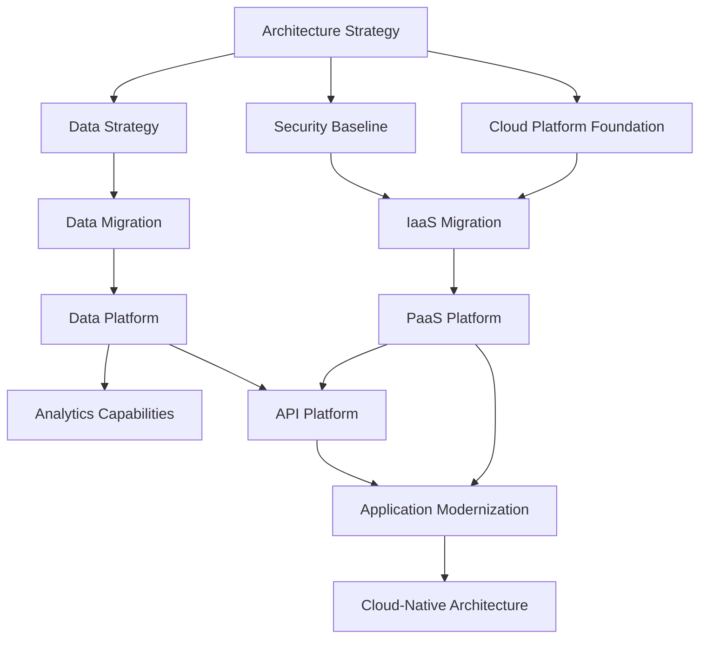

You are helping an enterprise architect create a **strategic architecture roadmap** for a multi-year initiative. The roadmap shows the evolution from current state to future state across multiple themes, timelines, and governance cycles.

## User Input

```text
$ARGUMENTS
```

## Prerequisites: Read Available Documents

Scan the project directory for existing artifacts and read them to inform this roadmap:

**MANDATORY** (warn if missing):
- `ARC-000-PRIN-*.md` in `projects/000-global/` — Architecture principles
  - Extract: Technology standards, strategic direction, compliance requirements
  - If missing: STOP and ask user to run `/arckit.principles` first. The roadmap must align to approved principles.
- `ARC-*-REQ-*.md` in `projects/{project-dir}/` — Requirements specification
  - Extract: Capability needs, BR/FR/NFR IDs, technology constraints
  - If missing: warn user to run `/arckit.requirements` first

**RECOMMENDED** (read if available, note if missing):
- `ARC-*-STKE-*.md` in `projects/{project-dir}/` — Stakeholder analysis
  - Extract: Business drivers, strategic goals, success metrics, investment appetite
- `ARC-*-WARD-*.md` in `projects/{project-dir}/wardley-maps/` — Wardley maps
  - Extract: Technology evolution, build vs buy positioning, evolution velocity
- `ARC-*-RISK-*.md` in `projects/{project-dir}/` — Risk register
  - Extract: Strategic risks, risk appetite, mitigation timelines

**OPTIONAL** (read if available, skip silently if missing):
- `ARC-*-SOBC-*.md` in `projects/{project-dir}/` — Business case
  - Extract: Investment figures, ROI targets, payback period, benefits timeline

**What to extract from each document**:
- **Principles**: Strategic direction, technology standards, compliance requirements
- **Requirements**: Capability needs, BR/FR/NFR IDs, priorities
- **Stakeholders**: Business drivers, strategic goals, investment appetite
- **Wardley Maps**: Technology evolution, build vs buy, evolution velocity
- **Risk**: Strategic risks impacting roadmap sequencing

### Prerequisites 4b: Check for External Documents (optional)

Scan for external (non-ArcKit) documents the user may have provided:

**Existing Strategic Roadmaps & Capability Plans**:
- **Look in**: `projects/{project-dir}/external/`
- **File types**: PDF (.pdf), Word (.docx), Markdown (.md), Images (.png, .jpg)
- **What to extract**: Current strategic direction, capability gaps, planned investments, dependency timelines
- **Examples**: `technology-roadmap.pdf`, `capability-plan.docx`, `strategic-vision.png`

**User prompt**: If no external roadmap docs found but they would improve strategic alignment, ask:
"Do you have any existing strategic roadmaps, capability plans, or technology vision documents? I can read PDFs and images directly. Place them in `projects/{project-dir}/external/` and re-run, or skip."

**Important**: This command works without external documents. They enhance output quality but are never blocking.

## Instructions

### 1. Identify or Create Project

Run the project creation script to get the project directory:

```bash
bash .arckit/scripts/bash/create-project.sh --name "[project-name-from-user-input]" --json
```

Parse the JSON response to extract:
- `project_path`: Where to create the roadmap file
- `project_id`: For document ID generation
- `project_name`: For document metadata

### 2. Gather Strategic Context

Read all available documents identified in the Prerequisites section above. Use this context to inform roadmap themes, timeline, and priorities.

### 3. Read Roadmap Template

Load the roadmap template structure:

**Read the template** (with user override support):
- **First**, check if `.arckit/templates-custom/roadmap-template.md` exists (user override)
- **If found**: Read the user's customized template
- **If not found**: Read `.arckit/templates/roadmap-template.md` (default)

> **Note**: Read the `VERSION` file and update the version in the template metadata line when generating.
> **Tip**: Users can customize templates with `/arckit.customize roadmap`

### 4. Generate Strategic Roadmap

Create a comprehensive multi-year architecture roadmap with the following sections:

#### Document Control
- Generate Document ID: `ARC-[PROJECT_ID]-ROAD-v1.0` (for filename: `ARC-{PROJECT_ID}-ROAD-v1.0.md`)
- Set owner, dates, financial years covered
- Review cycle: Quarterly (default for roadmaps)

#### Executive Summary
- **Strategic Vision**: What transformation is being enabled? (1-2 paragraphs)
- **Investment Summary**: Total investment, CAPEX/OPEX split, ROI, payback period
- **Expected Outcomes**: 3-5 measurable business outcomes
- **Timeline at a Glance**: Duration, major phases, key milestones, governance gates

#### Strategic Context
- **Vision & Strategic Drivers**: Link to stakeholder drivers, architecture principles alignment
- **Current State Assessment**: Technology landscape, capability maturity baseline, technical debt, risk exposure
- **Future State Vision**: Target architecture, capability maturity targets, technology evolution (reference Wardley Maps if available)

#### Roadmap Timeline
- **Visual Timeline**: Mermaid Gantt chart showing 3-5 year timeline
  - Use financial year notation: FY 2024/25, FY 2025/26, etc. (if UK Government) OR calendar years
  - Show 4 major phases: Foundation, Migration, Transformation, Optimization
  - Include governance gates as milestones
  - **IMPORTANT**: Remember Mermaid gantt syntax - no `<br/>` tags in task names

Example Gantt structure:


- **Roadmap Phases**: Describe each phase with objectives, key deliverables, investment

#### Roadmap Themes & Initiatives
Create 3-5 strategic themes (e.g., Cloud Migration, Data Modernization, Security & Compliance, DevOps Transformation, Legacy Decommissioning)

For each theme:
- Strategic objective
- Timeline by financial year (what happens in FY 2024/25, FY 2025/26, etc.)
- Initiatives within each year
- Milestones and investment
- Success criteria

#### Capability Delivery Matrix
Show capability maturity progression over time using a table:
- Capability domains (Cloud Platform, API Management, Data Analytics, DevOps, Security, etc.)
- Current maturity level (L1-L5)
- Target maturity by year
- Final target maturity

#### Dependencies & Sequencing
Create a Mermaid flowchart showing initiative dependencies:
- **IMPORTANT**: Flowcharts CANNOT use `<br/>` in edge labels (causes parse errors)
- Use comma-separated text in edge labels instead
- Example: `A -->|Requires completion, dependencies met| B`

Example dependency flowchart:


#### Investment & Resource Planning
- **Investment Summary by Financial Year**: Table showing CAPEX, OPEX, total by year
- **Resource Requirements**: FTE needed, key roles, recruitment timeline, training budget
- **Investment by Theme**: Budget allocation across themes
- **Cost Savings & Benefits Realization**: Operational savings, efficiency gains, revenue enablement

#### Risks, Assumptions & Constraints
- **Key Risks**: Strategic risks impacting roadmap (link to risk register if available)
- **Critical Assumptions**: Funding, skills, vendor support, executive sponsorship
- **Constraints**: Budget caps, regulatory requirements, timeline mandates

#### Governance & Decision Gates
- **Governance Structure**: ARB (monthly), Programme Board (monthly), Steering Committee (quarterly)
- **Review Cycles**: Weekly progress, monthly ARB, quarterly business review, annual strategic review
- **Service Standard Assessment Gates** (if UK Government): Alpha, Beta, Live assessments with dates
- **Decision Gates**: Go/No-Go gates at major phase transitions

#### Success Metrics & KPIs
Create tables showing progression over time:
- **Strategic KPIs**: Cloud adoption %, technical debt reduction, security incidents, MTTR, deployment frequency
- **Capability Maturity Metrics**: Maturity levels by year
- **Technical Metrics**: API availability, page load time, IaC %, automated testing coverage
- **Business Outcome Metrics**: User satisfaction, cost reduction, revenue enablement, productivity gains

#### Traceability
Link roadmap back to source artifacts:
- Stakeholder Drivers → Roadmap Themes
- Architecture Principles → Compliance Timeline
- Requirements → Capability Delivery
- Wardley Maps → Technology Evolution
- Risk Register → Mitigation Timeline

#### Appendices
- **Appendix A**: Capability Maturity Model (L1-L5 definitions)
- **Appendix B**: Technology Radar (Adopt/Trial/Assess/Hold)
- **Appendix C**: Vendor Roadmap Alignment
- **Appendix D**: Compliance & Standards Roadmap

### 5. UK Government Specifics

If the user indicates this is a UK Government project, include:

- **Financial Year Notation**: Use "FY 2024/25", "FY 2025/26" format (not calendar years)
- **Spending Review Alignment**: Mention SR periods and budget cycles
- **Service Standard Assessment Gates**: Include Alpha, Beta, Live assessment milestones
- **TCoP (Technology Code of Practice)**: Reference compliance with 13 points
- **NCSC CAF**: Include security baseline progression
- **Cyber Essentials/ISO 27001**: Security certification timeline
- **Digital Marketplace**: If procurement involved, reference G-Cloud/DOS
- **Cross-Government Services**: Reference GOV.UK Pay, Notify, Design System integration

### 6. MOD Specifics

If this is a Ministry of Defence project, include:

- **JSP 440**: Defence project management framework alignment
- **Security Clearances**: BPSS, SC, DV requirements and timeline
- **IAMM (Information Assurance Maturity Model)**: Security maturity progression
- **JSP 936**: If AI/ML involved, reference AI assurance timeline

### 7. Mermaid Diagram Syntax - CRITICAL RULES

**Gantt Charts**:
- ✅ Use descriptive task names without `<br/>` tags
- ✅ Use dateFormat: YYYY-MM-DD
- ✅ Status: done, active, crit (critical path)
- ✅ Milestones: Use milestone keyword with 0d duration

**Flowcharts**:
- ✅ Node labels: CAN use `<br/>` for multi-line: `Node["Line 1<br/>Line 2"]`
- ❌ Edge labels: CANNOT use `<br/>` (causes parse error: "Expecting 'SQE', got 'PIPE'")
- ✅ Edge labels: Use comma-separated text instead: `A -->|Step 1, Step 2| B`


---

**CRITICAL - Auto-Populate Document Control Fields**:

Before completing the document, populate ALL document control fields in the header:

**Generate Document ID**:
```bash
# Use the ArcKit document ID generation script
DOC_ID=$(.arckit/scripts/bash/generate-document-id.sh "${PROJECT_ID}" "ROAD" "${VERSION}")
# Example output: ARC-001-ROAD-v1.0
```

**Populate Required Fields**:

*Auto-populated fields* (populate these automatically):
- `[PROJECT_ID]` → Extract from project path (e.g., "001" from "projects/001-project-name")
- `[VERSION]` → "1.0" (or increment if previous version exists)
- `[DATE]` / `[YYYY-MM-DD]` → Current date in YYYY-MM-DD format
- `[DOCUMENT_TYPE_NAME]` → "Strategic Architecture Roadmap"
- `ARC-[PROJECT_ID]-ROAD-v[VERSION]` → Use generated DOC_ID
- `[COMMAND]` → "arckit.roadmap"

*User-provided fields* (extract from project metadata or user input):
- `[PROJECT_NAME]` → Full project name from project metadata or user input
- `[OWNER_NAME_AND_ROLE]` → Document owner (prompt user if not in metadata)
- `[CLASSIFICATION]` → Default to "OFFICIAL" for UK Gov, "PUBLIC" otherwise (or prompt user)

*Calculated fields*:
- `[YYYY-MM-DD]` for Review Date → Current date + 30 days

*Pending fields* (leave as [PENDING] until manually updated):
- `[REVIEWER_NAME]` → [PENDING]
- `[APPROVER_NAME]` → [PENDING]
- `[DISTRIBUTION_LIST]` → Default to "Project Team, Architecture Team" or [PENDING]

**Populate Revision History**:

```markdown
| 1.0 | {DATE} | ArcKit AI | Initial creation from `/arckit.roadmap` command | [PENDING] | [PENDING] |
```

**Populate Generation Metadata Footer**:

The footer should be populated with:
```markdown
**Generated by**: ArcKit `/arckit.roadmap` command
**Generated on**: {DATE} {TIME} GMT
**ArcKit Version**: [Read from VERSION file]
**Project**: {PROJECT_NAME} (Project {PROJECT_ID})
**AI Model**: [Use actual model name, e.g., "claude-sonnet-4-5-20250929"]
**Generation Context**: [Brief note about source documents used]
```

---

### 8. Write the Roadmap File

**IMPORTANT**: The roadmap will be a LARGE document (typically 400-600 lines). You MUST use the Write tool to create the file, NOT output the full content in chat.

Create the file at:
```
projects/[PROJECT_ID]/ARC-{PROJECT_ID}-ROAD-v1.0.md
```

Use the Write tool with the complete roadmap content following the template structure.

### 9. Show Summary to User

After writing the file, show a concise summary (NOT the full document):

```markdown
## Strategic Architecture Roadmap Created

**Document**: `projects/[PROJECT_ID]/ARC-{PROJECT_ID}-ROAD-v1.0.md`
**Document ID**: ARC-[PROJECT_ID]-ROAD-v1.0

### Roadmap Overview
- **Timeline**: FY [START_YEAR] - FY [END_YEAR] ([N] years)
- **Total Investment**: £[AMOUNT] ([% CAPEX] / [% OPEX])
- **Financial Years Covered**: [N] years
- **Major Phases**: [N] phases

### Strategic Themes
1. **[Theme 1]**: [Brief description] - £[INVESTMENT]
2. **[Theme 2]**: [Brief description] - £[INVESTMENT]
3. **[Theme 3]**: [Brief description] - £[INVESTMENT]
[...additional themes]

### Key Milestones
- **FY [YEAR] Q[N]**: [Milestone 1]
- **FY [YEAR] Q[N]**: [Milestone 2]
- **FY [YEAR] Q[N]**: [Milestone 3]
- **FY [YEAR] Q[N]**: [Milestone 4]

### Capability Evolution
- **[Capability 1]**: L[CURRENT] → L[TARGET] by FY [YEAR]
- **[Capability 2]**: L[CURRENT] → L[TARGET] by FY [YEAR]
- **[Capability 3]**: L[CURRENT] → L[TARGET] by FY [YEAR]

### Governance Gates
- **Alpha Assessment**: FY [YEAR] Q[N]
- **Beta Assessment**: FY [YEAR] Q[N]
- **Live Assessment**: FY [YEAR] Q[N]

### Expected Outcomes
1. [Measurable outcome 1]
2. [Measurable outcome 2]
3. [Measurable outcome 3]

### Success Metrics (Year 3 Targets)
- Cloud adoption: [%]%
- Technical debt reduction: [%]%
- Security incident reduction: [%]%
- Deployment frequency: [frequency]
- Time to market: [duration]

### Next Steps
1. Review roadmap with Architecture Review Board (ARB)
2. Validate investment with Finance
3. Confirm resource availability with HR
4. Create detailed project plan for Phase 1: `/arckit.plan`
5. Prepare business case (SOBC): `/arckit.sobc`
6. Generate backlog from roadmap: `/arckit.backlog`

### Traceability
- Aligned to [N] architecture principles
- Addresses [N] stakeholder drivers
- Delivers [N] strategic capabilities
- Mitigates [N] strategic risks

**File location**: `projects/[PROJECT_ID]/ARC-{PROJECT_ID}-ROAD-v1.0.md`
```

## Important Notes

2. **Use Write Tool**: The roadmap document is typically 400-600 lines. ALWAYS use the Write tool to create it. Never output the full content in chat.

3. **Strategic vs Tactical**:
   - Roadmap = Multi-year, multi-initiative, capability-focused, executive communication
   - Plan (arckit.plan) = Single project, detailed tasks, delivery-focused, team execution

4. **Financial Years**:
   - UK Government: Use "FY 2024/25" notation (April-March)
   - US/Other: Can use calendar years or fiscal years as appropriate

5. **Capability Maturity**: Use 5-level model (L1: Initial, L2: Repeatable, L3: Defined, L4: Managed, L5: Optimized)

6. **Governance**: Roadmaps require heavier governance than project plans (ARB, Programme Board, Steering Committee, Quarterly reviews)

7. **Integration**: Roadmap feeds into:
   - `/arckit.plan` - Detailed plans for each phase
   - `/arckit.sobc` - Business case aligned to roadmap investment
   - `/arckit.backlog` - User stories prioritized by roadmap timeline
   - `/arckit.traceability` - Full traceability matrix

8. **Mermaid Diagrams**: Include 2 diagrams minimum:
   - Gantt chart for timeline (shows WHEN)
   - Flowchart for dependencies (shows SEQUENCE)

9. **Realistic Timelines**:
   - Foundation phase: 3-6 months
   - Migration phase: 6-18 months
   - Transformation phase: 12-24 months
   - Optimization phase: 6-12 months
   - Total typical roadmap: 2-5 years

10. **Investment Realism**: Show investment increasing in middle years (migration/transformation), then decreasing in optimization phase

11. **Traceability**: Link every roadmap theme back to stakeholder drivers and architecture principles to show strategic alignment
