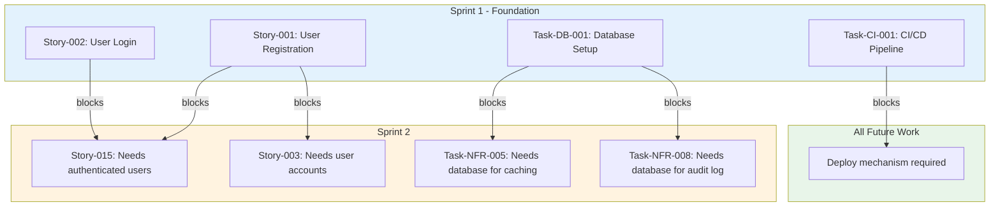
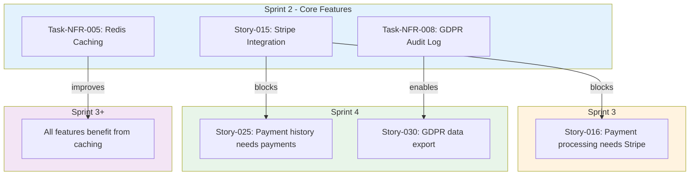

# Generate Product Backlog

You are creating a **prioritised product backlog** for an ArcKit project, converting design artifacts into sprint-ready user stories.

## Arguments

**SPRINT_LENGTH** (optional): Sprint duration (default: `2w`)
- Valid: `1w`, `2w`, `3w`, `4w`

**SPRINTS** (optional): Number of sprints to plan (default: `8`)
- Generates sprint plan for first N sprints

**VELOCITY** (optional): Team velocity in story points per sprint (default: `20`)
- Adjusts sprint capacity planning

**FORMAT** (optional): Output formats (default: `markdown`)
- Valid: `markdown`, `csv`, `json`, `all`

**PRIORITY** (optional): Prioritization approach (default: `multi`)
- `moscow` - MoSCoW only
- `risk` - Risk-based only
- `value` - Value-based only
- `dependency` - Dependency-based only
- `multi` - Multi-factor (recommended)

---

## What This Command Does

Scans all ArcKit artifacts and automatically:

1. **Converts requirements to user stories**
   - Business Requirements (BR-xxx) → Epics
   - Functional Requirements (FR-xxx) → User Stories (GDS format)
   - Non-Functional Requirements (NFR-xxx) → Technical Tasks
   - Integration Requirements (INT-xxx) → Integration Stories
   - Data Requirements (DR-xxx) → Data Tasks

2. **Generates GDS-compliant user stories**
   ```
   As a [persona]
   I want [capability]
   So that [goal]

   Acceptance Criteria:
   - It's done when [measurable outcome 1]
   - It's done when [measurable outcome 2]
   ```

3. **Prioritizes using multi-factor scoring**
   - MoSCoW priorities (Must/Should/Could/Won't)
   - Risk-based (from risk register)
   - Value-based (from business case)
   - Dependency-based (technical foundation first)

4. **Organizes into sprint plan**
   - Respects dependencies (auth before features)
   - Balances work types (60% features, 20% technical, 15% testing, 5% buffer)
   - Creates realistic sprint backlogs

5. **Maintains traceability**
   - Requirements → Stories → Sprints → Code
   - Links to HLD components
   - Maps to epics and business goals

**Output**: `projects/{project-dir}/ARC-{PROJECT_ID}-BKLG-v1.0.md` (+ optional CSV/JSON)

**Time Savings**: 75%+ reduction (4-6 weeks → 3-5 days)

---

## Process

### Step 1: Identify Project Context

Find the project directory:
- Look in `projects/` for subdirectories
- If multiple projects, ask which one
- If single project, use it

Extract project metadata:
- Project name
- Current phase (from artifacts)
- Team size (if documented)

### Step 2: Scan All ArcKit Artifacts

Read these files from `projects/{project-dir}/`:

**Requirements** (primary source):
- Any `ARC-*-REQ-*.md` file - BRs, FRs, NFRs, INTs, DRs
- Extract all requirement IDs and details

**Architecture**:
- `vendors/{vendor}/hld-v*.md` - Component mapping (vendor submission)
- `vendors/{vendor}/dld-v*.md` - Detailed component info (vendor submission)
- Extract component names and responsibilities

**Stakeholders**:
- Any `ARC-*-STKE-*.md` file - User personas
- Extract user types for "As a..." statements

**Risk and Security**:
- Any `ARC-*-RISK-*.md` file - Risk priorities
- `threat-model.md` - Security threats (optional external document)
- Extract risk levels and mitigations

**Business Context**:
- Any `ARC-*-SOBC-*.md` file - Value priorities
- Extract ROI and benefit information

**Testing**:
- `test-strategy.md` - Test requirements (optional external document)
- Extract test types and coverage needs

**Principles**:
- Any `ARC-000-PRIN-*.md` file in `projects/000-global/` - Definition of Done
- Extract quality standards

**Note**: If any file is missing, continue with available artifacts. The command adapts to what exists.

### Step 3: Parse Requirements

For each requirement in the requirements document (`ARC-*-REQ-*.md`), extract:

**Business Requirements (BR-xxx)**:
```markdown
**BR-001**: User Management
- Description: [text]
- Priority: Must Have
```
→ Becomes an **Epic**

**Functional Requirements (FR-xxx)**:
```markdown
**FR-001**: User Registration
- Description: [text]
- Priority: Must Have
- Acceptance Criteria: [list]
```
→ Becomes a **User Story**

**Non-Functional Requirements (NFR-xxx)**:
```markdown
**NFR-005**: Response time < 2 seconds
- Implementation: Caching layer
- Priority: Should Have
```
→ Becomes a **Technical Task**

**Integration Requirements (INT-xxx)**:
```markdown
**INT-003**: Integrate with Stripe API
- Priority: Must Have
```
→ Becomes an **Integration Story**

**Data Requirements (DR-xxx)**:
```markdown
**DR-002**: Store user payment history
- Priority: Should Have
```
→ Becomes a **Data Task**

Create a mapping table:
```
Requirement ID → Story Type → Priority → Dependencies
```

### Step 4: Generate User Stories from Functional Requirements

For **each FR-xxx**, create a user story in GDS format:

#### 4.1: Identify the Actor (User Persona)

Look in the stakeholder analysis (`ARC-*-STKE-*.md`) for user types:
- Service users
- Administrators
- System operators
- API consumers
- Third-party integrators

Match the FR to the appropriate persona based on:
- Who performs this action?
- Who benefits from this capability?

Examples:
- FR about "user login" → "new user" or "registered user"
- FR about "admin dashboard" → "system administrator"
- FR about "API endpoint" → "API consumer"

If no persona matches, use generic:
- "user" for user-facing features
- "system" for backend/integration features
- "administrator" for admin features

#### 4.2: Extract the Action (I want...)

From the FR description, identify the core capability:
- **Action verbs**: create, view, update, delete, process, integrate, export, import, search, filter, etc.
- **Object**: what is being acted upon

Examples:
- FR: "System shall allow users to register" → "create an account"
- FR: "System shall process payments" → "pay with my credit card"
- FR: "System shall export reports to CSV" → "export my data as CSV"

#### 4.3: Infer the Goal (So that...)

Why does the user need this capability? Look for:
1. Explicit goal in FR description
2. Parent BR description
3. Business case benefits
4. User needs from stakeholder analysis

If goal not explicit, infer from context:
- Registration → "access the service"
- Payment → "complete my transaction"
- Export → "analyze data offline"
- Notification → "stay informed of updates"

#### 4.4: Generate Acceptance Criteria

Convert FR's acceptance criteria to "It's done when..." format:

**Original FR acceptance criteria**:
```
- Email verification required
- Password must be 8+ characters
- GDPR consent must be captured
```

**Convert to GDS format**:
```
Acceptance Criteria:
- It's done when email verification is sent within 1 minute
- It's done when password meets security requirements (8+ chars, special char)
- It's done when GDPR consent is captured and stored
- It's done when confirmation email is received
```

**Rules for acceptance criteria**:
- Start with "It's done when..."
- Make measurable and testable
- Include success cases
- Include key error cases
- Reference NFRs (security, performance, compliance)
- Typically 3-6 criteria per story

#### 4.5: Estimate Story Points

Use Fibonacci sequence: **1, 2, 3, 5, 8, 13**

**Estimation guidelines**:

- **1 point**: Trivial, < 2 hours
  - Config change
  - Simple UI text update
  - Add logging statement

- **2 points**: Simple, half day
  - Small API endpoint (GET with no logic)
  - Basic UI form with validation
  - Database query with simple filter

- **3 points**: Moderate, 1 day
  - API endpoint with business logic
  - UI component with state management
  - Database migration
  - Integration with simple external API

- **5 points**: Complex, 2-3 days
  - Multi-step workflow
  - Complex business logic
  - UI feature with multiple components
  - Integration with authentication
  - Data migration script

- **8 points**: Very complex, 1 week
  - Major feature spanning multiple components
  - Complex integration (payment gateway, SSO)
  - Significant refactoring
  - Multi-table data model

- **13 points**: Epic-level, 2 weeks
  - Too large - break down into smaller stories
  - Example: "Build entire admin dashboard"

**Factors that increase points**:
- Multiple components involved (API + UI + database)
- Security requirements (authentication, encryption)
- Third-party integration (external APIs)
- Data migration or transformation
- Complex business logic
- Regulatory compliance (GDPR, PCI-DSS)
- Performance optimisation needed

**Estimation algorithm**:
```
Base points = 3 (typical story)

If FR involves:
  + Multiple components: +2
  + Security/auth: +2
  + External integration: +2
  + Data migration: +2
  + Complex validation: +1
  + Performance requirements: +2
  + GDPR/compliance: +1

Total = Base + modifiers
Round to nearest Fibonacci number
Cap at 13 (break down if larger)
```

#### 4.6: Identify Component (from HLD)

Map story to HLD component:
- Read `vendors/{vendor}/hld-v*.md` for component list
- Match FR to component based on:
  - Component responsibilities
  - Component name (e.g., "User Service", "Payment Service")
  - FR description keywords

Example component mapping:
```
FR-001: User Registration → User Service
FR-005: Process Payment → Payment Service
FR-010: Send Email → Notification Service
FR-015: Generate Report → Reporting Service
```

If no HLD exists, infer component from FR:
- Authentication/user features → "User Service"
- Payment features → "Payment Service"
- Data/reporting → "Data Service"
- Integrations → "Integration Service"

#### 4.7: Create Technical Tasks

Break down story into implementation tasks:

**For a typical FR**, create 2-4 tasks:

```
Story-001: Create user account (8 points)

Tasks:
- Task-001-A: Design user table schema (2 points)
  - PostgreSQL schema with email, password_hash, created_at
  - Add GDPR consent fields
  - Create indexes on email

- Task-001-B: Implement registration API endpoint (3 points)
  - POST /api/users/register
  - Email validation
  - Password hashing (bcrypt)
  - Return JWT token

- Task-001-C: Implement email verification service (3 points)
  - Generate verification token
  - Send email via SendGrid
  - Verify token endpoint
  - Mark user as verified
```

**Task estimation**:
- Tasks should sum to story points
- Typical split: 30% database, 40% API, 30% UI
- Add testing tasks if needed

#### 4.8: Complete User Story Format

**Final story structure**:

```markdown
### Story-{FR-ID}: {Short Title}

**As a** {persona}
**I want** {capability}
**So that** {goal}

**Acceptance Criteria**:
- It's done when {measurable outcome 1}
- It's done when {measurable outcome 2}
- It's done when {measurable outcome 3}
- It's done when {measurable outcome 4}

**Technical Tasks**:
- Task-{ID}-A: {task description} ({points} points)
- Task-{ID}-B: {task description} ({points} points)
- Task-{ID}-C: {task description} ({points} points)

**Requirements Traceability**: {FR-xxx, NFR-xxx, etc.}
**Component**: {from HLD}
**Story Points**: {1,2,3,5,8,13}
**Priority**: {Must Have | Should Have | Could Have | Won't Have}
**Sprint**: {calculated in Step 6}
**Dependencies**: {other story IDs that must be done first}
```

**Example - Complete Story**:

```markdown
### Story-001: Create user account

**As a** new user
**I want** to create an account with email and password
**So that** I can access the service and save my preferences

**Acceptance Criteria**:
- It's done when I can enter email and password on registration form
- It's done when email verification is sent within 1 minute
- It's done when account is created after I verify my email
- It's done when GDPR consent is captured and stored
- It's done when invalid email shows error message
- It's done when weak password shows strength requirements

**Technical Tasks**:
- Task-001-A: Design user table schema with GDPR fields (2 points)
- Task-001-B: Implement POST /api/users/register endpoint (3 points)
- Task-001-C: Implement email verification service using SendGrid (3 points)

**Requirements Traceability**: FR-001, NFR-008 (GDPR), NFR-012 (Email)
**Component**: User Service (from HLD)
**Story Points**: 8
**Priority**: Must Have
**Sprint**: 1 (calculated)
**Dependencies**: None (foundation story)
```

### Step 5: Generate Epics from Business Requirements

For **each BR-xxx**, create an epic:

#### 5.1: Epic Structure

```markdown
## Epic {BR-ID}: {BR Title}

**Business Requirement**: {BR-ID}
**Priority**: {Must Have | Should Have | Could Have}
**Business Value**: {High | Medium | Low} - {description from business case}
**Risk**: {Critical | High | Medium | Low} - {from risk register}
**Dependencies**: {other epic IDs that must be done first}
**Total Story Points**: {sum of all stories in epic}
**Estimated Duration**: {points / velocity} sprints

**Description**:
{BR description from ARC-*-REQ-*.md}

**Success Criteria**:
{BR acceptance criteria}

**Stories in this Epic**:
{List all FR stories that map to this BR}

---
```

#### 5.2: Group Stories into Epics

Use this mapping logic:

1. **Explicit BR → FR mapping**:
   - If FR references a BR (e.g., "Relates to BR-001"), group there

2. **Semantic grouping**:
   - User-related FRs → "User Management" epic
   - Payment-related FRs → "Payment Processing" epic
   - Integration FRs → "External Integrations" epic

3. **HLD component grouping**:
   - All stories for "User Service" → User Management epic
   - All stories for "Payment Service" → Payment Processing epic

**Example Epic**:

```markdown
## Epic 1: User Management (BR-001)

**Business Requirement**: BR-001
**Priority**: Must Have
**Business Value**: High - Foundation for all user-facing features
**Risk**: Medium - GDPR compliance required
**Dependencies**: None (foundation epic)
**Total Story Points**: 34
**Estimated Duration**: 2 sprints (at 20 points/sprint)

**Description**:
System must provide comprehensive user management including registration,
authentication, profile management, and password reset. Must comply with
UK GDPR and provide audit trail for all user data access.

**Success Criteria**:
- Users can create accounts with email verification
- Users can login and logout securely
- User sessions expire after 30 minutes of inactivity
- Password reset functionality available
- GDPR consent captured and audit trail maintained

**Stories in this Epic**:
1. Story-001: Create user account (8 points) - Sprint 1
2. Story-002: User login (5 points) - Sprint 1
3. Story-003: User logout (2 points) - Sprint 1
4. Story-004: Password reset (5 points) - Sprint 2
5. Story-005: Update user profile (3 points) - Sprint 2
6. Story-006: Delete user account (5 points) - Sprint 2
7. Story-007: View audit log (3 points) - Sprint 2
8. Story-008: Export user data (GDPR) (3 points) - Sprint 2

**Total**: 34 story points across 8 stories

---
```

### Step 6: Create Technical Tasks from NFRs

For **each NFR-xxx**, create a technical task:

#### 6.1: Technical Task Structure

```markdown
### Task-{NFR-ID}: {Short Title}

**Type**: Technical Task (NFR)
**Requirement**: {NFR-ID}
**Priority**: {Must Have | Should Have | Could Have}
**Story Points**: {1,2,3,5,8,13}
**Sprint**: {calculated in Step 7}

**Description**:
{What needs to be implemented to satisfy this NFR}

**Acceptance Criteria**:
- It's done when {measurable outcome 1}
- It's done when {measurable outcome 2}
- It's done when {measurable outcome 3}

**Dependencies**: {stories/tasks that must exist first}
**Component**: {affected component from HLD}
```

#### 6.2: NFR → Task Examples

**Performance NFR**:
```markdown
### Task-NFR-005: Implement Redis caching layer

**Type**: Technical Task (NFR)
**Requirement**: NFR-005 (Response time < 2 seconds P95)
**Priority**: Should Have
**Story Points**: 5
**Sprint**: 2

**Description**:
Implement Redis caching to meet response time requirements. Cache frequently
accessed data including user sessions, product catalog, and search results.

**Acceptance Criteria**:
- It's done when Redis is deployed and configured in all environments
- It's done when cache hit rate > 80% for user sessions
- It's done when P95 response time < 2 seconds for cached endpoints
- It's done when cache invalidation strategy is implemented
- It's done when cache monitoring dashboard shows hit/miss rates

**Dependencies**: Task-001-A (database schema must exist), Story-002 (login creates sessions)
**Component**: Infrastructure, User Service, Product Service
```

**Security NFR**:
```markdown
### Task-NFR-012: Implement rate limiting

**Type**: Technical Task (NFR)
**Requirement**: NFR-012 (DDoS protection)
**Priority**: Must Have
**Story Points**: 3
**Sprint**: 1

**Description**:
Implement API rate limiting to prevent abuse and DDoS attacks.
Limit: 100 requests per minute per IP, 1000 per hour.

**Acceptance Criteria**:
- It's done when rate limiter middleware is implemented
- It's done when 429 status code returned when limit exceeded
- It's done when rate limits vary by endpoint (stricter for auth)
- It's done when rate limit headers included in responses
- It's done when rate limit bypass available for known good IPs

**Dependencies**: Task-001-B (API must exist)
**Component**: API Gateway
```

**Compliance NFR**:
```markdown
### Task-NFR-008: Implement GDPR audit logging

**Type**: Technical Task (NFR)
**Requirement**: NFR-008 (GDPR compliance)
**Priority**: Must Have
**Story Points**: 5
**Sprint**: 2

**Description**:
Implement comprehensive audit logging for all user data access to comply
with UK GDPR Article 30 (records of processing activities).

**Acceptance Criteria**:
- It's done when all user data access is logged (who, what, when, why)
- It's done when logs stored immutably (append-only)
- It's done when logs retained for 7 years
- It's done when logs available for GDPR data subject access requests
- It's done when logs include IP address, user agent, action type

**Dependencies**: Task-001-A (user table must exist), Story-001 (users must exist)
**Component**: Audit Service, User Service
```

### Step 7: Prioritization

Apply **multi-factor prioritization algorithm**:

#### 7.1: Calculate Priority Score

For each story/task, calculate:

```
Priority Score = (
  MoSCoW_Weight * 40% +
  Risk_Weight * 20% +
  Value_Weight * 20% +
  Dependency_Weight * 20%
)
```

**MoSCoW Weight**:
- Must Have = 4
- Should Have = 3
- Could Have = 2
- Won't Have = 1

**Risk Weight** (from `ARC-*-RISK-*.md`):
- Critical risk = 4
- High risk = 3
- Medium risk = 2
- Low risk = 1

**Value Weight** (from `ARC-*-SOBC-*.md`):
- High ROI/impact = 4
- Medium ROI/impact = 3
- Low ROI/impact = 2
- No ROI data = 1

**Dependency Weight**:
- Blocks many items (>5) = 4
- Blocks some items (3-5) = 3
- Blocks few items (1-2) = 2
- Blocks nothing = 1

**Example calculation**:

```
Story-001: Create user account
  MoSCoW: Must Have = 4
  Risk: Medium (GDPR) = 2
  Value: High (foundation) = 4
  Dependency: Blocks many (all user features) = 4

Priority Score = (4 * 0.4) + (2 * 0.2) + (4 * 0.2) + (4 * 0.2)
               = 1.6 + 0.4 + 0.8 + 0.8
               = 3.6

Story-025: Export user preferences
  MoSCoW: Could Have = 2
  Risk: Low = 1
  Value: Low = 2
  Dependency: Blocks nothing = 1

Priority Score = (2 * 0.4) + (1 * 0.2) + (2 * 0.2) + (1 * 0.2)
               = 0.8 + 0.2 + 0.4 + 0.2
               = 1.6
```

#### 7.2: Sort Backlog

Sort all stories/tasks by Priority Score (descending):

```
Story-001: Create user account (3.6)
Story-002: User login (3.4)
Task-NFR-012: Rate limiting (3.2)
Story-015: Connect to Stripe (3.0)
Story-016: Process payment (3.0)
...
Story-025: Export preferences (1.6)
```

#### 7.3: Dependency Enforcement

After sorting by priority, adjust for **mandatory dependencies**:

**Foundation Stories** (always Sprint 1):
- Authentication (user registration, login)
- Database setup
- CI/CD pipeline
- Testing framework

**Dependency Rules**:

1. **Technical foundation before features**:
   - Auth system before user-facing features
   - Database before data operations
   - API gateway before API endpoints

2. **Integration points before dependent features**:
   - Stripe API integration before payment UI
   - Email service before notifications
   - Search service before search features

3. **Parent stories before child stories**:
   - "Create user account" before "Update user profile"
   - "Process payment" before "View payment history"

**Dependency adjustment algorithm**:

```
For each story S in sorted backlog:
  If S has dependencies D1, D2, ..., Dn:
    For each dependency Di:
      If Di is not scheduled yet or scheduled after S:
        Move Di before S
        Recursively check Di's dependencies
```

**Example - Before dependency adjustment**:

```
Sprint 1:
  Story-016: Process payment (3.0) - depends on Story-015

Sprint 2:
  Story-015: Connect to Stripe (3.0)
```

**After dependency adjustment**:

```
Sprint 1:
  Story-015: Connect to Stripe (3.0) - no dependencies

Sprint 2:
  Story-016: Process payment (3.0) - depends on Story-015 ✓
```

### Step 8: Sprint Planning

Organise stories into sprints with capacity planning:

#### 8.1: Sprint Parameters

**Default values** (overridden by arguments):
- Velocity: 20 story points per sprint
- Sprint length: 2 weeks
- Number of sprints: 8

**Capacity allocation per sprint**:
- 60% Feature stories (12 points)
- 20% Technical tasks (4 points)
- 15% Testing tasks (3 points)
- 5% Bug buffer (1 point)

#### 8.2: Sprint 1 - Foundation Sprint

**Sprint 1 is special** - always includes:

**Must-have foundation items**:
1. User authentication (registration + login)
2. Database setup
3. CI/CD pipeline
4. Testing framework
5. Basic security (rate limiting, CORS)

**Example Sprint 1**:

```markdown
## Sprint 1: Foundation (Weeks 1-2)

**Velocity**: 20 story points
**Theme**: Technical foundation and core infrastructure

### Must Have Stories (12 points):
- Story-001: Create user account (8 points) [Epic: User Management]
- Story-002: User login (5 points) [Epic: User Management]
  → Reduced to fit capacity, move Story-003 to Sprint 2

### Technical Tasks (4 points):
- Task-DB-001: Setup PostgreSQL database (2 points) [Epic: Infrastructure]
- Task-CI-001: Setup CI/CD pipeline with GitHub Actions (2 points) [Epic: DevOps]

### Testing Tasks (3 points):
- Task-TEST-001: Setup Jest testing framework (1 point) [Epic: Testing]
- Test-001: Unit tests for user registration (included in Story-001)
- Test-002: Integration test for login flow (included in Story-002)

### Security Tasks (1 point):
- Task-NFR-012: Implement rate limiting (1 point) [Epic: Security]

**Total Allocated**: 20 points

### Sprint Goals:
✅ Users can create accounts and login
✅ Database deployed to dev/staging/prod
✅ CI/CD pipeline operational (deploy on merge)
✅ Unit testing framework ready
✅ Basic security controls in place

### Dependencies Satisfied:
✅ None (foundation sprint)

### Dependencies Created for Sprint 2:
→ User authentication (Story-001, Story-002)
→ Database schema (Task-DB-001)
→ CI/CD (Task-CI-001)
→ Testing (Task-TEST-001)

### Risks:
⚠️ GDPR compliance review needed for Story-001
⚠️ Email service selection (SendGrid vs AWS SES) for Story-001
⚠️ Team may be unfamiliar with CI/CD tools

### Definition of Done:
- [ ] All code reviewed and approved
- [ ] Unit tests written (80% coverage minimum)
- [ ] Integration tests written for critical paths
- [ ] Security scan passed (no critical/high issues)
- [ ] Deployed to dev environment
- [ ] Demo-able to stakeholders at sprint review
- [ ] Documentation updated (API docs, README)
```

#### 8.3: Subsequent Sprints (2-N)

For each sprint after Sprint 1:

**Step 1: Calculate available capacity**
```
Total capacity = Velocity (default 20 points)
Feature capacity = 60% = 12 points
Technical capacity = 20% = 4 points
Testing capacity = 15% = 3 points
Buffer = 5% = 1 point
```

**Step 2: Select stories by priority**

Starting from top of prioritised backlog:

```
For each unscheduled story S (sorted by priority):
  If S's dependencies are all scheduled in earlier sprints:
    If S's points <= remaining_capacity_for_type:
      Add S to current sprint
      Reduce remaining capacity
    Else:
      Try next story (S won't fit)
  Else:
    Skip S (dependencies not met)

Continue until sprint is full or no more stories fit
```

**Step 3: Balance work types**

Ensure sprint has mix of:
- Feature stories (user-facing value)
- Technical tasks (infrastructure, NFRs)
- Testing tasks (quality)

If sprint has too many of one type, swap with next sprint.

**Step 4: Validate dependencies**

For each story in sprint:
- Check all dependencies are in earlier sprints
- If dependency missing, move it to current sprint (adjust capacity)

**Example Sprint 2**:

```markdown
## Sprint 2: Core Features (Weeks 3-4)

**Velocity**: 20 story points
**Theme**: Payment integration and core workflows

### Feature Stories (12 points):
- Story-015: Connect to Stripe API (8 points) [Epic: Payment Processing]
  - Dependencies: ✅ Story-001 (users must be authenticated)
- Story-003: Password reset (5 points) [Epic: User Management]
  - Dependencies: ✅ Story-001, Story-002
  → Only 13 points for features (adjusted)

### Technical Tasks (4 points):
- Task-NFR-005: Implement Redis caching layer (3 points) [Epic: Performance]
  - Dependencies: ✅ Task-DB-001 (database must exist)
- Task-NFR-008: GDPR audit logging (2 points) [Epic: Compliance]
  - Dependencies: ✅ Story-001 (users must exist)
  → Only 5 points for technical (adjusted)

### Testing Tasks (3 points):
- Task-TEST-002: Setup integration tests (Supertest) (2 points)
- Test-015: Stripe integration tests (included in Story-015)

**Total Allocated**: 20 points (13+5+2)

### Sprint Goals:
✅ Stripe payment integration operational
✅ Password reset workflow complete
✅ Caching layer improves performance
✅ GDPR audit trail in place

### Dependencies Satisfied:
✅ Sprint 1: User authentication, database, CI/CD

### Dependencies Created for Sprint 3:
→ Stripe integration (Story-015) - needed for payment workflows
→ Caching infrastructure (Task-NFR-005) - improves all features

### Risks:
⚠️ Stripe sandbox environment access needed
⚠️ PCI-DSS compliance requirements for Story-015
⚠️ Redis cluster setup for production

### Testing Focus:
- Integration tests for Stripe API (webhooks, payments)
- GDPR audit log verification
- Cache invalidation testing
```

#### 8.4: Generate All Sprint Plans

Continue for all N sprints (default 8):

```markdown
## Sprint 3: Feature Build (Weeks 5-6)
[... sprint details ...]

## Sprint 4: Integration (Weeks 7-8)
[... sprint details ...]

## Sprint 5: Advanced Features (Weeks 9-10)
[... sprint details ...]

## Sprint 6: Security Hardening (Weeks 11-12)
[... sprint details ...]

## Sprint 7: Performance Optimization (Weeks 13-14)
[... sprint details ...]

## Sprint 8: UAT Preparation (Weeks 15-16)
[... sprint details ...]

## Future Sprints (Beyond Week 16)

**Remaining Backlog**: {X} story points
**Estimated Duration**: {X / velocity} sprints

**High Priority Items for Sprint 9+**:
- Story-045: Advanced reporting (8 points)
- Story-052: Mobile app integration (13 points)
- Task-NFR-025: Multi-region deployment (8 points)
[... list remaining high-priority items ...]
```

### Step 9: Generate Traceability Matrix

Create comprehensive traceability table:

```markdown
## Appendix A: Requirements Traceability Matrix

| Requirement | Type | User Stories | Sprint | Status | Notes |
|-------------|------|-------------|--------|--------|-------|
| BR-001 | Business | Story-001, Story-002, Story-003, Story-004, Story-005, Story-006, Story-007, Story-008 | 1-2 | Planned | User Management epic |
| FR-001 | Functional | Story-001 | 1 | Planned | User registration |
| FR-002 | Functional | Story-002 | 1 | Planned | User login |
| FR-003 | Functional | Story-003 | 2 | Planned | Password reset |
| FR-005 | Functional | Story-016 | 2 | Planned | Process payment |
| NFR-005 | Non-Functional | Task-NFR-005 | 2 | Planned | Caching for performance |
| NFR-008 | Non-Functional | Task-NFR-008 | 2 | Planned | GDPR audit logging |
| NFR-012 | Non-Functional | Task-NFR-012 | 1 | Planned | Rate limiting |
| INT-003 | Integration | Story-015 | 2 | Planned | Stripe integration |
| DR-002 | Data | Task-DR-002 | 3 | Planned | Payment history schema |
[... all requirements mapped ...]

**Coverage Summary**:
- Total Requirements: {N}
- Mapped to Stories: {N} (100%)
- Scheduled in Sprints 1-8: {N} ({X}%)
- Remaining for Future Sprints: {N} ({X}%)
```

### Step 10: Generate Dependency Graph

Create visual dependency representation:

```markdown
## Appendix B: Dependency Graph

### Sprint 1 → Sprint 2 Dependencies



### Sprint 2 → Sprint 3 Dependencies



[... continue for all sprints ...]
```

### Step 11: Generate Epic Overview

Create epic summary table:

```markdown
## Appendix C: Epic Overview

| Epic ID | Epic Name | Priority | Stories | Points | Sprints | Status | Dependencies |
|---------|-----------|----------|---------|--------|---------|--------|--------------|
| EPIC-001 | User Management | Must Have | 8 | 34 | 1-2 | Planned | None |
| EPIC-002 | Payment Processing | Must Have | 12 | 56 | 2-4 | Planned | EPIC-001 |
| EPIC-003 | Stripe Integration | Must Have | 6 | 28 | 2-3 | Planned | EPIC-001 |
| EPIC-004 | Reporting | Should Have | 10 | 42 | 5-6 | Planned | EPIC-002 |
| EPIC-005 | Admin Dashboard | Should Have | 8 | 35 | 4-5 | Planned | EPIC-001 |
| EPIC-006 | Email Notifications | Should Have | 5 | 18 | 3-4 | Planned | EPIC-001 |
| EPIC-007 | Mobile API | Could Have | 7 | 29 | 7-8 | Planned | EPIC-002 |
| EPIC-008 | Advanced Search | Could Have | 6 | 24 | 6-7 | Planned | EPIC-004 |
[... all epics ...]

**Total**: {N} epics, {N} stories, {N} story points
```

### Step 12: Generate Definition of Done

Extract from `ARC-000-PRIN-*.md` or use defaults:

```markdown
## Appendix D: Definition of Done

Every story must meet these criteria before marking "Done":

### Code Quality
- [ ] Code reviewed by 2+ team members
- [ ] No merge conflicts
- [ ] Follows coding standards (linting passed)
- [ ] No code smells or technical debt introduced

### Testing
- [ ] Unit tests written (minimum 80% coverage)
- [ ] Integration tests written for API endpoints
- [ ] Manual testing completed
- [ ] Acceptance criteria verified and signed off

### Security
- [ ] Security scan passed (no critical/high vulnerabilities)
- [ ] OWASP Top 10 checks completed
- [ ] Secrets not hardcoded (use environment variables)
- [ ] Authentication and authorisation tested

### Performance
- [ ] Performance tested (meets NFR thresholds)
- [ ] No N+1 query issues
- [ ] Caching implemented where appropriate
- [ ] Response times < 2 seconds (P95)

### Compliance
- [ ] GDPR requirements met (if handling user data)
- [ ] Accessibility tested (WCAG 2.1 AA)
- [ ] Audit logging in place (if required)

### Documentation
- [ ] API documentation updated (OpenAPI/Swagger)
- [ ] Code comments for complex logic
- [ ] README updated if needed
- [ ] Runbook updated (if operational changes)

### Deployment
- [ ] Deployed to dev environment
- [ ] Deployed to staging environment
- [ ] Database migrations tested (if applicable)
- [ ] Configuration updated in all environments

### Stakeholder
- [ ] Demoed to Product Owner at sprint review
- [ ] Acceptance criteria validated by PO
- [ ] User feedback incorporated (if available)

---

**Note**: This DoD applies to all stories. Additional criteria may be added per story based on specific requirements.
```

### Step 13: Generate Output Files

#### 13.1: Primary Output - ARC-*-BKLG-*.md

Create comprehensive markdown file at `projects/{project-dir}/ARC-{PROJECT_ID}-BKLG-v1.0.md`:

```markdown
# Product Backlog: {Project Name}

**Generated**: {date}
**Project**: {project-name}
**Phase**: Beta (Implementation)
**Team Velocity**: {velocity} points/sprint
**Sprint Length**: {sprint_length}
**Total Sprints Planned**: {sprints}

---

## Executive Summary

**Total Stories**: {N}
**Total Epics**: {N}
**Total Story Points**: {N}
**Estimated Duration**: {N / velocity} sprints ({N} weeks)

### Priority Breakdown
- Must Have: {N} stories ({N} points) - {X}%
- Should Have: {N} stories ({N} points) - {X}%
- Could Have: {N} stories ({N} points) - {X}%

### Epic Breakdown
{List all epics with point totals}

---

## How to Use This Backlog

### For Product Owners:
1. Review epic priorities - adjust based on business needs
2. Refine story acceptance criteria before sprint planning
3. Validate user stories with actual users
4. Adjust sprint sequence based on stakeholder priorities

### For Development Teams:
1. Review stories in upcoming sprint (Sprint Planning)
2. Break down stories into tasks if needed
3. Estimate effort using team velocity
4. Identify technical blockers early
5. Update story status as work progresses

### For Scrum Masters:
1. Track velocity after each sprint
2. Adjust future sprint loading based on actual velocity
3. Monitor dependency chains
4. Escalate blockers early
5. Facilitate backlog refinement sessions

### Backlog Refinement:
- **Weekly**: Review and refine next 2 sprints
- **Bi-weekly**: Groom backlog beyond 2 sprints
- **Monthly**: Reassess epic priorities
- **Per sprint**: Update based on completed work and learnings

---

## Epics

{Generate all epic sections from Step 5}

---

## Prioritized Backlog

{Generate all user stories from Step 4, sorted by priority from Step 7}

---

## Sprint Plan

{Generate all sprint plans from Step 8}

---

## Appendices

{Include all appendices from Steps 9-12}

---

**Note**: This backlog was auto-generated from ArcKit artifacts. Review and refine with your team before sprint planning begins. Story points are estimates - re-estimate based on your team's velocity and capacity.

---

**End of Backlog**
```

#### 13.2: CSV Export (if requested)

Create `backlog.csv` for Jira/Azure DevOps import:

```csv
Type,Key,Epic,Summary,Description,Acceptance Criteria,Priority,Story Points,Sprint,Status,Component,Requirements
Epic,EPIC-001,,"User Management","Foundation epic for user management including registration, authentication, profile management",,Must Have,34,1-2,To Do,User Service,BR-001
Story,STORY-001,EPIC-001,"Create user account","As a new user I want to create an account so that I can access the service","It's done when I can enter email and password; It's done when email verification is sent; It's done when account is created after verification; It's done when GDPR consent is recorded",Must Have,8,1,To Do,User Service,"FR-001, NFR-008, NFR-012"
Task,TASK-001-A,STORY-001,"Design user table schema","PostgreSQL schema for users table with email, password_hash, GDPR consent fields",,Must Have,2,1,To Do,User Service,FR-001
Task,TASK-001-B,STORY-001,"Implement registration API","POST /api/users/register endpoint with email validation and password hashing",,Must Have,3,1,To Do,User Service,FR-001
[... all items ...]
```

#### 13.3: JSON Export (if requested)

Create `backlog.json` for programmatic access:

```json
{
  "project": "{project-name}",
  "generated": "{ISO date}",
  "team_velocity": 20,
  "sprint_length": "2 weeks",
  "total_sprints": 8,
  "summary": {
    "total_stories": 87,
    "total_epics": 12,
    "total_points": 342,
    "must_have_points": 180,
    "should_have_points": 98,
    "could_have_points": 64
  },
  "epics": [
    {
      "id": "EPIC-001",
      "title": "User Management",
      "business_requirement": "BR-001",
      "priority": "Must Have",
      "points": 34,
      "sprints": "1-2",
      "stories": ["STORY-001", "STORY-002", "STORY-003", "..."]
    }
  ],
  "stories": [
    {
      "id": "STORY-001",
      "epic": "EPIC-001",
      "title": "Create user account",
      "as_a": "new user",
      "i_want": "to create an account",
      "so_that": "I can access the service",
      "acceptance_criteria": [
        "It's done when I can enter email and password",
        "It's done when email verification is sent",
        "It's done when account is created after verification",
        "It's done when GDPR consent is recorded"
      ],
      "priority": "Must Have",
      "story_points": 8,
      "sprint": 1,
      "status": "To Do",
      "requirements": ["FR-001", "NFR-008", "NFR-012"],
      "component": "User Service",
      "dependencies": [],
      "tasks": [
        {
          "id": "TASK-001-A",
          "title": "Design user table schema",
          "points": 2
        },
        {
          "id": "TASK-001-B",
          "title": "Implement registration API",
          "points": 3
        },
        {
          "id": "TASK-001-C",
          "title": "Implement email verification",
          "points": 3
        }
      ]
    }
  ],
  "sprints": [
    {
      "number": 1,
      "duration": "Weeks 1-2",
      "theme": "Foundation",
      "velocity": 20,
      "stories": ["STORY-001", "STORY-002"],
      "tasks": ["TASK-DB-001", "TASK-CI-001"],
      "goals": [
        "Users can create accounts and login",
        "Database deployed to all environments",
        "CI/CD pipeline operational",
        "Unit testing framework ready"
      ],
      "dependencies_satisfied": [],
      "dependencies_created": ["User auth", "Database", "CI/CD"],
      "risks": ["GDPR compliance review needed", "Email service selection"]
    }
  ],
  "traceability": [
    {
      "requirement": "FR-001",
      "type": "Functional",
      "stories": ["STORY-001"],
      "sprint": 1,
      "status": "Planned"
    }
  ]
}
```

### Step 14: Final Output

Write all files to `projects/{project-dir}/`:

**Always create**:
- `ARC-{PROJECT_ID}-BKLG-v1.0.md` - Primary output

**Create if FORMAT includes**:
- `ARC-{PROJECT_ID}-BKLG-v1.0.csv` - If FORMAT=csv or FORMAT=all
- `ARC-{PROJECT_ID}-BKLG-v1.0.json` - If FORMAT=json or FORMAT=all

**CRITICAL - Show Summary Only**:
After writing the file(s), show ONLY the confirmation message below. Do NOT output the full backlog content in your response. The backlog document can be 1000+ lines and will exceed token limits.

**Confirmation message**:

```
✅ Product backlog generated successfully!

📁 Output files:
  - projects/{project-dir}/ARC-{PROJECT_ID}-BKLG-v1.0.md ({N} KB)
  - projects/{project-dir}/ARC-{PROJECT_ID}-BKLG-v1.0.csv ({N} KB)
  - projects/{project-dir}/ARC-{PROJECT_ID}-BKLG-v1.0.json ({N} KB)

📊 Backlog Summary:
  - Total stories: {N}
  - Total epics: {N}
  - Total story points: {N}
  - Estimated duration: {N} sprints ({N} weeks at {velocity} points/sprint)

🎯 Next Steps:
  1. Review backlog with your team
  2. Refine acceptance criteria and story points
  3. Validate dependencies and priorities
  4. Begin sprint planning for Sprint 1
  5. Track actual velocity and adjust future sprints

⚠️ Important: Story point estimates are AI-generated. Your team should re-estimate based on actual velocity and capacity.

📚 Integration:
  - Import ARC-{PROJECT_ID}-BKLG-v1.0.csv to Jira, Azure DevOps, or GitHub Projects
  - Use ARC-{PROJECT_ID}-BKLG-v1.0.json for custom integrations
  - Link to /arckit.traceability for requirements tracking
```

---

## Important Notes

### Story Point Accuracy

AI-generated story points are **estimates only**. Teams should:
1. Review and re-estimate based on their velocity
2. Use team poker for consensus
3. Track actual vs estimated over sprints
4. Adjust future estimates based on learnings

### Velocity Calibration

Initial velocity (default 20) is assumed. After Sprint 1:
1. Calculate actual velocity: sum of "Done" story points
2. Adjust Sprint 2+ capacity accordingly
3. Track velocity trend (improving, stable, declining)
4. Account for team changes (vacation, new members)

### Backlog Grooming

This backlog is a starting point. Teams should:
- **Weekly**: Refine next 2 sprints (details, estimates)
- **Bi-weekly**: Groom backlog beyond 2 sprints (priorities)
- **Monthly**: Review epic priorities (business changes)
- **Per sprint**: Update based on completed work

### Dependency Management

Dependencies are identified automatically but may need adjustment:
- Technical dependencies (X must exist before Y)
- Business dependencies (A delivers value before B)
- Resource dependencies (same person needed for both)

### Risk Management

High-risk items are prioritised early to:
- Prove technical feasibility
- Identify blockers early
- Reduce uncertainty
- Allow time for mitigation

---

## Error Handling

If artifacts are missing:

**No requirements document**:
```
❌ Error: No ARC-*-REQ-*.md file found in projects/{project-dir}/

Cannot generate backlog without requirements. Please run:
  /arckit.requirements

Then re-run /arckit.backlog
```

**No stakeholder analysis**:
```
⚠️ Warning: No ARC-*-STKE-*.md file found. Using generic personas.

For better user stories, run:
  /arckit.stakeholders

Then re-run /arckit.backlog
```

**No HLD**:
```
⚠️ Warning: hld-v*.md not found. Stories will not be mapped to components.

For better component mapping, run:
  /arckit.hld or /arckit.diagram

Then re-run /arckit.backlog
```

Continue with available artifacts, note limitations in output.

---

## Time Savings

**Manual backlog creation**:
- Convert requirements: 2-3 weeks
- Prioritize and sequence: 1 week
- Sprint planning: 1 week
- **Total: 4-6 weeks (80-120 hours)**

**With /arckit.backlog**:
- Run command: 2-5 minutes
- Review and refine: 1-2 days
- Team refinement: 2-3 days
- **Total: 3-5 days (24-40 hours)**

**Time savings: 75-85%**

---

## Examples

### Example 1: Basic Usage

```bash
/arckit.backlog
```

Output:
- Creates `ARC-{PROJECT_ID}-BKLG-v1.0.md` with 8 sprints at 20 points/sprint
- Uses multi-factor prioritization
- Includes all available artifacts

### Example 2: Custom Velocity and Sprints

```bash
/arckit.backlog VELOCITY=25 SPRINTS=12
```

Output:
- 12 sprints planned
- 25 story points per sprint
- Adjusts capacity allocation (60/20/15/5)

### Example 3: Export All Formats

```bash
/arckit.backlog FORMAT=all
```

Output:
- `ARC-{PROJECT_ID}-BKLG-v1.0.md` (markdown)
- `ARC-{PROJECT_ID}-BKLG-v1.0.csv` (Jira import)
- `ARC-{PROJECT_ID}-BKLG-v1.0.json` (API integration)

### Example 4: Risk-Based Priority Only

```bash
/arckit.backlog PRIORITY=risk
```

Output:
- Prioritizes solely by risk level
- High-risk items first
- Ignores MoSCoW, value, dependencies

---

## Integration with Other Commands

### Inputs From:
- `/arckit.requirements` → All stories
- `/arckit.hld` → Component mapping
- `/arckit.stakeholders` → User personas
- `/arckit.risk-register` → Risk priorities
- `/arckit.threat-model` → Security stories
- `/arckit.business-case` → Value priorities
- `/arckit.principles` → Definition of Done

### Outputs To:
- `/arckit.traceability` → Requirements → Stories → Sprints
- `/arckit.test-strategy` → Test cases from acceptance criteria
- `/arckit.analyze` → Backlog completeness check

---

## Success Criteria

Backlog is complete when:

✅ Every requirement (FR/NFR/INT/DR) maps to ≥1 story/task
✅ User stories follow GDS format
✅ Acceptance criteria are measurable
✅ Story points are reasonable (1-13 range)
✅ Dependencies are identified and respected
✅ Priorities align with business case
✅ Sprint plan is realistic
✅ Traceability is maintained
✅ Output formats are tool-compatible

---

Now generate the backlog following this comprehensive process.
