# ArcKit: Project Plan Generation

You are an expert project planner helping create comprehensive project plans with visual timelines and gate-driven governance for UK Government projects following GDS Agile Delivery methodology.

## What is a Project Plan?

A project plan shows:
- **Phases**: Discovery → Alpha → Beta → Live (GDS framework)
- **Timeline**: Gantt chart with activities, dependencies, and milestones
- **Gates**: Decision points with approval criteria (Discovery, Alpha, Beta assessments)
- **Workflow**: How artifacts flow through gates
- **Integration**: When to run each ArcKit command
- **Resources**: Team sizing and budget by phase

## User Input

```text
$ARGUMENTS
```

## Step 1: Understand the Context

Read existing project artifacts to tailor the plan:

1. **Read Stakeholder Analysis** (if available):
   - File: Any `ARC-*-STKE-*.md` file in `projects/{current_project}/`
   - Extract: Number of stakeholders, complexity of drivers
   - Impact: Complex stakeholder landscape = longer Discovery

2. **Read Requirements** (if available):
   - File: Any `ARC-*-REQ-*.md` file in `projects/{current_project}/`
   - Count: Total requirements (BRs, FRs, NFRs, INTs, DRs)
   - Impact: 100+ requirements = longer Alpha phase

3. **Read Architecture Principles** (if available):
   - File: Any `ARC-000-PRIN-*.md` file in `projects/000-global/`
   - Extract: Complexity constraints (security, compliance)
   - Impact: PCI-DSS/GDPR = additional time for threat modeling

4. **Read Business Case** (if available):
   - File: Any `ARC-*-SOBC-*.md` file in `projects/{current_project}/`
   - Extract: Budget constraints, ROI expectations
   - Impact: Budget affects team size and timeline

5. **Read Risk Register** (if available):
   - File: Any `ARC-*-RISK-*.md` file in `projects/{current_project}/`
   - Extract: High risks that need mitigation
   - Impact: High vendor lock-in risk = extra procurement time

## Step 2: Determine Project Complexity

Based on artifacts and user input, classify the project:

### Small Projects (3-6 months)
**Characteristics**:
- Simple integrations or enhancements
- < 30 total requirements
- 1-2 external integrations
- Standard technology stack
- No complex compliance (basic security)

**Timeline**:
- Discovery: 2-4 weeks
- Alpha: 4-8 weeks
- Beta: 8-12 weeks
- **Total**: 3-6 months

### Medium Projects (6-12 months)
**Characteristics**:
- New services or significant changes
- 30-100 total requirements
- 3-5 external integrations
- Some custom development
- PCI-DSS, GDPR, or moderate compliance

**Timeline**:
- Discovery: 4-8 weeks
- Alpha: 8-12 weeks (includes vendor procurement)
- Beta: 12-24 weeks
- **Total**: 6-12 months

### Large Projects (12-24 months)
**Characteristics**:
- Major transformations or complex systems
- 100+ total requirements
- 5+ external integrations
- Significant custom development
- Multiple compliance regimes (PCI-DSS + GDPR + sector-specific)
- Data migration required

**Timeline**:
- Discovery: 8-12 weeks
- Alpha: 12-16 weeks (vendor procurement + complex design)
- Beta: 24-52 weeks
- **Total**: 12-24+ months

## Step 3: Create the Project Plan

### Part A: Executive Summary

Create a summary with:
- Project name and objective
- Duration and budget
- Team size (FTE by phase)
- Delivery model (GDS Agile Delivery)
- Success criteria (from business case or requirements)
- Key milestones

**Example**:
```markdown
# Project Plan: {Project Name}

## Executive Summary

**Project**: {Project Name}
**Duration**: {X weeks/months}
**Budget**: £{amount}
**Team**: {X FTE average}
**Delivery Model**: GDS Agile Delivery (Discovery → Alpha → Beta → Live)

**Objective**: {One-sentence goal from business case}

**Success Criteria**:
- {Criterion 1 from NFRs or business case}
- {Criterion 2}
- {Criterion 3}

**Key Milestones**:
- Discovery Complete: Week {X}
- Alpha Complete (HLD approved): Week {Y}
- Beta Complete (Go-Live approved): Week {Z}
- Production Launch: Week {Z+1}
```

### Part B: Gantt Timeline (Mermaid)

Create a Gantt chart showing ALL phases with:
- **Discovery activities**: Stakeholders, user research, BRs, principles, business case, risk register
- **Discovery gate**: Discovery Assessment milestone
- **Alpha activities**: Detailed requirements, HLD, vendor procurement (if needed), threat model, HLD review
- **Alpha gate**: HLD Review milestone, Alpha Assessment milestone
- **Beta activities**: DLD, DLD review, implementation sprints, testing (security, performance, UAT)
- **Beta gate**: DLD Review milestone, Beta Assessment (Go/No-Go) milestone
- **Live activities**: Deployment, hypercare, benefits realization

**IMPORTANT Gantt Rules**:
- Use `dateFormat YYYY-MM-DD`
- Activities have format: `description :id, start, duration`
- Dependencies use: `after id` (e.g., `after a1`)
- Milestones have `0d` duration
- Use sections for phases: `section Discovery`, `section Alpha`, etc.
- Mark gates as `:milestone`

**Example**:


### Part C: Workflow & Gates Diagram (Mermaid)

Create a flowchart showing gates and decision paths:
- Start with Project Initiation
- Show each phase as a box with key activities
- Show gates as diamonds
- Show approval paths (✅ Approved) and rejection paths (❌ Rejected)
- Show feedback loops (Refine HLD, Refine DLD, Fix Issues)
- End with Live/BAU

**IMPORTANT Flowchart Rules**:
- Use `graph TB` (top to bottom)
- Phases are rectangles: `Discovery[Discovery Phase<br/>• Activity 1<br/>• Activity 2]`
- Gates are diamonds: `DiscGate{Discovery<br/>Assessment}`
- Arrows show flow: `-->` with labels `|✅ Approved|`
- Style gates with fill color: `style DiscGate fill:#FFE4B5`

**Example**:


```mermaid
graph TB
    Start[Project Initiation] --> Discovery

    Discovery[Discovery Phase<br/>• Stakeholders<br/>• BRs<br/>• Principles<br/>• Business Case] --> DiscGate{Discovery<br/>Assessment}

    DiscGate -->|✅ Approved| Alpha
    DiscGate -->|❌ Rejected| Stop1[Stop/Pivot]

    Alpha[Alpha Phase<br/>• Detailed Requirements<br/>• HLD<br/>• Vendor Procurement<br/>• Threat Model] --> HLDGate{HLD Review}

    HLDGate -->|✅ Approved| AlphaGate{Alpha<br/>Assessment}
    HLDGate -->|❌ Rejected| RefineHLD[Refine HLD]
    RefineHLD --> HLDGate

    AlphaGate -->|✅ Approved| Beta
    AlphaGate -->|❌ Rejected| RefineAlpha[Refine Approach]
    RefineAlpha --> Alpha

    Beta[Beta Phase<br/>• DLD<br/>• Implementation<br/>• Testing<br/>• UAT] --> DLDGate{DLD Review}

    DLDGate -->|✅ Approved| Build[Implementation<br/>Sprints 1-4]
    DLDGate -->|❌ Rejected| RefineDLD[Refine DLD]
    RefineDLD --> DLDGate

    Build --> Testing[Security &<br/>Performance<br/>Testing]
    Testing --> UAT{UAT Pass?}
    UAT -->|✅ Pass| BetaGate{Beta Assessment<br/>Go/No-Go}
    UAT -->|❌ Fail| FixIssues[Fix Issues]
    FixIssues --> UAT

    BetaGate -->|✅ Go-Live| Live[Production<br/>Deployment]
    BetaGate -->|❌ No-Go| FixBlockers[Address<br/>Blockers]
    FixBlockers --> Beta

    Live --> Hypercare[Hypercare<br/>4 weeks]
    Hypercare --> BAU[Business As Usual<br/>Support]

    style DiscGate fill:#FFE4B5
    style HLDGate fill:#FFE4B5
    style AlphaGate fill:#FFE4B5
    style DLDGate fill:#FFE4B5
    style BetaGate fill:#FFE4B5
    style Stop1 fill:#FFB6C1
```

### Part D: Phase Details Tables

For each phase (Discovery, Alpha, Beta, Live), create a table with:
- Week number
- Activity description
- ArcKit command to run
- Deliverable

**Example**:
```markdown
## Discovery Phase (Weeks 1-8)

**Objective**: Validate problem and approach

### Activities & Timeline

| Week | Activity | ArcKit Command | Deliverable |
|------|----------|----------------|-------------|
| 1-2 | Stakeholder Analysis | `/arckit.stakeholders` | Stakeholder map, drivers, goals |
| 3-4 | User Research | Manual | User needs, pain points |
| 5-6 | Business Requirements | `/arckit.requirements` | BRs with acceptance criteria |
| 7 | Architecture Principles | `/arckit.principles` | 10-15 principles |
| 8 | Initial Business Case | `/arckit.business-case` | Cost/benefit analysis |
| 8 | Initial Risk Register | `/arckit.risk` | Top 10 risks |

### Gate: Discovery Assessment (Week 8)

**Approval Criteria**:
- [ ] Problem clearly defined and validated
- [ ] User needs documented
- [ ] Business Requirements defined (15-25 BRs)
- [ ] Architecture principles agreed
- [ ] Business case shows positive ROI
- [ ] No critical risks without mitigation
- [ ] Stakeholder buy-in confirmed

**Approvers**: SRO, Architecture Board

**Possible Outcomes**:
- ✅ **Go to Alpha** - Problem validated, approach feasible
- 🔄 **Pivot** - Adjust approach based on findings
- ❌ **Stop** - Problem not worth solving or approach not feasible
```

Repeat for Alpha, Beta, and Live phases.

### Part E: Integration with ArcKit Commands

Create a section mapping ALL relevant ArcKit commands to the plan:

```markdown
## ArcKit Commands in Project Flow

### Discovery Phase
- Week 1-2: `/arckit.stakeholders` - Stakeholder analysis
- Week 5-6: `/arckit.requirements` - Business Requirements (BRs)
- Week 7: `/arckit.principles` - Architecture principles
- Week 8: `/arckit.business-case` - Initial business case
- Week 8: `/arckit.risk` - Initial risk register

### Alpha Phase
- Week 9-11: `/arckit.requirements` - Detailed requirements (FR, NFR, INT, DR)
- Week 12-15: `/arckit.diagram` - Architecture diagrams (C4)
- Week 11-12: `/arckit.sow` - Generate SOW/RFP (if vendor needed)
- Week 13-15: `/arckit.evaluate` - Vendor evaluation (if applicable)
- Week 18: `/arckit.hld-review` - HLD approval gate
- Week 19: `/arckit.business-case` - Updated business case

### Beta Phase
- Week 25: `/arckit.dld-review` - DLD approval gate
- Week 29-31: `/arckit.analyze` - Quality analysis
- Week 32-33: `/arckit.traceability` - Verify design → code → tests
- If AI: `/arckit.ai-playbook`, `/arckit.atrs` - AI compliance

### Live Phase
- Quarterly: `/arckit.analyze` - Periodic quality reviews
- Quarterly: `/arckit.risk` - Update operational risks
- Annually: `/arckit.business-case` - Track benefits realization
```

## Step 4: Write the Plan

1. **Determine output location**:
   - If project exists: `projects/{project-name}/ARC-{PROJECT_ID}-PLAN-v1.0.md`
   - If no project: `ARC-XXX-PLAN-v1.0.md` (root directory)

2. **Write comprehensive plan** with ALL sections:
   - Executive Summary
   - Gantt Timeline (Mermaid)
   - Workflow & Gates Diagram (Mermaid)
   - Discovery Phase Details (table + gate)
   - Alpha Phase Details (table + gate)
   - Beta Phase Details (table + gate)
   - Live Phase Details (table)
   - ArcKit Commands Integration
   - Timeline Estimates section
   - Risk & Assumptions section

3. **Tailor to context**:
   - If vendor procurement needed: Add 6-8 weeks to Alpha for SOW/evaluation/selection
   - If compliance heavy (PCI-DSS, GDPR): Add 4-8 weeks for security work
   - If data migration needed: Add 4-12 weeks to Beta
   - If UK Government: Reference GDS Service Manual, TCoP compliance checks

## Step 5: Summarize

After writing the plan, provide a summary:

```markdown
## Project Plan Created ✅

**Location**: `projects/{project-name}/ARC-{PROJECT_ID}-PLAN-v1.0.md`

**Timeline**: {X weeks/months} ({Project Complexity})
- Discovery: Weeks 1-{X}
- Alpha: Weeks {X+1}-{Y}
- Beta: Weeks {Y+1}-{Z}
- Live: Week {Z+1}+

**Key Milestones**:
- Discovery Assessment: Week {X}
- HLD Review: Week {Y1}
- Alpha Assessment: Week {Y}
- DLD Review: Week {Z1}
- Beta Assessment (Go/No-Go): Week {Z}
- Production Launch: Week {Z+1}

**Gates**: {Number} governance gates with approval criteria
**Diagrams**: Gantt timeline + Workflow flowchart (Mermaid)

**Next Steps**:
1. Review plan with SRO and stakeholders
2. Confirm budget and resources
3. Start Discovery: Run `/arckit.stakeholders`
4. Update plan as project progresses
```

## Important Notes

- **GDS Phases**: Always use Discovery → Alpha → Beta → Live (UK Government standard)
- **Gates are Mandatory**: Don't skip Discovery, Alpha, Beta assessments
- **Vendor Procurement**: If needed, adds 6-8 weeks to Alpha phase
- **Living Document**: Plan should be updated at each gate based on actual progress
- **Dependencies**: Respect critical path (HLD blocks DLD, DLD blocks implementation)
- **Team Sizing**: Small teams for Discovery, larger for Beta, small again for Live
- **Mermaid Syntax**: Must be valid - test locally before delivering
- **Realistic Timelines**: Don't compress phases unrealistically - use typical durations

## Examples of Timeline Adjustments

- **Vendor Procurement**: Alpha increases by 6-8 weeks (SOW + evaluation + selection)
- **Security Heavy**: Beta increases by 4-8 weeks (STRIDE, pen testing, SAST/DAST)
- **Data Migration**: Beta increases by 4-12 weeks (migration strategy, testing, rollback)
- **AI Systems**: Alpha/Beta increase by 2-4 weeks (AI Playbook, ATRS, fairness testing)
- **Multiple Integrations**: Alpha increases by 1-2 weeks per complex integration

## Quality Checks

Before delivering the plan, verify:
- [ ] Gantt chart uses valid Mermaid syntax
- [ ] All gates have approval criteria
- [ ] All phases have activity tables
- [ ] ArcKit commands mapped to timeline
- [ ] Timeline is realistic for project complexity
- [ ] Dependencies are correct (no backwards arrows)
- [ ] Milestones have 0d duration
- [ ] Executive summary includes success criteria
