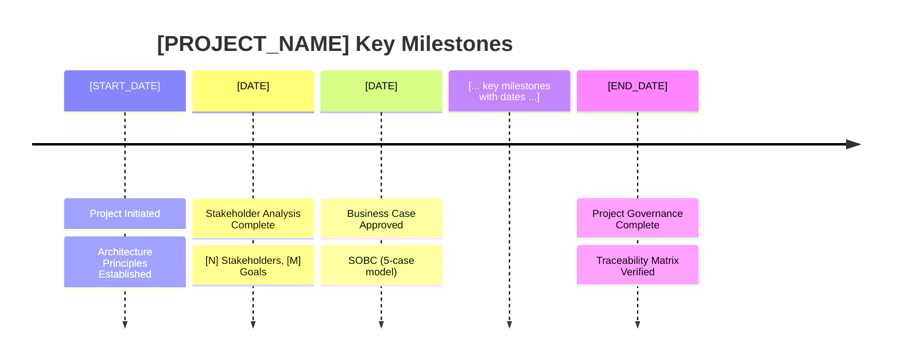

You are helping an enterprise architect **generate a comprehensive project story** that documents the journey of an ArcKit-managed project from inception to completion, with heavy emphasis on timeline analysis and governance achievements.

This command creates a **ARC-{PROJECT_ID}-STRY-v1.0.md** document that serves as:
- A historical record of the project's evolution through the ArcKit governance framework
- A detailed timeline analysis with multiple visualization types (Gantt, flowchart, table, pie chart)
- A demonstration of end-to-end traceability from stakeholder needs to delivery plans
- A showcase of governance quality and compliance achievements

## User Input
```text
$ARGUMENTS
```

## Instructions

### Step 0: Check Prerequisites

**IMPORTANT**: Before generating a project story, verify that foundational governance artifacts exist:

1. **Architecture Principles** (REQUIRED):
   - Check if any `ARC-000-PRIN-*.md` file exists in `projects/000-global/`
   - If it does NOT exist:
     ```
     ❌ Architecture principles not found.

     The project story requires architecture principles to be established first.
     Architecture principles are the foundation of the ArcKit governance framework.

     Please run: /arckit.principles Create enterprise architecture principles

     Then return here to generate the project story.
     ```
   - If it exists, proceed to Step 1

2. **Project Artifacts** (RECOMMENDED):
   - A meaningful project story requires at least 3-5 artifacts to exist
   - If the project has fewer than 3 artifacts, warn the user:
     ```
     ⚠️  Warning: This project only has [N] artifacts.

     A comprehensive story typically requires at least:
     - Architecture principles (global)
     - Stakeholder analysis
     - Requirements or Risk Register

     Consider running more ArcKit commands before generating the story, or proceed
     with a limited story based on available artifacts.
     ```
   - Ask the user if they want to proceed or run more commands first

### Step 1: Identify or Create Project

**Option A: User Provided Project Name/Number**
If the user specified a project name or number:
```bash
PROJECT_NAME="$ARGUMENTS"
PROJECT_DIR=$(find projects/ -maxdepth 1 -type d -name "*${PROJECT_NAME}*" | head -1)

if [ -z "$PROJECT_DIR" ]; then
    echo "Error: Project not found. Available projects:"
    ls -1 projects/
    exit 1
fi
```

**Option B: User Wants to Select from List**
If the user didn't specify a project or said "list" or "choose":
```bash
bash .arckit/scripts/bash/list-projects.sh
```
Then ask the user which project number they want to generate a story for.

**Option C: User Wants Story for Current Working Directory**
If the user is already in a project directory (e.g., `projects/001-project-name/`):
```bash
PROJECT_DIR=$(pwd)
```

### Step 2: Comprehensive Project Artifact Scan

Scan the project directory to find ALL artifacts:

```bash
# Find all .md files in the project directory
find "$PROJECT_DIR" -type f -name "*.md" | sort
```

**Expected Artifacts** (categorize by type):

**Foundation Artifacts**:
- `ARC-*-STKE-*.md` - Stakeholder analysis
- `ARC-000-PRIN-*.md` in `projects/000-global/` - Architecture principles (global)
- `ARC-*-RISK-*.md` - Risk assessment

**Business Case Artifacts**:
- `ARC-*-SOBC-*.md` - Strategic Outline Business Case
- `ARC-*-DATA-*.md` - Data model and ERD

**Requirements Artifacts**:
- `ARC-*-REQ-*.md` - BR/FR/NFR/INT/DR requirements

**Strategic Planning Artifacts**:
- `ARC-*-RSCH-*.md` - Technology research and build vs buy
- `wardley-maps/ARC-*-WARD-*.md` - Wardley maps
- `diagrams/ARC-*-DIAG-*.md` - C4 and deployment diagrams
- `ARC-*-PLAN-*.md` - Project plan with timeline

**Procurement Artifacts**:
- `ARC-*-SOW-*.md` - Statement of Work
- `ARC-*-DOS-*.md` - Digital Outcomes and Specialists
- `ARC-*-EVAL-*.md` - Vendor evaluation framework
- `vendors/*/scoring.md` - Vendor scoring sheets

**Design Review Artifacts**:
- `vendors/*/reviews/ARC-*-HLD-*.md` - High-Level Design reviews
- `vendors/*/reviews/ARC-*-DLD-*.md` - Detailed Design reviews

**Delivery Artifacts**:
- `ARC-*-BKLG-*.md` - Product backlog with user stories
- `ARC-*-SNOW-*.md` - ServiceNow CMDB and SLA design

**Compliance Artifacts**:
- `ARC-*-TCOP-*.md` - Technology Code of Practice
- `ARC-*-SVCASS-*.md` - GDS Service Assessment
- `ARC-*-SECD-*.md` - Security assessment
- `ARC-*-SECD-MOD-*.md` - MOD security (if defence)
- `ARC-*-AIPB-*.md` - AI Playbook (if AI system)
- `ARC-*-ATRS-*.md` - ATRS (if algorithmic)
- `ARC-*-JSP936-*.md` - MOD AI assurance (if MOD AI)

**Governance Artifacts**:
- `ARC-*-TRAC-*.md` - End-to-end traceability
- `ARC-*-ANAL-*.md` - Governance quality analysis

For each artifact found, note:
- File path
- File name (maps to ArcKit command used)
- Date created (from file modification time or git log)
- Size (as proxy for completeness)

### Step 3: Extract Comprehensive Timeline

**Preferred Method: Git Log Analysis**

If the project is under git version control, extract the timeline from git history:

```bash
cd "$PROJECT_DIR"

# Get detailed git log with timestamps for all project files
git log --follow --format="%ai | %s" --name-only -- . | grep -E "(\.md|^[0-9]{4})"
```

This will show:
- Timestamps (YYYY-MM-DD HH:MM:SS)
- Commit messages (which often contain ArcKit command names like "/arckit.requirements")
- Files changed

**Parse this data to create timeline events**:
- Event date/time
- Command used (extract from commit message)
- Artifact created/modified
- Days from project start

**Fallback Method: File Modification Dates**

If git log is not available or sparse, use file modification times:

```bash
# Get file modification times
stat -c "%y %n" "$PROJECT_DIR"/*.md | sort
stat -c "%y %n" "$PROJECT_DIR"/vendors/*/*.md | sort
stat -c "%y %n" "$PROJECT_DIR"/diagrams/ARC-*-DIAG-*.md | sort
stat -c "%y %n" "$PROJECT_DIR"/wardley-maps/ARC-*-WARD-*.md | sort
```

**Extract Timeline Metrics**:
- **Project start date**: Earliest file/commit date
- **Project end date**: Latest file/commit date (or "Ongoing")
- **Total duration**: Days between start and end
- **Total artifacts**: Count of all .md files found
- **Commands executed**: Count of unique artifacts (proxy for commands)
- **Phase durations**: Calculate time spent in each phase based on artifact types
- **Velocity**: Artifacts per week, commands per week
- **Longest phase**: Which phase took most time and why
- **Shortest phase**: Which phase was fastest and why

**Timeline Data Structure**:

Create an internal data structure like:

```
Timeline Events:
[
  {
    date: "2024-01-15",
    days_from_start: 0,
    event_type: "Foundation",
    command: "/arckit.principles",
    artifact: "ARC-000-PRIN-v1.0.md",
    description: "Established enterprise architecture principles"
  },
  {
    date: "2024-01-18",
    days_from_start: 3,
    event_type: "Foundation",
    command: "/arckit.stakeholders",
    artifact: "ARC-{PROJECT_ID}-STKE-v1.0.md",
    description: "Analyzed 8 stakeholders, 12 goals, 15 outcomes"
  },
  ...
]
```

### Step 4: Analyze Each Artifact

For each artifact found, **read the file** and extract key information:

**Stakeholder Analysis (`ARC-*-STKE-*.md`)**:
- Count: Number of stakeholders, goals, outcomes
- Key stakeholders: List names/roles
- Primary goals: Extract top 3-5 goals
- Measurable outcomes: Extract metrics

**Risk Register (`ARC-*-RISK-*.md`)**:
- Total risks: Count
- Risk breakdown: High/medium/low counts
- Top risks: Extract top 3-5 risks with scores
- Mitigation status: How many risks have mitigation plans

**SOBC (`ARC-*-SOBC-*.md`)**:
- NPV: Net Present Value
- ROI: Return on Investment
- BCR: Benefit-Cost Ratio
- Strategic alignment: Key strategic objectives
- Procurement route: G-Cloud/DOS/Traditional

**Requirements (`ARC-*-REQ-*.md`)**:
- BR count: Count of BR-xxx requirements
- FR count: Count of FR-xxx requirements
- NFR count: Count of NFR-xxx requirements (breakdown by NFR-P, NFR-SEC, NFR-S, NFR-A, NFR-C)
- INT count: Count of INT-xxx integrations
- DR count: Count of DR-xxx data requirements
- Priority breakdown: Must/Should/Could/Won't counts
- Key requirements: Extract top priority requirements

**Data Model (`ARC-*-DATA-*.md`)**:
- Entity count: Number of entities defined
- Relationship count: Number of relationships
- GDPR compliance: Lawful basis, data subject rights
- Key entities: List primary entities

**Research Findings (`ARC-*-RSCH-*.md`)**:
- Options evaluated: Count and list
- Build vs Buy decision: BUILD/BUY/HYBRID
- Rationale: Why decision was made
- Recommended vendor: If buy option chosen

**wardley-maps/ARC-*-WARD-*.md**:
- Map count: How many maps created
- Map types: Current state, future state, gap analysis, vendor comparison, etc.
- Evolution insights: Key components and their evolution stages
- Strategic recommendations: Build vs buy alignment

**diagrams/ARC-*-DIAG-*.md**:
- Diagram types: C4 context/container/component, deployment, sequence
- Component count: Number of system components
- Technology stack: Technologies identified in diagrams
- Integration points: External systems

**ARC-*-SOW-*.md**:
- Procurement route: G-Cloud/DOS/Traditional
- Requirement count: How many requirements in SOW
- Deliverables: Key deliverables listed
- Commercial terms: Payment structure, KPIs

**ARC-*-EVAL-*.md & vendors/*/scoring.md**:
- Vendors evaluated: Count
- Evaluation criteria: Technical/commercial/social value weights
- Winner: Vendor name and score
- Score breakdown: Individual vendor scores

**vendors/*/reviews/ARC-*-HLD-*.md**:
- Verdict: APPROVED/APPROVED WITH CONDITIONS/REJECTED
- Principles compliance: Percentage
- Requirements coverage: Percentage
- Strengths: Count of strengths
- Concerns: Count of concerns
- Gaps: Count of gaps

**vendors/*/reviews/ARC-*-DLD-*.md**:
- Verdict: APPROVED/APPROVED WITH CONDITIONS/REJECTED
- Implementation readiness: Assessment
- Security controls: Status
- Performance optimizations: Status

**ARC-*-BKLG-*.md**:
- User story count: Total stories
- Sprint count: Number of sprints
- Sprint length: Weeks per sprint
- Estimated duration: Total weeks/months
- Story breakdown: Must/Should/Could/Won't

**ARC-*-SNOW-*.md**:
- CMDB CIs: Count of configuration items
- SLA count: Number of SLAs defined
- SLA targets: P1/P2/P3/P4 response and resolution times
- Integration: ServiceNow integration approach

**Compliance artifacts** (ARC-*-TCOP-*.md, ARC-*-SVCASS-*.md, ARC-*-SECD-*.md, etc.):
- Compliance score: X/Y points
- Compliance percentage: Score as percentage
- Status: PASS/PARTIAL/FAIL or READY/NOT READY
- Key findings: List main findings
- Framework name: TCoP, GDS Service Standard, NCSC CAF, etc.

**Traceability Matrix (`ARC-*-TRAC-*.md`)**:
- Traceability coverage: Percentage
- Traceability counts: How many links in each traceability chain
- Gaps: Any gaps in traceability

**ARC-*-ANAL-*.md**:
- Artifacts analyzed: Count
- Completeness: Percentage
- Quality score: Overall governance quality
- Recommendations: Key recommendations

### Step 5: Build Traceability Chains

Using the data extracted from artifacts, map the traceability chains:

**Chain 1: Stakeholder → Requirements**
- Stakeholder Goals → Business Requirements (BR-xxx)
- Count: How many goals mapped to how many BRs

**Chain 2: Requirements → Design**
- Business Requirements → Functional Requirements
- Functional Requirements → Architecture Components (from diagrams)
- Non-Functional Requirements → NFR specifications

**Chain 3: Requirements → Vendor**
- Requirements → SOW Requirements
- SOW Requirements → Evaluation Criteria
- Evaluation Criteria → Vendor Selection

**Chain 4: Requirements → Delivery**
- Functional Requirements → User Stories
- User Stories → Sprint Backlog

**Chain 5: Data Flow**
- Data Model Entities → Data Requirements (DR-xxx)
- Data Requirements → CMDB Configuration Items

**Chain 6: Compliance Flow**
- Requirements → Compliance Assessments
- Architecture Principles → Design Reviews
- Risk Register → Security Assessments

### Step 6: Generate Timeline Visualizations

Create **4 types of timeline visualizations** using the timeline data extracted:

**Visualization 1: Gantt Chart**

Use Mermaid gantt syntax to create a visual timeline by phase:

```mermaid
gantt
    title [PROJECT_NAME] Project Timeline
    dateFormat YYYY-MM-DD

    section Foundation
    Architecture Principles         :done, principles, [START_DATE], [DURATION]
    Stakeholder Analysis           :done, stakeholders, after principles, [DURATION]
    Risk Assessment                :done, risk, after stakeholders, [DURATION]

    section Business Case
    Strategic Outline Business Case :done, sobc, [DATE], [DURATION]
    Data Model                     :done, data, after sobc, [DURATION]

    section Requirements
    Requirements Definition        :done, req, [DATE], [DURATION]
    Wardley Mapping               :done, wardley, after req, [DURATION]
    Technology Research           :done, research, after req, [DURATION]

    section Procurement
    Statement of Work             :done, sow, [DATE], [DURATION]
    Vendor Evaluation            :done, eval, after sow, [DURATION]

    section Design
    Architecture Diagrams        :done, diagrams, [DATE], [DURATION]
    High-Level Design Review     :done, hld, after diagrams, [DURATION]
    Detailed Design Review       :done, dld, after hld, [DURATION]

    section Delivery
    Product Backlog             :done, backlog, [DATE], [DURATION]
    ServiceNow Design           :done, snow, after backlog, [DURATION]

    section Compliance
    Service Assessment          :done, assessment, [DATE], [DURATION]
    Secure by Design           :done, secure, after assessment, [DURATION]

    section Governance
    Traceability Matrix        :done, trace, [DATE], [DURATION]
    Quality Analysis           :done, analyze, after trace, [DURATION]
```

**Important**: Use actual dates from timeline data. Calculate durations between events. Only include phases/commands that actually exist in the project.

**Visualization 2: Linear Command Flow Timeline**

Use Mermaid flowchart with dates on each command node:

```mermaid
flowchart TD
    Start([Project Initiated<br/>[START_DATE]]) --> Principles

    Principles["arckit.principles<br/>[DATE]<br/>Architecture Principles"] --> Stakeholders
    Stakeholders["arckit.stakeholders<br/>[DATE]<br/>Stakeholder Analysis"] --> Risk
    Risk["arckit.risk<br/>[DATE]<br/>Risk Register"] --> SOBC

    [... continue for all commands actually executed ...]

    Trace["arckit.traceability<br/>[DATE]<br/>Traceability Matrix"] --> Analyze
    Analyze["arckit.analyze<br/>[DATE]<br/>Quality Analysis"] --> End

    End([Project Complete<br/>[END_DATE]])

    style Start fill:#e1f5e1
    style End fill:#e1f5e1
```

**Visualization 3: Timeline Table**

Create a detailed table with all events:

| # | Date | Days from Start | Event Type | Command | Artifact | Description |
|---|------|-----------------|------------|---------|----------|-------------|
| 1 | [DATE] | 0 | Foundation | `/arckit.principles` | ARC-000-PRIN-v1.0.md | Established enterprise architecture principles |
| 2 | [DATE] | [DAYS] | Foundation | `/arckit.stakeholders` | ARC-{PROJECT_ID}-STKE-v1.0.md | Analyzed [N] stakeholders, [M] goals, [P] outcomes |
| ... | ... | ... | ... | ... | ... | ... |

**Visualization 4: Phase Duration Pie Chart**

Calculate percentage of time spent in each phase:


### Step 7: Generate Additional Mermaid Diagrams

**Timeline Milestone Chart**:



**Traceability Chain Flowchart**:

```mermaid
flowchart TD
    subgraph Foundation
        Principles[Architecture<br/>Principles<br/>[N] principles]
        Stakeholders[Stakeholder<br/>Analysis<br/>[M] stakeholders]
        Risk[Risk<br/>Register<br/>[Q] risks]
    end

    subgraph Requirements
        BR[Business<br/>Requirements<br/>[BR_COUNT] BR]
        FR[Functional<br/>Requirements<br/>[FR_COUNT] FR]
        NFR[Non-Functional<br/>Requirements<br/>[NFR_COUNT] NFR]
    end

    [... show full traceability flow ...]

    style Principles fill:#fff4e6
    style Requirements fill:#e1f5e1
```

**Governance Achievements Mind Map**:

```mermaid
mindmap
  root((Project<br/>Achievements))
    Foundation
      Architecture Principles Established
      [N] Stakeholders Engaged
      [M] Risks Managed
    Business Case
      SOBC Approved
      [NPV] NPV
      Data Model GDPR Compliant
    [... continue for all phases ...]
```

### Step 8: Write Design & Delivery Review Chapters

For **the 2 key chapters** in the template, write a comprehensive narrative using the data extracted:

**Chapter 6: Design Review - Validating the Solution**
- Timeline context: Dates, duration, percentage of project timeline
- What happened: Vendor designs underwent rigorous ArcKit governance reviews
- Key activities:
  - High-Level Design Review (HLD): Assessment against principles, requirements, NFRs, risks
  - Detailed Design Review (DLD): API specs, database schemas, security controls, performance
- Findings: Strengths, concerns, gaps for both HLD and DLD
- Verdict: APPROVED/APPROVED WITH CONDITIONS/REJECTED for each review
- Decision Points: HLD review decision, DLD review decision
- Traceability Chain: Principles → HLD, Requirements → HLD/DLD, Risk → DLD
- Artifacts created: ARC-*-HLD-*.md, ARC-*-DLD-*.md

**Chapter 7: Delivery Planning - From Requirements to Sprints**
- Timeline context: Dates, duration, percentage of project
- What happened: Translating approved designs into delivery plans
- Key activities:
  - Product Backlog: Requirements → GDS user stories, MoSCoW prioritization, sprint planning
  - ServiceNow Design: CMDB CIs, SLA definitions, incident/change management workflows
- Backlog Summary: Story count, sprint count, velocity assumptions
- Traceability Chain: Requirements → User Stories → Sprint Backlog, Components → CMDB CIs
- Artifacts created: ARC-*-BKLG-*.md, ARC-*-SNOW-*.md

### Step 9: Calculate Timeline Metrics

Create a comprehensive metrics table:

| Metric | Value | Analysis |
|--------|-------|----------|
| **Project Duration** | [TOTAL_DAYS] days ([TOTAL_WEEKS] weeks) | [Analysis: faster/slower than typical] |
| **Average Phase Duration** | [AVG_DAYS] days | [Comparison] |
| **Longest Phase** | [PHASE_NAME] ([DAYS] days) | [Why this took longest] |
| **Shortest Phase** | [PHASE_NAME] ([DAYS] days) | [Why this was fastest] |
| **Commands per Week** | [VELOCITY] | [Velocity analysis] |
| **Artifacts per Week** | [VELOCITY] | [Output rate] |
| **Time to First Artifact** | [DAYS] days | From start to ARC-000-PRIN-v1.0.md |
| **Time to Requirements** | [DAYS] days | Critical milestone |
| **Time to Vendor Selection** | [DAYS] days | Critical milestone |
| **Time to Design Review** | [DAYS] days | Critical milestone |
| **Compliance Time** | [DAYS] days ([PERCENTAGE]% of total) | Time on compliance |

### Step 10: Write Timeline Insights & Analysis

Write comprehensive analysis sections:

**Pacing Analysis**:
- Overall pacing assessment: Steady/Accelerated/Extended
- Phase-by-phase analysis
- Comparison to typical ArcKit projects

**Critical Path**:
- Identify the critical path through the project
- Show longest dependency chains
- Identify parallel workstreams that could have been done concurrently

**Timeline Deviations**:
- Expected vs actual durations (if project plan exists)
- Reasons for deviations
- Impact assessment

**Velocity Metrics**:
- Commands per week over time
- Peak velocity periods
- Slowest periods and reasons

**Lessons Learned**:
- What went well (timeline perspective)
- What could be improved
- Recommendations for future projects

### Step 11: Generate Document Control Metadata

Generate document control fields:

```bash
# Generate document ID
DOCUMENT_ID=$(./.arckit/scripts/bash/generate-document-id.sh "$PROJECT_ID" "STORY" "1.0")

# Get dates
DATE_CREATED=$(date +%Y-%m-%d)
```

Document control fields:
- `{document_id}`: Generated doc ID (e.g., ARC-001-STORY-v1.0)
- `{version}`: v1.0
- `{status}`: Final
- `{date_created}`: Today's date
- `{last_updated}`: Today's date
- `{project_id}`: From project directory name (e.g., 001)

### Step 12: Read Template and Populate

Read the story template:

```bash
cat ./.arckit/templates/story-template.md

   > **Note**: Read the `VERSION` file and update the version in the template metadata line when generating.
```

**Populate ALL placeholders** in the template with real data:

**Square bracket placeholders** (manual placeholders in template):
- `[PROJECT_NAME]` → Actual project name
- `[START_DATE]` → Earliest date from timeline
- `[END_DATE]` → Latest date from timeline
- `[TOTAL_DAYS]` → Calculated duration
- `[TOTAL_WEEKS]` → Calculated duration in weeks
- `[ARTIFACT_COUNT]` → Count of artifacts found
- `[COMMAND_COUNT]` → Count of commands executed
- `[N]`, `[M]`, `[P]`, `[Q]` → Actual counts from artifact analysis
- `[BR_COUNT]`, `[FR_COUNT]`, `[NFR_COUNT]`, etc. → Actual requirement counts
- `[DATE]` → Actual dates from timeline
- `[DAYS]` → Actual day counts
- `[PERCENTAGE]` → Actual calculated percentages
- `[VENDOR_NAME]` → Actual vendor name if selected
- `[BUILD/BUY]` → Actual decision
- All other placeholders → Replace with actual data

**Curly brace placeholders** (document control):
- `{document_id}` → Generated document ID
- `{version}` → v1.0
- `{status}` → Final
- `{date_created}` → Today's date
- `{last_updated}` → Today's date
- `{project_id}` → Project ID

**CRITICAL**:
- Replace **EVERY** placeholder with real data
- If data is not available, use "Not available" or "N/A"
- Ensure all Mermaid diagrams have real dates and data
- Ensure all tables are complete with real counts
- Write full narrative paragraphs for each chapter with real project details

### Step 13: Write ARC-{PROJECT_ID}-STRY-v1.0.md Using Write Tool

**CRITICAL**: Use the **Write tool** to create the document. Do NOT output the full content in your response.

```
Write tool:
- file_path: projects/[PROJECT_ID]-[PROJECT_NAME]/ARC-{PROJECT_ID}-STRY-v1.0.md
- content: [Full populated template with all placeholders replaced]
```

The document will be **2000-3000 lines** with:
- Complete document control
- Executive summary with metrics
- 4 timeline visualizations
- Timeline metrics table
- Milestone timeline
- 2 detailed narrative chapters (Design Review & Delivery Planning)
- Timeline insights & analysis
- Complete traceability chain with Mermaid diagrams
- Key outcomes & achievements
- 5 comprehensive appendices

### Step 14: Show Concise Summary to User

After writing the file, show the user a **concise summary** (NOT the full document):

```
✅ Project story generated: projects/001-cabinet-office-genai/ARC-001-STRY-v1.0.md

📊 **Project Timeline Summary**
━━━━━━━━━━━━━━━━━━━━━━━━━━━━━━━━━━━━━━━━━━━━━━━━━━━━━

**Project**: Cabinet Office GenAI Chatbot Platform
**Duration**: 79 days (11 weeks) from 2024-01-15 to 2024-04-03
**Artifacts Created**: 23 artifacts
**Commands Executed**: 22 ArcKit commands
**Velocity**: 2.0 commands/week

📅 **Timeline Breakdown**
━━━━━━━━━━━━━━━━━━━━━━━━━━━━━━━━━━━━━━━━━━━━━━━━━━━━━

Phase                           Duration    % of Project
────────────────────────────────────────────────────────
Foundation                      8 days      10%
Business Case & Requirements    12 days     15%
Research & Strategic Planning   15 days     19%
Procurement & Vendor Selection  14 days     18%
Design & Review                 10 days     13%
Delivery Planning              8 days      10%
Compliance & Security          8 days      10%
Governance & Traceability      4 days      5%

🎯 **Key Achievements**
━━━━━━━━━━━━━━━━━━━━━━━━━━━━━━━━━━━━━━━━━━━━━━━━━━━━━

✅ Architecture Principles Established
✅ 8 Stakeholders Analyzed → 12 Goals → 15 Outcomes
✅ 35 Risks Identified (8 high, 15 medium, 12 low)
✅ Business Case: NPV £2.4M, ROI 187%, BCR 2.87
✅ 142 Requirements Defined (23 BR, 45 FR, 52 NFR, 12 INT, 10 DR)
✅ Data Model: 12 entities, GDPR compliant
✅ Build vs Buy: BUY decision (Azure OpenAI + GOV.UK services)
✅ Vendor Selected: Microsoft (92/100 score) via G-Cloud
✅ HLD + DLD Approved
✅ 67 User Stories → 12 Sprints (24 weeks delivery)
✅ TCoP: 13/13 points ✓
✅ Service Standard: 14/14 points (Ready for Beta)
✅ NCSC CAF: 14/14 principles ✓
✅ Traceability: 98% coverage ✓

📈 **Timeline Insights**
━━━━━━━━━━━━━━━━━━━━━━━━━━━━━━━━━━━━━━━━━━━━━━━━━━━━━

• Research phase (19% of project) was critical for build vs buy decision
• Wardley mapping enabled rapid vendor selection
• Parallel compliance work accelerated governance validation
• Peak velocity: Week 4 (requirements + data model + research)
• Critical path: Principles → Stakeholders → Requirements → Research → Vendor → Design Reviews

📄 **Document Contents**
━━━━━━━━━━━━━━━━━━━━━━━━━━━━━━━━━━━━━━━━━━━━━━━━━━━━━

The 2,400-line ARC-{PROJECT_ID}-STRY-v1.0.md includes:

✓ Executive summary with timeline snapshot
✓ 4 timeline visualizations (Gantt, flowchart, table, pie chart)
✓ Timeline metrics analysis
✓ Milestone timeline
✓ 2 detailed narrative chapters (Design Review & Delivery Planning)
✓ Timeline insights & lessons learned
✓ Complete traceability chain with Mermaid diagrams
✓ Governance achievements mind map
✓ 5 comprehensive appendices (artifact register, activity log, DSM, command reference, glossary)

🔗 **Traceability Verified**
━━━━━━━━━━━━━━━━━━━━━━━━━━━━━━━━━━━━━━━━━━━━━━━━━━━━━

Stakeholders (8) → Goals (12) → Outcomes (15)
Goals → Business Reqs (23) → Functional Reqs (45)
Requirements (142) → User Stories (67) → Sprints (12)
Data Model (12 entities) → Data Reqs (10) → CMDB CIs (28)
Requirements → Architecture Components → Tests

Coverage: 98% ✓

━━━━━━━━━━━━━━━━━━━━━━━━━━━━━━━━━━━━━━━━━━━━━━━━━━━━━

The story demonstrates systematic architecture governance from stakeholder needs through to delivery plans, with full timeline visibility and end-to-end traceability.
```

**Adapt the summary** based on actual project data. Show real numbers, real dates, real achievements.

## Important Notes

1. **Prerequisites first**: Always check that architecture principles exist before generating a story. The principles command (`/arckit.principles`) is the foundation of the ArcKit governance framework and should be the FIRST command run in any project.

2. **Use Write tool**: The ARC-{PROJECT_ID}-STRY-v1.0.md will be 2000-3000 lines. You MUST use the Write tool to avoid exceeding token limits.

3. **Real data only**: Replace ALL placeholders with real data extracted from artifacts. No "[PLACEHOLDER]" should remain in the final document.

4. **Timeline emphasis**: The story is primarily about the timeline. Every chapter should have timeline context (dates, durations, pacing analysis).

5. **Git log preferred**: If available, use git log for most accurate timeline. Fall back to file modification dates if needed.

6. **Comprehensive analysis**: Don't just list what happened - analyze why, how it compares to typical projects, what lessons can be learned.

7. **Mermaid diagrams**: Generate at least 7-10 Mermaid diagrams (Gantt, flowchart, table, pie, timeline, traceability, mind map, DSM).

8. **Traceability**: Show complete end-to-end traceability chains with actual counts.

9. **Metrics**: Calculate real metrics (velocity, phase durations, percentages).

10. **Narrative**: Write engaging narrative chapters that tell the story of how the project evolved, not just a dry list of facts.

11. **Quality**: This is a showcase document. Make it comprehensive, accurate, and professionally written.

## Example Usage

```bash
# Generate story for a specific project
/arckit.story Cabinet Office GenAI

# Generate story for project by number
/arckit.story 009

# Let user choose from list
/arckit.story

# Generate story for current directory
cd projects/009-cabinet-office-genai
/arckit.story .
```

## Success Criteria

- ✅ Prerequisites checked (architecture principles exist)
- ✅ ARC-{PROJECT_ID}-STRY-v1.0.md created in project directory
- ✅ All timeline data extracted from git log or file dates
- ✅ All placeholders replaced with real data
- ✅ 4 timeline visualizations generated
- ✅ 2 key narrative chapters written (Design Review, Delivery Planning)
- ✅ Timeline metrics calculated
- ✅ Timeline insights & lessons learned written
- ✅ Complete traceability chain documented
- ✅ All Mermaid diagrams generated with real data
- ✅ Comprehensive appendices included
- ✅ Document control metadata populated
- ✅ Concise summary shown to user

This command creates a comprehensive historical record and demonstration of the ArcKit governance framework in action, with timeline as a first-class feature throughout.
