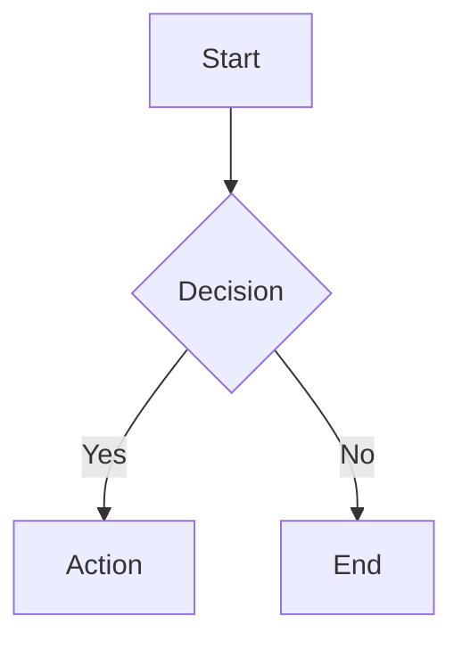

# GitHub Pages Generator Playbook

`/arckit.pages` generates a GitHub Pages documentation site that displays all project documents with Mermaid diagram support.

---

## Inputs

| Artefact | Purpose |
|----------|---------|
| Repository structure | Scans for all ArcKit artifacts |
| `projects/000-global/` | Global documents (principles) |
| `projects/*/` | All project documents |

---

## Command

```bash
/arckit.pages Generate documentation site for this repository
```

Output:
- `docs/index.html` - Main documentation site
- `docs/manifest.json` - Document index

---

## Generated Site Features

| Feature | Description |
|---------|-------------|
| Dashboard | Governance overview with KPI cards, charts, and coverage metrics (default landing page) |
| Sidebar Navigation | Collapsible tree of all projects and documents |
| Markdown Rendering | Full GitHub-flavored markdown support |
| Mermaid Diagrams | Auto-rendered diagram visualizations |
| GOV.UK Styling | Professional government design system |
| Mobile Responsive | Works on all screen sizes |
| Document Caching | Fast navigation between documents |

---

## Document Categories

| Category | Artifacts Included |
|----------|-------------------|
| Discovery | Requirements, Stakeholder Drivers, Research |
| Planning | SOBC, Project Plan, Roadmap, Backlog |
| Architecture | Principles, HLD, DLD, Data Model, Wardley Map |
| Governance | Risk Register, Traceability Matrix |
| Compliance | TCoP, Secure by Design, AI Playbook, ATRS, DPIA |
| Operations | ServiceNow, DevOps, MLOps, FinOps |
| Procurement | SoW, Evaluation Criteria, Vendor Documents |
| Diagrams | All architecture diagrams (Mermaid) |
| Decisions | Architecture Decision Records |

---

## Manifest Structure

```json
{
  "generated": "2026-01-22T10:30:00Z",
  "repository": {
    "owner": "org-name",
    "name": "repo-name",
    "branch": "main"
  },
  "global": [...],
  "projects": [
    {
      "id": "001-project-name",
      "name": "Project Name",
      "documents": [...],
      "diagrams": [...],
      "decisions": [...],
      "vendors": [...]
    }
  ]
}
```

---

## Enabling GitHub Pages

| Step | Action |
|------|--------|
| 1 | Go to repository Settings |
| 2 | Navigate to Pages section |
| 3 | Set Source to "Deploy from a branch" |
| 4 | Set Branch to `main` and folder to `/docs` |
| 5 | Save |

Site available at: `https://{owner}.github.io/{repo}/`

---

## One-Page Workflow

| Phase | Key Activities | ArcKit Commands |
|-------|----------------|-----------------|
| Discovery | Document requirements and stakeholders | `/arckit.requirements`, `/arckit.stakeholders` |
| Design | Create architecture artifacts | `/arckit.hld-review`, `/arckit.diagram` |
| Compliance | Assess against standards | `/arckit.tcop`, `/arckit.secure` |
| Publish | Generate documentation site | `/arckit.pages` |

---

## Mermaid Diagram Support

The generated site automatically renders Mermaid diagrams:

```markdown

```

Supported diagram types:
- Flowcharts
- Sequence diagrams
- C4 diagrams (Context, Container, Component)
- Class diagrams
- State diagrams
- Entity relationship diagrams
- Gantt charts

---

## Technical Stack

| Component | Library | Version |
|-----------|---------|---------|
| Styling | GOV.UK Frontend | 5.13.0 |
| Markdown | marked.js | 15.0.6 |
| Diagrams | mermaid.js | 11.4.1 |

All libraries loaded from CDN for easy updates.

---

## Dashboard

The dashboard (`#dashboard`) is the default landing page, providing an instant portfolio overview computed entirely from `manifest.json` with zero backend.

### KPI Cards (Top Row)

| Card | Metric |
|------|--------|
| Total Projects | Count of numbered projects (`001-*`, `002-*`, etc.) |
| Total Documents | Sum of all documents across projects and global |
| Architecture Decisions | Total ADRs across all projects |
| Avg Artifact Coverage | Percentage of 6 core types (REQ, STKE, RISK, SOBC, PLAN, DATA) present per project, averaged |

### Charts and Panels

| Panel | Description |
|-------|-------------|
| Documents by Category | SVG donut chart showing document distribution across Discovery, Planning, Architecture, etc. |
| Project Artifact Coverage | Horizontal bar chart per project with color coding (green >=80%, amber >=50%, red <50%) |
| Projects Table | Name, Docs, Diagrams, ADRs, Vendors, Coverage mini-bar |
| Guide Maturity | SVG donut chart showing live/beta/alpha/experimental guide counts |
| Governance Coverage | Checklist of key artifact types present/absent across portfolio |

### Coverage Calculation

Coverage measures how many of the 6 core artifact types each project has:
- REQ (Requirements), STKE (Stakeholders), RISK (Risk Register)
- SOBC (Business Case), PLAN (Project Plan), DATA (Data Model)

A project with 4 of 6 types = 67% coverage.

---

## URL Routing

Documents use hash-based routing:

```
https://org.github.io/repo/#dashboard                              (dashboard)
https://org.github.io/repo/#guides                                 (guides index)
https://org.github.io/repo/#projects/001-name/ARC-001-REQ-v1.0.md (document)
```

Benefits:
- Dashboard is the default view (bare URL with no hash)
- Shareable links to specific documents
- Browser back/forward navigation works
- No server-side configuration needed

---

## Review Checklist

- All project folders discovered and indexed.
- Global documents (principles) included.
- Mermaid diagrams render correctly.
- Navigation tree matches repository structure.
- Mobile layout tested.
- GitHub Pages enabled in repository settings.
- Site accessible at expected URL.

---

## Key Principles

1. **Single Source of Truth**: Documents fetched directly from repository.
2. **Auto-Discovery**: Scans for known ArcKit artifact patterns.
3. **Lazy Loading**: Documents fetched on demand for performance.
4. **Offline-Capable**: Once loaded, documents cached in memory.
5. **Accessible**: GOV.UK design system ensures accessibility.
