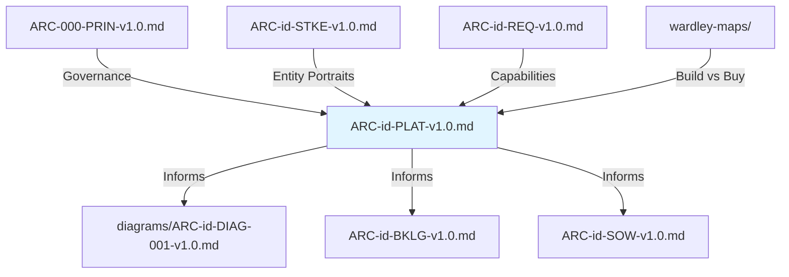

# Platform Strategy Design Guide

`/arckit.platform-design` designs multi-sided platforms using Platform Design Toolkit (PDT) methodology with 8 canvases for ecosystem analysis.

---

## Table of Contents

1. [What is Platform Design Toolkit](#what-is-platform-design-toolkit)
2. [When to Use This Command](#when-to-use-this-command)
3. [The 8 PDT Canvases](#the-8-pdt-canvases)
4. [Prerequisites](#prerequisites)
5. [Command Usage](#command-usage)
6. [UK Government Context](#uk-government-context)
7. [Integration with ArcKit Workflow](#integration-with-arckit-workflow)
8. [Examples](#examples)
9. [Common Pitfalls](#common-pitfalls)
10. [Further Reading](#further-reading)

---

## What is Platform Design Toolkit

The **Platform Design Toolkit (PDT)** is an open-source methodology from [Boundaryless.io](https://boundaryless.io) for designing multi-sided platforms. It provides 8 interconnected canvases that help you systematically design platforms that:

- **Enable transactions** between supply and demand sides
- **Reduce transaction costs** (search, information, negotiation, coordination, enforcement)
- **Create network effects** (same-side, cross-side, data, learning)
- **Build defensible moats** through liquidity and ecosystem effects
- **Solve chicken-and-egg problems** through bootstrapping strategies

### Platform vs. Traditional Business

| Traditional Business | Platform Business |
|---------------------|-------------------|
| Creates value directly | **Enables others to create value** |
| Linear value chain | **Network of value exchanges** |
| Owns resources | **Orchestrates ecosystem** |
| Revenue from products | **Revenue from transactions/data** |
| Economies of scale | **Network effects** |

### Examples of Multi-Sided Platforms

- **Government**: GOV.UK (citizens ↔ services), Digital Marketplace (buyers ↔ suppliers)
- **Healthcare**: NHS App (patients ↔ providers), booking platforms
- **Education**: Online learning (students ↔ educators ↔ employers)
- **Procurement**: G-Cloud (public sector ↔ suppliers)
- **Data**: Data marketplaces (data providers ↔ data consumers)

---

## When to Use This Command

### ✅ Use platform-design when:

1. **Multi-sided market**: You have supply side + demand side (e.g., buyers & sellers, patients & providers)
2. **Transaction-based**: Value comes from enabling exchanges between parties
3. **Network effects**: More participants = more value for everyone
4. **Ecosystem strategy**: You're orchestrating, not just building
5. **Government as a Platform (GaaP)**: Designing reusable services/APIs for other departments

### ❌ Don't use platform-design when:

1. **Single-sided product**: Traditional SaaS/software for one user type
2. **Linear workflow**: Sequential process without network dynamics
3. **Internal system**: No external ecosystem (use `/arckit.diagram` instead)
4. **Simple integration**: Just connecting two systems (use `/arckit.requirements`)

### Decision Tree

```
Is there a supply side AND demand side?
├─ No → Use /arckit.requirements + /arckit.diagram
└─ Yes → Does value increase with more participants?
    ├─ No → Traditional marketplace (use /arckit.requirements)
    └─ Yes → Use /arckit.platform-design ✅
```

---

## The 8 PDT Canvases

### 1. Ecosystem Canvas
**Purpose**: Map all entities in your platform ecosystem

**Key Questions**:
- Who are the platform's supply side entities? (sellers, providers, creators)
- Who are the demand side entities? (buyers, consumers, learners)
- What supporting entities exist? (regulators, payment processors, data providers)
- How do they connect?

**Output**: Entity relationship diagram (Mermaid), entity classification table

**Example** (NHS appointment booking):
- Supply: GP practices, hospitals, specialists
- Demand: Patients, caregivers
- Supporting: NHS Digital, ICB data services, payment gateway

---

### 2. Entity-Role Portraits
**Purpose**: Deep dive into 3-5 key entities to understand motivations

**Key Questions**:
- What is this entity's **context**? (industry, size, maturity, constraints)
- What **performance pressures** do they face? (cost, time, quality, risk)
- What are their **goals**? (strategic objectives, outcomes)
- What **gains** does the platform provide? (pain relievers, gain creators)

**Output**: 3-5 detailed portraits with context → pressures → goals → gains chain

**Why Important**: Without understanding entity motivations, you can't design valuable transactions.

---

### 3. Motivations Matrix
**Purpose**: Identify synergies and conflicts between entities

**Key Questions**:
- Where do entity goals **align**? (win-win transactions)
- Where do they **conflict**? (zero-sum dynamics, trust issues)
- How can platform reduce conflicts? (governance, reputation, escrow)
- What new collaborations are possible? (unexpected pairings)

**Output**: Cross-entity synergy/conflict matrix with mitigation strategies

**Example**: GP practices want fewer no-shows (cost) ↔ Patients want easy rebooking (convenience) → Platform sends SMS reminders + one-click reschedule

---

### 4. Transactions Board
**Purpose**: Design the core value exchanges enabled by the platform

**Key Questions**:
- What **transactions** happen between entities? (bookings, payments, data sharing)
- What **transaction costs** exist today? (search time, information asymmetry, contract negotiation)
- How does the platform **reduce each cost**? (search algorithms, reviews, standard contracts)
- What **data flows** enable transactions? (patient records, availability data, payment info)

**Output**: 10-20 transactions with cost analysis and platform services

**Why Important**: Transaction cost reduction is the core platform value proposition.

---

### 5. Learning Engine Canvas
**Purpose**: Design services that help ecosystem participants improve over time

**Key Questions**:
- What **data** does the platform capture? (usage, ratings, outcomes, behaviors)
- How can entities **learn** from this data? (benchmarks, recommendations, training)
- What **feedback loops** drive improvement? (ratings → better matching, outcomes → better protocols)
- What **network learning effects** exist? (more data → better algorithms → better outcomes)

**Output**: 5+ learning services with data sources and feedback loops

**Example** (G-Cloud):
- Supplier performance data → Buyer recommendations
- Procurement patterns → Cost benchmarks
- Security assessments → Risk scoring

---

### 6. Platform Experience Canvas
**Purpose**: Map the end-to-end journeys for each entity type

**Key Questions**:
- What is the **onboarding** journey? (signup → verification → first transaction)
- What is the **transaction** journey? (search → negotiate → complete → rate)
- What are the **touchpoints**? (web, mobile, API, support)
- What **emotions** do users feel at each stage? (excited, frustrated, confused)
- What **business model** supports this? (commission, subscription, freemium)

**Output**: 2+ journey maps with business model and unit economics

**Why Important**: Great platform mechanics mean nothing if the experience is poor.

---

### 7. Minimum Viable Platform (MVP) Canvas
**Purpose**: Design a validation strategy for your riskiest assumptions

**Key Questions**:
- What **assumptions** must be true for the platform to work? (entities want this, price is right, liquidity achievable)
- What is the **minimum feature set** for first transaction? (no bells and whistles)
- How do you **bootstrap liquidity**? (seed supply side, incentivize demand, staged rollout)
- What **metrics** validate success? (transaction volume, retention, NPS)
- What is the **validation strategy**? (alpha test, pilot region, private beta)

**Output**: Assumption-risk matrix, MVP feature set, bootstrapping plan, validation metrics

**Why Important**: Platforms fail from lack of liquidity, not lack of features. MVP validates demand before scale.

---

### 8. Platform Design Canvas
**Purpose**: Synthesize all insights into cohesive platform strategy

**Key Sections**:
1. **Value Proposition**: What unique value does the platform create?
2. **Ecosystem**: Who participates and why?
3. **Transactions**: What exchanges happen and how?
4. **Learning**: How does the platform get smarter?
5. **Governance**: What rules/policies guide behavior?
6. **Business Model**: How does the platform capture value?

**Output**: One-page strategic overview synthesizing all 8 canvases

**Why Important**: Ensures all design decisions cohere into a viable platform strategy.

---

## Prerequisites

### Required

1. **Architecture Principles** (`/arckit.principles`)
   - Platform governance principles will reference these
   - Example: "Open Standards" principle → platform uses open APIs

### Recommended (enables auto-population)

2. **Stakeholder Analysis** (`/arckit.stakeholders`)
   - Stakeholders → Entity portraits
   - Drivers → Performance pressures
   - Goals → Entity goals

3. **Requirements** (`/arckit.requirements`)
   - Functional requirements → Platform capabilities
   - Data requirements → Data flows in transactions
   - Integration requirements → Supporting entities

4. **Wardley Maps** (`/arckit.wardley`)
   - Component evolution → Build vs. buy decisions
   - Example: "Payment processing" at Commodity (0.9) → Use Stripe/GOV.UK Pay, don't build

### Workflow Order

```
1. /arckit.principles      → Governance foundation
2. /arckit.stakeholders    → Entity portraits
3. /arckit.requirements    → Platform capabilities
4. /arckit.wardley         → Build vs. buy strategy
5. /arckit.platform-design → Synthesize platform strategy ✅
6. /arckit.diagram         → Architecture diagrams
7. /arckit.backlog         → Implementation roadmap
```

---

## Command Usage

### Basic Usage

```
/arckit.platform-design Design NHS appointment booking platform
```

**Output**: Creates `projects/<id>/ARC-<id>-PLAT-v1.0.md` with all 8 canvases

> **Auto-versioning**: Re-running this command when a document already exists automatically increments the version (minor for refreshed content, major for changed scope) instead of overwriting.

### Advanced Usage

```
/arckit.platform-design Design Digital Marketplace for training services connecting:
- Supply: Training providers, independent trainers, content creators
- Demand: Public sector organizations, L&D departments, individual learners
- Supporting: Accreditation bodies (e.g., CPD Standards Office), payment gateway, LMS integrations

Focus on:
1. Liquidity bootstrapping (solve chicken-and-egg)
2. Quality assurance (accreditation, reviews, outcomes)
3. GaaP integration (GOV.UK Pay, Notify, Design System)
4. Data sharing (GDPR compliance, learner records portability)
```

### What the Command Does

1. **Checks prerequisites**: Validates architecture-principles exists, reads stakeholders/requirements/wardley if available
2. **Creates project**: Uses `create-project.sh` to create/find numbered project directory
3. **Auto-populates from context**:
   - Stakeholders → Entity portraits (context, pressures, goals)
   - Requirements → Platform capabilities (FR/DR/INT requirements)
   - Wardley maps → Build vs. buy decisions (component evolution)
   - Architecture principles → Governance principles
4. **Generates all 8 canvases**: Complete PDT methodology with depth
5. **Adds UK Government context**: GaaP, TCoP, Service Standard, Digital Marketplace
6. **Creates traceability**: Links to stakeholders, requirements, principles, Wardley maps
7. **Writes file**: Uses Write tool to create markdown document (avoids token limit)
8. **Shows summary**: Displays key metrics, entity counts, transaction types (not full document)

---

## UK Government Context

### Government as a Platform (GaaP)

The UK Government's [GaaP strategy](https://www.gov.uk/government/publications/government-as-a-platform) treats common capabilities as platforms:

| Platform | Supply Side | Demand Side | Transactions |
|----------|------------|-------------|--------------|
| **GOV.UK Pay** | Payment providers (Stripe, Worldpay) | Public sector services | Payment processing |
| **GOV.UK Notify** | Telcos (SMS, email providers) | Government services | Notifications |
| **Digital Marketplace** | Suppliers (G-Cloud, DOS) | Public sector buyers | Procurement |
| **GOV.UK Design System** | Design contributors | Service teams | UI components, patterns |
| **GOV.UK Verify** (deprecated) | Identity providers | Services needing auth | Identity verification |

**Platform Design Principles** (from GaaP):
1. **Common components**: Reusable across departments
2. **Open standards**: Avoid vendor lock-in
3. **Self-service**: Low friction onboarding
4. **API-first**: Programmatic access
5. **Data portability**: User owns their data

### Technology Code of Practice (TCoP)

Platform designs must align with [TCoP points](https://www.gov.uk/guidance/the-technology-code-of-practice):

- **Point 3 (Be open and use open source)**: Platform APIs should use open standards (REST, GraphQL, OAuth2)
- **Point 5 (Use cloud first)**: Platform infrastructure on AWS/Azure/GCP
- **Point 8 (Share, reuse and collaborate)**: Leverage GOV.UK common platforms
- **Point 11 (Define your purchasing strategy)**: Digital Marketplace for commercial services

### Service Standard

Platform services assessed against [14 points](https://www.gov.uk/service-manual/service-standard):

- **Point 2 (Solve a whole problem for users)**: Platform solves transaction costs, not just matching
- **Point 5 (Make sure everyone can use the service)**: WCAG 2.2 AA accessibility
- **Point 9 (Create a secure service)**: Secure by Design (NCSC CAF)
- **Point 13 (Use and contribute to open standards)**: Open Data Contract Standard for data products

### Digital Marketplace Integration

Platform designs often need to procure services via [Digital Marketplace](https://www.digitalmarketplace.service.gov.uk):

- **G-Cloud**: Buy cloud software/support (e.g., CRM platform, analytics tools)
- **DOS**: Commission custom development (e.g., platform MVP, integration work)

Use `/arckit.gcloud-search` to find relevant services, `/arckit.dos` to generate procurement docs.

---

## Integration with ArcKit Workflow

### How platform-design Uses Other Artifacts



**Input Artifacts**:
- `ARC-000-PRIN-v1.0.md` → Governance principles for platform
- `ARC-<id>-STKE-v1.0.md` → Entity portraits (stakeholders = entities)
- `ARC-<id>-REQ-v1.0.md` → Platform capabilities (FR/DR/INT requirements)
- `wardley-maps/ARC-<id>-WARD-*.md` → Build vs. buy strategy (component evolution)

**Output Artifacts** (created after platform-design):
- `diagrams/ARC-<id>-DIAG-001-v1.0.md` → C4 diagrams of platform technical architecture
- `ARC-<id>-BKLG-v1.0.md` → MVP features converted to user stories, sprint plan
- `ARC-<id>-SOW-v1.0.md` → RFP for platform development (if procuring vendor)
- `ARC-<id>-EVAL-v1.0.md` → Vendor scoring (if multiple proposals)
- `ARC-<id>-TRAC-v1.0.md` → Requirements → Platform components → Tests

### Typical Workflow

```
# Phase 1: Foundation
/arckit.principles       # Define governance principles
/arckit.stakeholders     # Analyze ecosystem entities

# Phase 2: Strategy
/arckit.platform-design  # Design platform strategy (8 canvases)
/arckit.wardley          # Map component evolution (build vs buy)

# Phase 3: Requirements
/arckit.requirements     # Define technical requirements
/arckit.data-model       # Design data architecture
/arckit.diagram          # Create C4/deployment diagrams

# Phase 4: Procurement (if buying)
/arckit.research         # Research platform vendors
/arckit.sow              # Create RFP
/arckit.evaluate         # Score proposals

# Phase 5: Delivery (if building)
/arckit.backlog          # Create sprint plan
/arckit.hld-review       # Review high-level design
/arckit.dld-review       # Review detailed design
```

---

## Examples

### Example 1: NHS Appointment Booking Platform ✅

**Use Case**: Enable patients to book GP/specialist appointments across trusts

**Why Platform Design**:
- Supply side: GP practices, hospitals, specialists (own calendars/availability)
- Demand side: Patients, caregivers (need appointments)
- Transaction: Appointment booking (reduces search time, phone wait times)
- Network effects: More providers → more choice → more patients → more data → better matching

**Key Canvases**:
- **Ecosystem**: NHS trusts, GP practices, patients, NHS Digital (identity), ICBs (data governance)
- **Transactions**: Book appointment, reschedule, cancel, SMS reminder, outcomes reporting
- **Learning Engine**: No-show prediction, optimal appointment duration, provider ratings
- **MVP**: Pilot with 3 GP practices in one ICB, 1000 patients, validate 20% reduction in phone bookings

**Outcome**: Platform design feeds into technical requirements, data model (patient records, calendars), integration requirements (NHS Login, PDS, GP systems), architecture diagrams.

---

### Example 2: Digital Marketplace for Training Services ✅

**Use Case**: Connect public sector organizations with training providers

**Why Platform Design**:
- Supply side: Training providers, independent trainers, content creators
- Demand side: Public sector L&D departments, individual civil servants
- Transaction: Course booking, certification, outcomes tracking
- Network effects: More providers → more courses → more learners → more data → better recommendations

**Key Canvases**:
- **Ecosystem**: Training suppliers, accreditation bodies (CPD Standards Office), public sector orgs, learners, LMS integrations
- **Transactions**: Search courses, compare providers, book training, track CPD, share certificates
- **Learning Engine**: Course effectiveness (pre/post assessments), provider quality (ratings + outcomes), skill gap analysis
- **MVP**: 10 accredited providers, 5 departments, 100 learners, validate 30% cost reduction vs. traditional procurement

**Outcome**: Informs G-Cloud service search (LMS, video platforms), DOS procurement (custom development), requirements (GDPR for learner data, WCAG 2.2 AA), Service Standard assessment.

---

### Example 3: Internal Employee Directory ❌

**Why NOT Platform Design**:
- No multi-sided market (just employees looking up colleagues)
- No transactions (just information retrieval)
- No network effects (value doesn't increase with more users)
- Linear workflow (search → view profile)

**Correct Approach**: Use `/arckit.requirements` for functional requirements, `/arckit.diagram` for architecture.

---

### Example 4: Data Marketplace for Local Authorities ✅

**Use Case**: Enable councils to share/buy datasets (e.g., planning data, environmental sensors)

**Why Platform Design**:
- Supply side: Local authorities with datasets, IoT sensor providers
- Demand side: Local authorities needing data, researchers, urban planners
- Transaction: Data product licensing (Open Data Contract Standard v3.0.2)
- Network effects: More data sources → richer analytics → more demand → more supply

**Key Canvases**:
- **Ecosystem**: 317 local authorities, central government, researchers, data processors, cloud storage (AWS S3)
- **Transactions**: Publish data product, license dataset, query API, manage access controls, data quality SLA
- **Learning Engine**: Data quality scoring (completeness, timeliness), usage patterns → recommendations, schema evolution
- **MVP**: 5 councils, 20 datasets (planning, transport, environment), 10 consumers, validate 50% faster data access vs. FOI requests

**Synergy**: Use `/arckit.data-mesh-contract` after platform-design to define data product contracts (SLAs, schemas, governance).

---

## Common Pitfalls

### 1. Confusing Platform with Product

**Mistake**: Designing a single-sided product but calling it a platform.

**Example**: "HR platform for managing employees" → This is HR software (product), not a platform (no multi-sided market).

**Fix**: If there's no supply + demand + transactions, use `/arckit.requirements` instead.

---

### 2. Ignoring Liquidity Bootstrapping

**Mistake**: Designing platform mechanics without solving chicken-and-egg problem.

**Example**: "We'll launch with perfect matching algorithm" → But no supply to match with demand.

**Fix**: MVP Canvas should prioritize bootstrapping strategy (seed supply, incentivize demand, staged rollout).

---

### 3. Over-Engineering the MVP

**Mistake**: Building all 8 canvases worth of features before first transaction.

**Example**: "We need learning engine, advanced analytics, and mobile app before launch."

**Fix**: MVP Canvas should identify **minimum features for first transaction** (e.g., manual matching, basic profiles, email notifications).

---

### 4. Neglecting Transaction Costs

**Mistake**: Focusing on matching but ignoring why transactions are costly today.

**Example**: "Platform matches patients with doctors" → But doesn't address trust (doctor credentials), coordination (scheduling conflicts), enforcement (no-shows).

**Fix**: Transactions Board should analyze **all 5 transaction costs** and how platform reduces each.

---

### 5. Forgetting Data Governance

**Mistake**: Designing data flows without GDPR/data protection considerations.

**Example**: "Platform shares patient data with all providers for better matching."

**Fix**: Platform Design Canvas should include governance rules (consent, data minimization, right to erasure). Use `/arckit.dpia` for GDPR compliance.

---

### 6. Assuming Network Effects

**Mistake**: "More users = more value" without understanding why.

**Example**: "More doctors on platform = better outcomes" → Not if matching algorithm is poor or supply/demand is imbalanced.

**Fix**: Learning Engine Canvas should explain **specific feedback loops** (e.g., more bookings → better no-show prediction → better scheduling → fewer wasted slots).

---

## Further Reading

### Platform Design Toolkit (PDT)

- **Official Website**: [boundaryless.io/pdt-toolkit](https://boundaryless.io/pdt-toolkit)
- **Canvas Downloads**: [PDT v2.2.1](https://boundaryless.io/pdt-toolkit) (CC-BY-SA license)
- **User Guide**: Included in PDT download (PDF)
- **Stories**: [stories.platformdesigntoolkit.com](https://stories.platformdesigntoolkit.com)

### Platform Economics

- **"Platform Revolution" (2016)**: Parker, Van Alstyne, Choudary - Foundational text on platform business models
- **"Modern Monopolies" (2016)**: Moazed, Johnson - Explains platform vs. pipeline businesses
- **Transaction Cost Economics**: Coase, Williamson - Academic foundation for why platforms reduce costs

### UK Government Resources

- **Government as a Platform**: [gov.uk/government/publications/government-as-a-platform](https://www.gov.uk/government/publications/government-as-a-platform)
- **Technology Code of Practice**: [gov.uk/guidance/the-technology-code-of-practice](https://www.gov.uk/guidance/the-technology-code-of-practice)
- **Service Standard**: [gov.uk/service-manual/service-standard](https://www.gov.uk/service-manual/service-standard)
- **Digital Marketplace**: [digitalmarketplace.service.gov.uk](https://www.digitalmarketplace.service.gov.uk)

### Related ArcKit Commands

- `/arckit.stakeholders` - Entity analysis (feeds into Entity Portraits)
- `/arckit.wardley` - Component evolution (feeds into build vs. buy)
- `/arckit.data-mesh-contract` - Data product contracts for data platforms
- `/arckit.diagram` - Platform architecture diagrams (C4 model)
- `/arckit.backlog` - MVP features → user stories → sprints
- `/arckit.service-assessment` - GDS Service Standard for platform services
