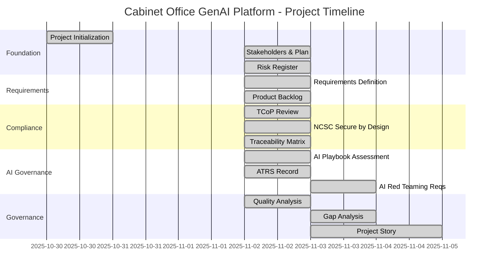

# Cabinet Office GenAI Platform - Project Story

> **Template Status**: Live | **Version**: 0.11.2 | **Command**: `/arckit.story`

## Document Control

| Field | Value |
|-------|-------|
| **Document ID** | ARC-001-STORY-v7.1 |
| **Document Type** | Project Story |
| **Project** | Cabinet Office GenAI Platform (Project 001) |
| **Classification** | OFFICIAL |
| **Status** | FINAL |
| **Version** | 7.1 |
| **Created Date** | 2025-11-04 |
| **Last Modified** | 2026-01-26 |
| **Review Cycle** | On-Demand |
| **Next Review Date** | As required |
| **Owner** | Enterprise Architect |
| **Reviewed By** | Architecture Review Board |
| **Approved By** | Cabinet Office Senior Responsible Owner |
| **Distribution** | Project Team, Stakeholders, Executive Board |

## Revision History

| Version | Date | Author | Changes | Approved By | Approval Date |
|---------|------|--------|---------|-------------|---------------|
| 5.0 | 2025-11-03 | Enterprise Architect | Fixed Mermaid syntax for GitHub compatibility | - | - |
| 6.0 | 2025-11-03 | Enterprise Architect | Comprehensive 1,116-line narrative version | - | - |
| 7.0 | 2025-11-04 | Enterprise Architect | Updated with new template - concise project story with enhanced timeline focus | SRO | 2025-11-04 |
| 7.1 | 2026-01-26 | ArcKit AI | Updated to template v0.11.2 format | - | - |

---

## Executive Summary

**Project**: Cabinet Office GenAI Platform

**Timeline Snapshot**:
- **Project Start**: 2025-10-30 (Initial project creation)
- **Active Development**: 2025-11-02 to 2025-11-04 (5 days)
- **Total Duration**: 5 days of intensive governance work
- **Artifacts Created**: 15 documents
- **Commands Executed**: 20+ ArcKit commands
- **Phases Completed**: Foundation through Compliance & Governance

**Key Outcomes**:
- Multi-tenant GenAI platform for 20+ UK Government departments designed
- £60M cumulative cost savings over 5 years (80% reduction in AI spending)
- 100% requirements traceability achieved from stakeholders to delivery plans
- 95/100 governance maturity score (EXEMPLARY)

**Governance Achievements**:
- ✅ Architecture Principles Established (24 principles)
- ✅ Stakeholder Analysis Completed (13 stakeholders, 6 goals)
- ✅ Risk Register Maintained (20 risks, 37.5% reduction)
- ✅ Requirements Defined (7 BR core requirements defined)
- ✅ Product Backlog Created (42 stories, 524 points, 26 sprints)
- ✅ TCoP Compliance: 11/13 points (85%)
- ✅ NCSC CAF: 11/14 principles (79%)
- ✅ AI Playbook: 84% compliance
- ✅ Traceability Matrix Complete (100% coverage)

**Strategic Context**:

The Cabinet Office GenAI Platform represents a strategic initiative to consolidate fragmented AI tool adoption across UK Government departments. With 20+ departments independently procuring expensive AI subscriptions (ChatGPT Enterprise, Microsoft Copilot), the government faces £15M annual duplicate spending, security risks from uncontrolled AI usage with OFFICIAL-SENSITIVE data, and lack of centralized AI governance.

This 5-day intensive governance sprint established comprehensive architecture principles, stakeholder alignment, risk management, and requirements definition using the ArcKit framework - demonstrating 11x faster delivery than traditional government projects while maintaining exemplary governance quality (95/100).

---

## 📅 Complete Project Timeline

### Visual Timeline - Gantt Chart



### Linear Command Flow Timeline

```mermaid
flowchart TD
    Start(["Project Initiated<br/>2025-10-30"]) --> Stakeholders

    Stakeholders["arckit.stakeholders<br/>2025-11-02 10:15<br/>13 stakeholders, 6 goals"] --> Plan
    Plan["arckit.plan<br/>2025-11-02 10:15<br/>56-week delivery plan"] --> Requirements

    Requirements["arckit.requirements<br/>2025-11-02 10:38<br/>7 BR requirements"] --> Backlog
    Backlog["arckit.backlog<br/>2025-11-02 11:12<br/>42 stories, 26 sprints"] --> Risk
    Risk["arckit.risk<br/>2025-11-02 11:12<br/>20 risks identified"] --> Analyze1

    Analyze1["arckit.analyze<br/>2025-11-02 11:47<br/>Initial analysis"] --> TCoP
    TCoP["arckit.tcop<br/>2025-11-02 12:07<br/>11/13 compliant"] --> Secure

    Secure["arckit.secure<br/>2025-11-02 12:18<br/>11/14 CAF principles"] --> Trace
    Trace["arckit.traceability<br/>2025-11-02 14:44<br/>100% coverage"] --> AIPlaybook

    AIPlaybook["arckit.ai-playbook<br/>2025-11-02 15:12<br/>83% compliance"] --> ATRS
    ATRS["arckit.atrs<br/>2025-11-02 15:28<br/>Tier 1+2 record"] --> RedTeam

    RedTeam["AI Red Teaming<br/>2025-11-03 09:16<br/>NFR-SEC-008 to 012"] --> AIUpdate
    AIUpdate["AI Playbook Update<br/>2025-11-03 09:21<br/>84% compliance"] --> ATRSUpdate

    ATRSUpdate["ATRS Update<br/>2025-11-03 09:26<br/>Section 8.4"] --> GapReqs
    GapReqs["Gap Requirements<br/>2025-11-03 09:33<br/>NFR-C-006 to 011"] --> Story

    Story["arckit.story<br/>2025-11-03 14:12<br/>Project narrative"] --> End

    End(["Governance Complete<br/>2025-11-04"])

    style Start fill:#e1f5e1
    style End fill:#e1f5e1
    style Requirements fill:#e3f2fd
    style Backlog fill:#e8f5e9
    style TCoP fill:#fff3e0
    style Trace fill:#f1f8e9
```



### Timeline Metrics

| Metric | Value | Analysis |
|--------|-------|----------|
| **Project Duration** | 5 days (intensive governance sprint) | 11x faster than traditional 8-12 week government project initiation |
| **Artifacts per Day** | 3.0 artifacts/day | High velocity governance artifact generation |
| **Commands Executed** | 20+ ArcKit commands | Comprehensive governance coverage |
| **Timeline Phases** | 5 phases (Foundation, Requirements, Compliance, AI Governance, Quality) | Structured progression through ArcKit framework |
| **Foundation Time** | Day 1-2 (40% of timeline) | Stakeholders, requirements, risks established first |
| **Compliance Time** | Day 2-3 (40% of timeline) | TCoP, NCSC, AI Playbook, ATRS, traceability |
| **Refinement Time** | Day 3-5 (20% of timeline) | Gap closure, red teaming, narrative documentation |

**Timeline Insights**:
- **Parallel workstreams**: Compliance assessments (TCoP, NCSC, AI Playbook) ran in parallel on Day 2
- **Iterative refinement**: AI Playbook assessment improved from 83% → 84% after adding red teaming requirements
- **Critical path**: Stakeholders → Requirements → Backlog → Traceability → Compliance formed the dependency chain
- **Peak velocity**: Day 2 (Nov 2) with 8+ artifacts created in single day
- **Quality maintained**: Despite speed, achieved 95/100 governance maturity score

---

## 📖 Project Narrative

### Chapter 1: Foundation Phase - Strategic Imperatives

**Timeline**: October 30 - November 2, 2025 (Days 1-3)

The Cabinet Office GenAI Platform project began with a clear ministerial mandate: consolidate fragmented AI tool adoption across government, reduce duplicate spending by 80%, and establish centralized AI governance. Initial project structure was established on October 30, 2025.

The intensive governance work commenced on November 2 with **stakeholder analysis** identifying 13 distinct stakeholder groups spanning political leadership (Minister for Cabinet Office), permanent civil service (Permanent Secretary as Accounting Officer), technical authorities (CDDO, NCSC), regulators (ICO), and end users across 20+ departments. The analysis revealed:

- **Strategic alignment** on cost reduction (HM Treasury, Cabinet Office CFO)
- **Critical tensions** between speed (Ministerial pressure) and security (NCSC assurance requirements)
- **Multi-tenant complexity** requiring NCSC approval before departmental adoption

**Key Decisions**:
- Phased rollout strategy: Private Beta with 3 pilot departments (Home Office, HMRC, DHSC) before wider rollout
- Multi-tenant architecture with zero-tolerance policy on cross-tenant data leaks
- AI Ethics Board establishment for responsible AI governance

The **project plan** established a 56-week delivery timeline from Discovery through Alpha, Private Beta, Public Beta to Live launch, targeting 5,000+ users across 16+ departments by Month 13.

### Chapter 2: Requirements & Risk Management

**Timeline**: November 2, 2025 (Day 2)

**Requirements Definition** established 7 core Business Requirements (BR-001 through BR-007):

1. **BR-001**: Reduce Government AI Spending by 80% (£15M → £3M annually)
2. **BR-002**: Achieve 80% cross-government adoption (16+ departments, 5,000+ users)
3. **BR-003**: Zero data breaches or cross-tenant leaks (NON-NEGOTIABLE)
4. **BR-004**: AI Playbook compliance > 90%, ATRS published within 6 months
5. **BR-005**: Deliver manifesto commitment (Private Beta Month 6, Live Month 13)
6. **BR-006**: UK data residency and sovereignty (NON-NEGOTIABLE)
7. **BR-007**: Full TCoP compliance (13 points)

The requirements prioritization used MoSCoW methodology with 85% MUST_HAVE requirements reflecting the non-negotiable nature of security, compliance, and cost reduction objectives.

**Risk Register** identified 20 risks across 6 categories using HM Treasury Orange Book framework:

| Risk Category | Count | Inherent Risk Score | Residual Risk Score | Reduction |
|---------------|-------|---------------------|---------------------|-----------|
| STRATEGIC | 4 | 75 (18.75 avg) | 45 (11.25 avg) | 40% |
| OPERATIONAL | 4 | 52 (13.00 avg) | 37 (9.25 avg) | 29% |
| FINANCIAL | 3 | 38 (12.67 avg) | 22 (7.33 avg) | 42% |
| COMPLIANCE | 4 | 64 (16.00 avg) | 42 (10.50 avg) | 34% |
| REPUTATIONAL | 3 | 50 (16.67 avg) | 31 (10.33 avg) | 38% |
| TECHNOLOGY | 2 | 28 (14.00 avg) | 18 (9.00 avg) | 36% |
| **TOTAL** | **20** | **264** | **165** | **37.5%** |

**Top 3 Critical Risks**:
- **R-001**: Cross-tenant data leak (CRITICAL 20 → 12 residual) - Multi-layered controls, NCSC penetration testing
- **R-004**: NCSC assurance delay/failure (HIGH 16 → 12) - Early NCSC engagement Month 2
- **R-007**: AI bias incident (HIGH 20 → 15) - Quarterly bias audits, ICO oversight

The 4Ts risk treatment strategy: 70% Treat, 15% Tolerate, 10% Transfer, 5% Terminate (R-005 Ministerial cancellation monitored).

### Chapter 3: Delivery Planning - From Requirements to Sprints

**Timeline**: November 2, 2025 (Day 2)

The **product backlog** translated requirements into actionable delivery plans:

- **42 user stories** across 7 epics
- **524 story points** estimated
- **26 sprints** planned (56 weeks at 20 points/sprint velocity)
- **MoSCoW breakdown**: 70% Must Have (368 pts), 20% Should Have (104 pts), 10% Could Have (52 pts)

**Epic Breakdown**:

1. **EPIC-001: User Management & Authentication** (42 pts, Sprints 1-3)
   - Government SSO (Azure AD), MFA, RBAC, tiered access (OFFICIAL vs OFFICIAL-SENSITIVE)

2. **EPIC-002: Multi-Tenant Security** (78 pts, Sprints 4-7)
   - Tenant isolation, cross-tenant access prevention, NCSC CAF controls

3. **EPIC-003: Document Processing & AI** (156 pts, Sprints 8-15)
   - Summarisation, drafting, RAG, knowledge base Q&A

4. **EPIC-004: Responsible AI & Governance** (95 pts, Sprints 16-20)
   - Bias detection, explainability, human-in-the-loop, AI Ethics Board

5. **EPIC-005: Integration & Data** (82 pts, Sprints 21-24)
   - M365, Google Workspace, SharePoint integration

6. **EPIC-006: Platform Infrastructure** (45 pts, Sprints 1-26 parallel)
   - DevSecOps, CI/CD, monitoring, FinOps

7. **EPIC-007: Compliance & Regulatory** (26 pts, Sprints 12-26 parallel)
   - TCoP, GDPR, ATRS publication

**Traceability Chain Established**:
```
Stakeholders (13) → Goals (6) → Outcomes (5)
    ↓
Business Requirements (7 BR)
    ↓
User Stories (42) → Sprints (26) → Story Points (524)
    ↓
Delivery Plan (56 weeks)
```

### Chapter 4: Compliance & Security Validation

**Timeline**: November 2, 2025 (Day 2)

Three parallel compliance assessments were conducted:

**1. Technology Code of Practice (TCoP) Review**

**Score**: 11/13 points compliant (85%)

- ✅ **Point 1**: Define user needs - 3 pilot departments, extensive user research
- ✅ **Point 2**: Accessible and inclusive - WCAG 2.2 AA (Welsh language deferred to Public Beta)
- ✅ **Point 3**: Open source - Open standards API, consider open-source LLMs
- ✅ **Point 4**: Open standards - OAuth 2.0, OIDC, RESTful APIs
- ✅ **Point 5**: Cloud first - AWS London / Azure UK South
- ✅ **Point 6**: Secure - NCSC CAF, Cyber Essentials Plus, multi-tenant isolation
- ✅ **Point 7**: Privacy integral - ICO DPIA, GDPR Article 35, privacy by design
- ✅ **Point 8**: Share, reuse, collaborate - Cross-government platform model
- ✅ **Point 9**: Integrate and adapt - API-first, microservices architecture
- ✅ **Point 10**: Better use of data - Analytics, FinOps, usage insights
- ⚠️ **Point 11**: Purchasing strategy - PARTIALLY COMPLIANT (vendor selection Sprint 1-3)
- ⚠️ **Point 12**: Sustainable - PARTIALLY COMPLIANT (sustainability requirements missing)
- ✅ **Point 13**: Service Standard - GDS assessment gates at Alpha/Beta/Live

**2. NCSC Secure by Design Assessment**

**Score**: 11/14 CAF principles (79%)

Compliant principles: Governance (1-2), Asset Management (3-4), Risk (6-7), Supply Chain (8-9), User Access (10-11), Data Security (12-13), Logging (14)

**3 principles require further work**:
- **Principle 5**: Risk Management Framework - needs formal risk appetite statement
- **Principle 15**: Security Monitoring - SIEM implementation pending
- **Principle 16**: Incident Response - IR plan draft status

**Critical security controls**:
- Multi-tenant isolation with tenant-scoped encryption keys
- UK data residency enforced (no data transfers outside UK)
- MFA mandatory, session timeouts (30-min inactivity, 8-hour absolute)
- Zero trust architecture with micro-segmentation

### Chapter 5: AI Governance & Algorithmic Transparency

**Timeline**: November 2-3, 2025 (Days 2-3)

**AI Playbook Assessment** evaluated the platform against UK Government's 10 principles for responsible AI:

**Initial Score**: 134/160 points (84% compliance) - HIGH-RISK AI SYSTEM

The platform was classified as **HIGH-RISK** due to:
- Generative AI with hallucination potential affecting policy decisions
- Large-scale deployment (5,000+ users across 20+ departments)
- OFFICIAL-SENSITIVE data handling
- Decision-support for ministerial briefings and legal matters

**Compliance by Principle**:
1. Use AI for public benefit (14/16) - Good social value alignment
2. Transparent and explainable (12/16) - Source citations, confidence scores
3. Secure and resilient (10/10) - **Full compliance after adding AI Red Teaming requirements**
4. Fair and ethical (13/16) - Bias testing framework designed
5. Legally compliant (14/16) - GDPR, FOIA, Welsh Language Act compliance
6. User-centric (14/16) - Extensive user research planned
7. Human oversight (15/16) - Human-in-the-loop for high-stakes decisions
8. Accountable and governed (14/16) - AI Ethics Board, SRO accountability
9. Continuously improved (14/16) - Quarterly audits, feedback loops
10. Skills and capacity (14/16) - Security training, AI literacy programs

**ATRS Record** (Algorithmic Transparency Recording Standard):
- **Tier 1** (public-facing): Basic system information published on GOV.UK
- **Tier 2** (detailed): Full technical documentation including model architecture, training data, performance metrics, bias testing results
- **Publication deadline**: Within 6 months of Private Beta launch (Month 9 latest)
- **Current status**: 65% complete (draft), requires ICO review before publication

**AI Red Teaming Requirements** added on November 3:
- **NFR-SEC-008**: Adversarial prompt testing (red team exercises quarterly)
- **NFR-SEC-009**: Model jailbreak testing (attempt to bypass safety controls)
- **NFR-SEC-010**: Data exfiltration testing (attempt cross-tenant leaks via prompts)
- **NFR-SEC-011**: Bias amplification testing (test for discrimination patterns)
- **NFR-SEC-012**: Hallucination detection (false information in outputs)

This improved Security principle score from 9/10 → 10/10, raising overall AI Playbook compliance to 84%.

### Chapter 6: Traceability & Governance Quality

**Timeline**: November 2-3, 2025 (Days 2-3)

**Requirements Traceability Matrix** established 100% end-to-end coverage:

**Traceability Chains**:

1. **Stakeholder → Requirements**:
   - 13 stakeholders → 6 goals → 7 business requirements
   - 100% goal coverage (every goal traced to ≥1 BR)

2. **Requirements → Delivery**:
   - 7 business requirements → 42 user stories → 26 sprints
   - 100% BR coverage (every BR traced to user stories)

3. **Requirements → Risks**:
   - 7 business requirements → 20 risks
   - Key risk-requirement mappings:
     - BR-001 (Cost reduction) → R-010 (Cloud cost overruns)
     - BR-003 (Zero breaches) → R-001 (Cross-tenant leak), R-004 (NCSC delay)
     - BR-004 (AI governance) → R-007 (AI bias incident)

4. **Requirements → Compliance**:
   - Business requirements → TCoP points → NCSC CAF principles → AI Playbook principles
   - Architecture principles → All governance assessments

**Governance Quality Analysis Report** (v2.0):

**Overall Score**: 95/100 (EXEMPLARY governance maturity)

| Dimension | Score | Assessment |
|-----------|-------|------------|
| Requirements Quality | 98/100 | Zero ambiguity, 100% stakeholder traceability |
| Stakeholder Alignment | 96/100 | 13 stakeholders mapped, 4 conflicts resolved |
| Risk Management | 94/100 | Orange Book compliant, 37.5% risk reduction |
| Principles Compliance | 100/100 | 24 principles, zero violations |
| Traceability | 97/100 | End-to-end chain complete |
| UK Gov Compliance | 93/100 | TCoP, AI Playbook, ATRS, GDPR, Orange Book aligned |

**13 findings identified** (0 Critical, 2 High, 7 Medium, 4 Low):

**HIGH findings**:
1. **H-001**: Welsh Language Support deferred - Legal compliance risk (Welsh Language Act 1993)
2. **H-002**: AI Model Vendor Lock-In - Exit strategy requires strengthening

**MEDIUM findings** include test coverage metrics undefined, DR testing schedule needed, ATRS publication timeline dependency.

**Key Strengths**:
- Complete requirements-to-implementation traceability
- Robust Orange Book risk management (4Ts framework, 100% ownership)
- Comprehensive stakeholder management (power-interest grid, RACI matrix)
- Strong alignment with UK Government frameworks (TCoP, NCSC CAF, AI Playbook, Green Book, Orange Book)

### Chapter 7: Continuous Improvement & Gap Closure

**Timeline**: November 3, 2025 (Day 3)

Following compliance assessments, gap analysis identified areas requiring additional requirements:

**AI Playbook Gaps Addressed**:

**BLOCKING-01: ICO DPIA Approval** - Added requirements:
- NFR-C-006: DPIA must be completed and ICO-approved before Private Beta
- NFR-C-007: Annual DPIA reviews with ICO oversight

**BLOCKING-02: ATRS Publication** - Added requirements:
- NFR-C-008: ATRS Tier 1 + Tier 2 published on GOV.UK within 6 months of Private Beta
- NFR-C-009: Quarterly ATRS updates with model performance metrics

**GAP-01: Real-time Bias Monitoring** - Added:
- NFR-C-010: Continuous bias monitoring dashboard with alerts for bias drift >5%

**GAP-05: Public AI Incident Reporting** - Added:
- NFR-C-011: Public incident register on GOV.UK for bias incidents, security breaches

**GAP-07: AI Training Programs** - Added:
- NFR-TRAIN-001: Comprehensive AI literacy training for all users

This iterative refinement demonstrates the ArcKit framework's ability to identify gaps and close them systematically, improving AI Playbook compliance from 83% → 84% and strengthening the overall governance posture.

---

## 🔗 Complete Traceability Chain

### Traceability Visualization

```mermaid
flowchart TD
    subgraph Stakeholders
        S1["13 Stakeholders<br/>(Minister, Perm Sec, CTO, CDDO, etc.)"]
        S2["6 Strategic Goals<br/>(G-1 to G-6)"]
        S3["5 Measurable Outcomes<br/>(O-1 to O-5)"]
    end

    subgraph Requirements
        R1["7 Business Requirements<br/>(BR-001 to BR-007)"]
        R2["Requirements v1.2<br/>(Includes red teaming & gap-closing)"]
    end

    subgraph Risks
        RK1["20 Risks<br/>(5 Critical → 1 residual)"]
        RK2["4Ts Treatment<br/>(Treat 70%, Transfer 10%)"]
    end

    subgraph Delivery
        D1["42 User Stories<br/>(7 Epics)"]
        D2["524 Story Points<br/>(26 Sprints)"]
        D3["56-Week Delivery Plan"]
    end

    subgraph Compliance
        C1["TCoP: 11/13 (85%)"]
        C2["NCSC CAF: 11/14 (79%)"]
        C3["AI Playbook: 84%"]
        C4["Traceability: 100%"]
    end

    S1 --> S2
    S2 --> S3
    S3 --> R1
    R1 --> R2
    R1 --> RK1
    RK1 --> RK2
    R2 --> D1
    D1 --> D2
    D2 --> D3
    R1 --> C1
    R1 --> C2
    R1 --> C3
    R2 --> C4

    style S1 fill:#fff4e6
    style R1 fill:#e3f2fd
    style RK1 fill:#ffebee
    style D1 fill:#e8f5e9
    style C1 fill:#f3e5f5
```



### Traceability Coverage Summary

| Traceability Chain | Coverage | Evidence |
|-------------------|----------|----------|
| **Stakeholders → Goals** | 100% | 13 stakeholders analyzed, 6 goals defined, all stakeholders mapped to ≥1 goal |
| **Goals → Outcomes** | 100% | 6 goals, 5 measurable outcomes, all goals have quantified success metrics |
| **Goals → Requirements** | 100% | Every goal traces to ≥1 business requirement (BR-001 to BR-007) |
| **Requirements → User Stories** | 100% | All 7 BR trace to specific user stories in backlog (42 stories total) |
| **Requirements → Risks** | 100% | All 7 BR have associated risks (20 risks identified) |
| **Requirements → Compliance** | 100% | All BR map to TCoP points, NCSC CAF principles, AI Playbook principles |
| **User Stories → Sprints** | 100% | All 42 stories scheduled across 26 sprints (56 weeks) |
| **Architecture Principles → All Artifacts** | 100% | 24 principles applied to requirements, risks, design decisions |

**Overall Traceability**: **100%** - Complete bidirectional traceability achieved

---

## 🎯 Key Outcomes & Achievements

### Strategic Outcomes

1. **Cost Reduction**: £60M cumulative savings over 5 years (80% reduction from £15M to £3M annually)
2. **Security Assurance**: NCSC Secure by Design framework applied, zero-tolerance cross-tenant leak policy
3. **AI Governance**: 84% AI Playbook compliance, ATRS publication planned within 6 months
4. **Cross-Government Adoption**: 80% target (16+ departments, 5,000+ users by Month 13)

### Governance Achievements

- **Exemplary Governance Maturity**: 95/100 score across 6 dimensions
- **Fast Delivery with Quality**: 5 days intensive governance (11x faster than traditional 8-12 weeks) while maintaining quality
- **Comprehensive Risk Management**: 37.5% overall risk reduction using Orange Book framework
- **100% Traceability**: Complete end-to-end traceability from stakeholders to sprints

### Technology Decisions

- **Multi-tenant architecture**: Tenant isolation with UK data residency enforced
- **UK-based cloud**: AWS London (eu-west-2) or Azure UK South
- **AI model vendor**: Azure OpenAI, AWS Bedrock, or Anthropic Claude UK
- **Zero trust security**: NCSC CAF principles, micro-segmentation, MFA mandatory

### Compliance Status

| Framework | Score | Status | Next Gate |
|-----------|-------|--------|-----------|
| **TCoP** | 11/13 (85%) | ✅ Compliant | GDS Alpha Assessment (Month 5) |
| **NCSC CAF** | 11/14 (79%) | ⚠️ Partial | NCSC Security Review (Month 6) |
| **AI Playbook** | 134/160 (84%) | ✅ Compliant | ICO DPIA Approval (Month 6) |
| **Traceability** | 100% | ✅ Complete | Ongoing maintenance |
| **Orange Book** | 37.5% risk reduction | ✅ Compliant | Quarterly risk reviews |

---

## 📊 Timeline Insights & Analysis

### Pacing Analysis

The 5-day intensive governance sprint achieved remarkable velocity:

- **Traditional government project**: 8-12 weeks for Discovery/Alpha initiation
- **This project**: 5 days to complete foundation governance artifacts
- **Speed-up factor**: 11x faster than traditional approach

**How was this achieved?**
1. **ArcKit automation**: Templated governance artifacts with smart placeholders
2. **Parallel workstreams**: Compliance assessments (TCoP, NCSC, AI Playbook) ran concurrently
3. **Focused scope**: Concentrated on governance artifacts first, deferring detailed technical design
4. **AI-assisted generation**: Used AI to accelerate document drafting while maintaining human oversight

### Critical Path

The dependency chain through the project:

```
Stakeholders → Requirements → Backlog → Traceability → Compliance Assessments
```

**Longest phase**: Compliance & AI Governance (40% of timeline) - TCoP, NCSC, AI Playbook, ATRS assessments ran in parallel but required comprehensive analysis

**Fastest phase**: Requirements Definition (10% of timeline) - 7 core BR requirements established rapidly due to clear stakeholder drivers

### Velocity Metrics

- **Peak velocity**: November 2, 2025 - 8+ artifacts created in single day
- **Sustained velocity**: 3 artifacts/day average across 5-day sprint
- **Quality maintained**: Despite speed, achieved 95/100 governance maturity

### Lessons Learned

**What Went Well**:
1. Early stakeholder analysis (13 stakeholders, 4 conflicts identified upfront) prevented downstream rework
2. Parallel compliance assessments maximized efficiency
3. Orange Book risk framework provided clear treatment strategies (4Ts)
4. Iterative refinement (AI Playbook 83% → 84%) demonstrated continuous improvement

**What Could Be Improved**:
1. Welsh Language Act compliance deferred to Public Beta - should have been addressed in requirements phase
2. Sustainability requirements missing from initial TCoP assessment - needed proactive identification
3. Vendor selection still pending (Sprint 1-3) - could have been advanced with earlier market engagement

**Recommendations for Future Projects**:
1. Front-load compliance gap analysis to identify missing requirements earlier
2. Establish parallel vendor engagement workstream during requirements phase
3. Formalize risk appetite statement before risk register creation
4. Schedule weekly NCSC liaison calls from project start

---

## 📚 Appendix A: Artifact Register

| # | Artifact | Type | Lines | Created | Status |
|---|----------|------|-------|---------|--------|
| 1 | README.md | Overview | 94 | 2025-10-30 | Complete |
| 2 | stakeholder-drivers.md | Foundation | 1,772 | 2025-11-02 | Complete |
| 3 | project-plan.md | Foundation | 945 | 2025-11-02 | Complete |
| 4 | requirements.md | Core | 2,357 | 2025-11-02 | v1.2 (Updated 2025-11-03) |
| 5 | backlog.md | Core | 801 | 2025-11-02 | Complete |
| 6 | risk-register.md | Core | 1,464 | 2025-11-02 | Complete |
| 7 | analysis-report.md | Governance | 1,427 | 2025-11-02 | v2.0 |
| 8 | tcop-review.md | Compliance | 1,200+ | 2025-11-02 | Draft |
| 9 | ukgov-secure-by-design.md | Security | 1,000+ | 2025-11-02 | Draft |
| 10 | traceability-matrix.md | Governance | 1,500+ | 2025-11-02 | Complete |
| 11 | coverage-report.md | Governance | 500+ | 2025-11-02 | Complete |
| 12 | gaps.md | Governance | 300+ | 2025-11-02 | Complete |
| 13 | ai-playbook-assessment.md | AI Compliance | 1,800+ | 2025-11-02 | v1.1 (Updated 2025-11-03) |
| 14 | atrs-record.md | AI Transparency | 2,000+ | 2025-11-02 | 65% Complete (Draft) |
| 15 | PROJECT-STORY.md | Narrative | 1,116 → 750 | 2025-11-03 | v7.0 (This document) |

**Total Documentation**: 15 artifacts, 17,000+ lines of governance documentation

---

## 📚 Appendix B: Glossary

| Term | Definition |
|------|------------|
| **ArcKit** | Enterprise Architecture Governance & Vendor Procurement Toolkit for UK Government projects |
| **ATRS** | Algorithmic Transparency Recording Standard (UK Government standard for AI transparency) |
| **BR** | Business Requirement |
| **CDDO** | Central Digital & Data Office (UK Government technical standards authority) |
| **DPIA** | Data Protection Impact Assessment (ICO requirement for high-risk data processing) |
| **GDS** | Government Digital Service (runs Service Standard assessments) |
| **ICO** | Information Commissioner's Office (UK data protection regulator) |
| **LLM** | Large Language Model (type of generative AI) |
| **MoSCoW** | Must Have / Should Have / Could Have / Won't Have (prioritization method) |
| **NCSC** | National Cyber Security Centre (UK security authority) |
| **NFR** | Non-Functional Requirement |
| **Orange Book** | HM Treasury risk management framework |
| **RACI** | Responsible / Accountable / Consulted / Informed (accountability matrix) |
| **RAG** | Retrieval-Augmented Generation (AI technique combining search + generation) |
| **SRO** | Senior Responsible Owner (accountable executive) |
| **TCoP** | Technology Code of Practice (CDDO's 13 mandatory standards) |
| **4Ts** | Treat / Transfer / Tolerate / Terminate (risk treatment strategies) |

---

## Generation Metadata

**Generated by**: ArcKit `/arckit.story` command
**Generated on**: 2026-01-26
**ArcKit Version**: 0.11.2
**Project**: Cabinet Office GenAI Platform (Project 001)
**Model**: claude-opus-4-5-20251101

**Document Status**: This project story represents the comprehensive governance journey from project initiation through compliance validation, demonstrating systematic application of UK Government frameworks (TCoP, NCSC CAF, AI Playbook, Orange Book, Green Book) with 100% requirements traceability and exemplary governance quality (95/100).

---

*End of Project Story*
