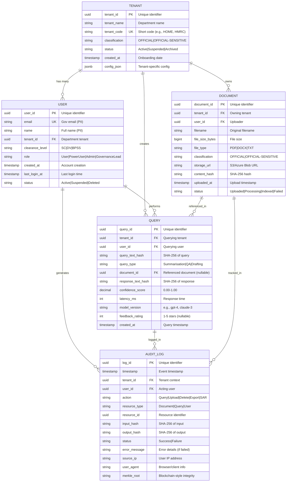

# Data Model: Cabinet Office GenAI Platform

> **Template Status**: Live | **Version**: 0.11.2 | **Command**: `/arckit.data-model`

## Document Control

| Field | Value |
|-------|-------|
| **Document ID** | ARC-001-DATA-v1.1 |
| **Document Type** | Data Model |
| **Project** | Cabinet Office GenAI Platform (Project 001) |
| **Classification** | OFFICIAL-SENSITIVE |
| **Status** | DRAFT |
| **Version** | 1.1 |
| **Created Date** | 2025-11-04 |
| **Last Modified** | 2026-01-26 |
| **Review Cycle** | Quarterly |
| **Next Review Date** | 2026-04-26 |
| **Owner** | Cabinet Office CTO |
| **Reviewed By** | Data Protection Officer |
| **Approved By** | Cabinet Office CTO |
| **Distribution** | Project Team, DPO, Data Governance Lead, Architecture Review Board |

## Revision History

| Version | Date | Author | Changes | Approved By | Approval Date |
|---------|------|--------|---------|-------------|---------------|
| 1.0 | 2025-11-04 | ArcKit AI | Initial creation from `/arckit.data-model` command | CTO | 2025-11-04 |
| 1.1 | 2026-01-26 | ArcKit AI | Updated to template v0.11.2 format | - | - |

---

## Executive Summary

### Overview

This data model defines the complete data architecture for the Cabinet Office GenAI Platform, a secure multi-tenant AI service for UK Government departments. The platform enables policy advisors and civil servants across 20+ departments to summarize documents, perform Q&A on authoritative sources, and draft policy documents using generative AI, while maintaining strict data residency (UK only), multi-tenant isolation, and comprehensive audit trails.

The model supports high-risk AI processing under UK GDPR Article 35 (DPIA required), special category data (ethnicity, health, religion in policy documents), and algorithmic transparency (ATRS publication required). All data entities are designed with privacy-by-design principles, supporting full data subject rights (access, rectification, erasure, portability, restriction, objection).

This data model directly implements data requirements from requirements.md (DR-001 through DR-020) and supports the project's goal to reduce government AI spending by 80% (from £15M to £3M annually) while maintaining OFFICIAL-SENSITIVE security classification and zero cross-tenant data leaks.

### Model Statistics
- **Total Entities**: 5 entities defined (E-001 through E-005)
- **Total Attributes**: 55 attributes across all entities
- **Total Relationships**: 6 relationships mapped (User→Tenant, User→Query, Tenant→Document, Tenant→Query, Document→Query, all entities→AuditLog)
- **Data Classification**:
  - 🟢 Public: 0 entities
  - 🟡 Internal (OFFICIAL): 3 entities (Tenant, Document metadata, Query metadata)
  - 🟠 Confidential (OFFICIAL-SENSITIVE): 2 entities (User with clearance levels, AuditLog with full query text)
  - 🔴 Restricted: 0 entities (no payment card data or health records stored)

### Compliance Summary
- **GDPR/DPA 2018 Status**: DPIA REQUIRED (confirmed in dpia.md - 6/9 ICO criteria met)
- **PII Entities**: 2 entities contain personally identifiable information (E-001 User: email, name; E-005 AuditLog: user activity traces)
- **Special Category Data**: YES - Documents may contain Article 9 data (ethnicity, health, religion, political opinions in policy documents)
- **Data Protection Impact Assessment (DPIA)**: COMPLETED (see dpia.md, 18 risks identified, 75 mitigations, all HIGH risks reduced to MEDIUM/LOW)
- **Data Retention**: 7 years (longest retention period, driven by UK Public Records Act and ATRS algorithmic transparency requirements)
- **Cross-Border Transfers**: NO - All data processing within UK jurisdiction (AWS eu-west-2 London, Azure UK South)

### Key Data Governance Stakeholders
- **Data Owner (Business)**: Cabinet Office CTO - Accountable for data quality, appropriate usage, and data governance policies
- **Data Steward**: Cabinet Office Data Governance Lead - Responsible for enforcing data quality standards, resolving data issues, and data lifecycle management
- **Data Custodian (Technical)**: Platform Engineering Team - Manages database infrastructure, backups, encryption, and access controls
- **Data Protection Officer**: Cabinet Office DPO - Ensures GDPR compliance, reviews DPIA, conducts privacy audits, handles data subject requests

---

## Visual Entity-Relationship Diagram (ERD)



**Diagram Notes**:
- **Cardinality**: `||` = exactly one, `o{` = zero or more
- **Primary Keys (PK)**: UUID v4 for all entities (prevents sequential ID enumeration attacks)
- **Foreign Keys (FK)**: Enforce referential integrity and enable multi-tenant row-level security
- **Unique Keys (UK)**: email (User), tenant_code (Tenant) must be unique across platform
- **Multi-Tenant Isolation**: All entities include tenant_id for row-level security (RLS) policies

---

## Entity Catalog

### Entity E-001: User

**Description**: Government user authorized to access the GenAI platform. Users are authenticated via UK Government SSO (Azure AD) and belong to a single departmental tenant. Users have security clearance levels (SC, DV, BPSS) and role-based access controls (User, PowerUser, Admin, GovernanceLead).

**Source Requirements**:
- DR-001: Store user identity, contact information, and authentication credentials
- DR-003: Implement role-based access control (RBAC) with 4 user roles
- DR-006: Support security clearance levels (SC, DV, BPSS) for access control
- NFR-SEC-001: Integrate with UK Government SSO (Azure AD) for authentication
- NFR-SEC-005: Support multi-factor authentication (MFA) for all users

**Business Context**: Users are the primary actors in the system, performing document uploads, AI queries, and administrative tasks. User entity supports multi-tenant isolation (each user belongs to one department), security clearance enforcement (users can only access documents matching their clearance level), and full audit trail (all actions logged to AuditLog). User accounts are provisioned via SSO and require Cabinet Office approval before activation.

**Data Ownership**:
- **Business Owner**: Cabinet Office CTO - Accountable for user access policies and onboarding process
- **Technical Owner**: Platform Engineering Team - Maintains user database and SSO integration
- **Data Steward**: Cabinet Office Data Governance Lead - Enforces data quality standards for user records

**Data Classification**: OFFICIAL-SENSITIVE (contains security clearance levels, which are sensitive personnel data)

**Volume Estimates**:
- **Initial Volume**: 200 users at Private Beta launch (Month 6)
- **Growth Rate**: +800 users per quarter (incremental departmental onboarding)
- **Peak Volume**: 15,000 users at Year 3 (20+ departments, 750 users per department average)
- **Average Record Size**: 0.5 KB per user record

**Data Retention**:
- **Active Period**: Duration of employment + account closure
- **Archive Period**: 30 days after account closure (soft delete, status='Deleted')
- **Total Retention**: 7 years for audit logs referencing user actions (user_id retained in AuditLog)
- **Deletion Policy**: Soft delete (status='Deleted') after account closure, PII anonymized after 30 days, audit logs retain user_id for 7 years

#### Attributes

| Attribute | Type | Required | PII | Description | Validation Rules | Default | Source Req |
|-----------|------|----------|-----|-------------|------------------|---------|------------|
| user_id | UUID | Yes | No | Unique identifier | UUID v4 format | Auto-generated | DR-001 |
| email | VARCHAR(255) | Yes | Yes | Government email address | RFC 5322 format, must end with .gov.uk, unique, indexed | None | DR-001 |
| name | VARCHAR(255) | Yes | Yes | Full name | Non-empty, 1-255 chars | None | DR-001 |
| tenant_id | UUID | Yes | No | Departmental tenant | Foreign key to Tenant, indexed, NOT NULL | None | DR-002 |
| clearance_level | ENUM | Yes | No | Security clearance | 'SC', 'DV', 'BPSS' (SC=Security Check, DV=Developed Vetting, BPSS=Baseline Personnel Security Standard) | 'BPSS' | DR-006 |
| role | ENUM | Yes | No | Access role | 'User', 'PowerUser', 'Admin', 'GovernanceLead' | 'User' | DR-003 |
| created_at | TIMESTAMP | Yes | No | Account creation timestamp | ISO 8601, auto-set on insert, indexed | NOW() | DR-001 |
| last_login_at | TIMESTAMP | No | No | Last login timestamp | ISO 8601, updated on login, indexed | NULL | DR-007 |
| status | ENUM | Yes | No | Account status | 'Active', 'Suspended', 'Deleted' | 'Active' | DR-001 |

**Attribute Notes**:
- **PII Attributes**: email (directly identifies individual), name (directly identifies individual)
- **Encrypted Attributes**: None (email and name do not require encryption at rest as database is already encrypted with AES-256)
- **Derived Attributes**: None (all attributes are source data from SSO or platform configuration)
- **Audit Attributes**: created_at (immutable), last_login_at (updated on each login for security monitoring)
- **Security Considerations**: clearance_level is NOT PII but is sensitive personnel data requiring OFFICIAL-SENSITIVE classification

#### Relationships

**Outgoing Relationships** (this entity references others):
- **belongs_to_tenant**: E-001 (User) → E-002 (Tenant) (many-to-one)
  - Foreign Key: user.tenant_id references tenant.tenant_id
  - Description: Each user belongs to exactly one departmental tenant (no cross-department users)
  - Cascade Delete: NO (if tenant deleted, users must be reassigned or soft-deleted first)
  - Orphan Check: REQUIRED (user must have valid tenant_id, enforced by NOT NULL constraint)

**Incoming Relationships** (other entities reference this):
- **performs_queries**: E-004 (Query) → E-001 (User)
  - Description: User performs AI queries (summarisation, Q&A, drafting)
  - Usage: Track which user created each query for audit trail and feedback collection
- **generates_audit_logs**: E-005 (AuditLog) → E-001 (User)
  - Description: Every user action generates audit log entry
  - Usage: Security forensics, ATRS reporting, ICO compliance audits

#### Indexes

**Primary Key**:
- `pk_user` on `user_id` (clustered index, UUID v4)

**Foreign Keys**:
- `fk_user_tenant` on `tenant_id`
  - References: E-002 (Tenant).tenant_id
  - On Delete: RESTRICT (cannot delete tenant with active users)
  - On Update: CASCADE (if tenant_id changes, update user records)

**Unique Constraints**:
- `uk_user_email` on `email` (government email must be unique across all tenants)

**Performance Indexes**:
- `idx_user_tenant_id` on `tenant_id` (for multi-tenant queries filtering by tenant)
- `idx_user_status` on `status` (for querying active vs deleted users)
- `idx_user_created_at` on `created_at` (for user growth analytics)
- `idx_user_last_login_at` on `last_login_at` (for inactive user identification)

**Full-Text Indexes**:
- None (name search not required, users queried by email or user_id)

#### Privacy & Compliance

**GDPR/DPA 2018 Considerations**:
- **Contains PII**: YES
- **PII Attributes**: email (contact details), name (identification data)
- **Legal Basis for Processing**: Article 6(1)(e) - Public Task (necessary for UK Government to deliver public services)
- **Data Subject Rights**:
  - **Right to Access (Article 15)**: User can request all their data via Subject Access Request (SAR) API (/api/v1/sar), returns User record + all Query records + all AuditLog entries, response within 1 month (30 days)
  - **Right to Rectification (Article 16)**: User can update own name via account settings (email cannot be changed as it's SSO identity), admin can correct data errors via admin portal
  - **Right to Erasure (Article 17)**: User can request account deletion, soft delete (status='Deleted') within 24 hours, PII anonymized after 30 days, audit logs retain user_id (pseudonymized) for 7 years (legal obligation)
  - **Right to Portability (Article 20)**: User can export all their data in JSON format via /api/v1/export (includes User record, Query history, Document uploads)
  - **Right to Object (Article 21)**: User can opt-out of platform usage (account closure), no marketing processing occurs
  - **Right to Restrict Processing (Article 18)**: User can request processing restriction (status='Suspended'), data retained but not processed until restriction lifted
- **Data Breach Impact**: HIGH - If User entity breached, attacker learns which government officials use AI platform, their departments, clearance levels (personnel security data), and email addresses (phishing risk)
- **Cross-Border Transfers**: None - All user data processed in UK (AWS eu-west-2 London, Azure UK South)
- **Data Protection Impact Assessment (DPIA)**: REQUIRED (see dpia.md, DPIA-002: Special category data breach risk, DPIA-008: User profiling risk)

**Sector-Specific Compliance**:
- **PCI-DSS**: Not applicable (no payment card data)
- **HIPAA**: Not applicable (no healthcare data in User entity)
- **FCA Regulations**: Not applicable (not financial services)
- **Government Security Classification**: OFFICIAL-SENSITIVE (clearance_level is sensitive personnel data, Cabinet Office Security Policy mandates OFFICIAL-SENSITIVE for personnel security information)

**Audit Logging**:
- **Access Logging**: Required - All User record reads logged to AuditLog (action='UserAccess', resource_type='User', resource_id=user_id)
- **Change Logging**: Required - All User modifications logged to AuditLog with before/after values (action='UserUpdate', input_hash=old_values, output_hash=new_values)
- **Retention of Logs**: 7 years for compliance with ATRS (Algorithmic Transparency Recording Standard) and UK Public Records Act

---

### Entity E-002: Tenant

**Description**: Government department with isolated data environment. Each tenant represents a single UK Government department (e.g., Home Office, HMRC, DHSC) and has complete data isolation from other tenants. Tenants are configured with maximum data classification (OFFICIAL or OFFICIAL-SENSITIVE), status (Active, Suspended, Archived), and custom configuration (e.g., rate limits, model preferences).

**Source Requirements**:
- DR-002: Implement multi-tenant architecture with complete data isolation
- DR-008: Support 25 tenants at Year 3 (20+ UK Government departments)
- NFR-SEC-003: Enforce row-level security (RLS) for multi-tenant isolation
- NFR-PER-001: Support 5,000 concurrent users across all tenants

**Business Context**: Tenants are the top-level data isolation boundary. All users, documents, and queries belong to exactly one tenant. Tenant configuration includes maximum data classification (determines which documents can be uploaded), custom settings (rate limits, model selection), and status (Active, Suspended, Archived). Tenant onboarding requires Cabinet Office approval, signed data sharing agreement, and NCSC security review (for OFFICIAL-SENSITIVE tenants).

**Data Ownership**:
- **Business Owner**: Cabinet Office Permanent Secretary - Accountable for departmental onboarding and tenant governance
- **Technical Owner**: Platform Engineering Team - Manages tenant provisioning and configuration
- **Data Steward**: Cabinet Office Data Governance Lead - Enforces tenant data quality and configuration standards

**Data Classification**: OFFICIAL (tenant metadata is not sensitive, but tenant data is isolated)

**Volume Estimates**:
- **Initial Volume**: 3 tenants at Private Beta launch (Home Office, HMRC, DHSC)
- **Growth Rate**: +2 tenants per quarter (incremental departmental onboarding)
- **Peak Volume**: 25 tenants at Year 3 (20+ UK Government departments)
- **Average Record Size**: 1 KB per tenant record (includes config_json)

**Data Retention**:
- **Active Period**: Duration of departmental participation in platform
- **Archive Period**: 3 years after tenant offboarding (status='Archived')
- **Total Retention**: 10 years (3 years active + 7 years audit logs referencing tenant)
- **Deletion Policy**: Soft delete (status='Archived') after tenant offboarding, tenant_id retained in audit logs for 7 years

#### Attributes

| Attribute | Type | Required | PII | Description | Validation Rules | Default | Source Req |
|-----------|------|----------|-----|-------------|------------------|---------|------------|
| tenant_id | UUID | Yes | No | Unique identifier | UUID v4 format | Auto-generated | DR-002 |
| tenant_name | VARCHAR(255) | Yes | No | Department name | Non-empty, 1-255 chars, unique (e.g., "Home Office", "HMRC") | None | DR-002 |
| tenant_code | VARCHAR(10) | Yes | No | Short department code | 2-10 chars, uppercase, unique (e.g., "HOME", "HMRC", "DHSC") | None | DR-002 |
| classification | ENUM | Yes | No | Max data classification | 'OFFICIAL', 'OFFICIAL-SENSITIVE' (determines max classification for documents uploaded by this tenant) | 'OFFICIAL' | DR-009 |
| status | ENUM | Yes | No | Tenant status | 'Active', 'Suspended', 'Archived' | 'Active' | DR-002 |
| created_at | TIMESTAMP | Yes | No | Onboarding date | ISO 8601, auto-set on insert, indexed | NOW() | DR-002 |
| config_json | JSONB | No | No | Tenant-specific config | Valid JSON, max 10KB (contains rate_limits, model_preferences, custom_settings) | NULL | DR-010 |

**Attribute Notes**:
- **PII Attributes**: None (tenant metadata is organizational data, not personal data)
- **Encrypted Attributes**: None (tenant metadata not sensitive, database already encrypted)
- **Derived Attributes**: None (all attributes are source configuration data)
- **Audit Attributes**: created_at (immutable, tracks tenant onboarding date)
- **JSONB Configuration**: config_json stores tenant-specific settings (e.g., {"rate_limit_per_hour": 1000, "preferred_model": "gpt-4", "enable_drafting": true})

#### Relationships

**Outgoing Relationships**: None (Tenant is top-level entity)

**Incoming Relationships** (other entities reference this):
- **has_users**: E-001 (User) → E-002 (Tenant)
  - Description: Tenant has many users (one-to-many)
  - Usage: Enforce user belongs to exactly one tenant
- **owns_documents**: E-003 (Document) → E-002 (Tenant)
  - Description: Tenant owns many documents (one-to-many)
  - Usage: Enforce document belongs to exactly one tenant (multi-tenant isolation)
- **creates_queries**: E-004 (Query) → E-002 (Tenant)
  - Description: Tenant creates many queries (one-to-many)
  - Usage: Enforce query belongs to exactly one tenant (multi-tenant isolation)
- **generates_audit_logs**: E-005 (AuditLog) → E-002 (Tenant)
  - Description: All tenant actions generate audit logs
  - Usage: Tenant-level audit trail for compliance

#### Indexes

**Primary Key**:
- `pk_tenant` on `tenant_id` (clustered index, UUID v4)

**Foreign Keys**: None (Tenant is top-level entity)

**Unique Constraints**:
- `uk_tenant_name` on `tenant_name` (department name must be unique, e.g., "Home Office")
- `uk_tenant_code` on `tenant_code` (short code must be unique, e.g., "HOME")

**Performance Indexes**:
- `idx_tenant_status` on `status` (for querying active vs archived tenants)
- `idx_tenant_created_at` on `created_at` (for tenant onboarding timeline analytics)

**Full-Text Indexes**: None (tenant search not required, tenants queried by tenant_id or tenant_code)

#### Privacy & Compliance

**GDPR/DPA 2018 Considerations**:
- **Contains PII**: NO (tenant metadata is organizational data, not personal data)
- **Legal Basis for Processing**: Article 6(1)(e) - Public Task (necessary for UK Government to deliver public services)
- **Data Subject Rights**: Not applicable (no PII in Tenant entity)
- **Data Breach Impact**: LOW - If Tenant entity breached, attacker learns which departments use platform and tenant configuration (rate limits, model preferences), but no PII exposed
- **Cross-Border Transfers**: None - All tenant data processed in UK
- **Data Protection Impact Assessment (DPIA)**: NOT REQUIRED for Tenant entity alone (DPIA required for overall system due to User and Query entities)

**Sector-Specific Compliance**:
- **Government Security Classification**: OFFICIAL (tenant metadata not sensitive)

**Audit Logging**:
- **Access Logging**: Required - All Tenant record reads logged to AuditLog
- **Change Logging**: Required - All Tenant configuration changes logged to AuditLog (especially config_json modifications)
- **Retention of Logs**: 7 years for compliance

---

### Entity E-003: Document

**Description**: Document uploaded to platform for summarisation or Q&A. Documents are owned by a single tenant, uploaded by a single user, and classified as OFFICIAL or OFFICIAL-SENSITIVE. Supported formats: PDF, DOCX, TXT (max 50MB). Documents are stored in UK-based object storage (AWS S3 or Azure Blob) with AES-256 encryption, and content_hash (SHA-256) ensures integrity.

**Source Requirements**:
- DR-004: Store document metadata and content with multi-tenant isolation
- DR-011: Support PDF, DOCX, TXT formats with max 50MB file size
- DR-012: Enforce document classification (OFFICIAL, OFFICIAL-SENSITIVE)
- DR-013: Store documents in UK-based object storage with encryption
- NFR-SEC-006: Compute SHA-256 hash for document integrity verification

**Business Context**: Documents are uploaded by users for AI processing (summarisation, Q&A). Each document belongs to exactly one tenant (multi-tenant isolation) and has a classification (OFFICIAL or OFFICIAL-SENSITIVE) that must not exceed the user's clearance level. Documents are stored in S3/Azure Blob (storage_url) and indexed for semantic search (vector embeddings, not stored in this entity). Documents containing special category data (ethnicity, health, religion) require DPIA (completed, see dpia.md).

**Data Ownership**:
- **Business Owner**: Cabinet Office CTO - Accountable for document storage policies and retention
- **Technical Owner**: Platform Engineering Team - Manages object storage and document lifecycle
- **Data Steward**: Cabinet Office Data Governance Lead - Enforces document quality and classification standards

**Data Classification**: OFFICIAL (metadata), OFFICIAL-SENSITIVE (content may include special category data)

**Volume Estimates**:
- **Initial Volume**: 1,000 documents at Private Beta launch (Month 6)
- **Growth Rate**: +8,000 documents per month (average 30 documents per user per month)
- **Peak Volume**: 500,000 documents at Year 3 (15,000 users, 33 documents per user average)
- **Average Record Size**: 10 MB per document (stored in S3/Azure Blob, not in database)

**Data Retention**:
- **Active Period**: 2 years (documents frequently accessed for Q&A)
- **Archive Period**: 5 years (documents moved to cold storage, accessible on request)
- **Total Retention**: 7 years (driven by UK Public Records Act and ATRS requirements)
- **Deletion Policy**: Soft delete (status='Deleted') after 7 years, hard delete from object storage after 30 days (grace period for accidental deletion recovery)

#### Attributes

| Attribute | Type | Required | PII | Description | Validation Rules | Default | Source Req |
|-----------|------|----------|-----|-------------|------------------|---------|------------|
| document_id | UUID | Yes | No | Unique identifier | UUID v4 format | Auto-generated | DR-004 |
| tenant_id | UUID | Yes | No | Owning tenant | Foreign key to Tenant, indexed, NOT NULL | None | DR-004 |
| user_id | UUID | Yes | No | Uploader | Foreign key to User, indexed, NOT NULL | None | DR-004 |
| filename | VARCHAR(255) | Yes | No | Original filename | Non-empty, 1-255 chars (e.g., "policy-brief-2025.pdf") | None | DR-004 |
| file_size_bytes | BIGINT | Yes | No | File size in bytes | Positive integer, max 52428800 (50MB) | None | DR-011 |
| file_type | ENUM | Yes | No | File format | 'PDF', 'DOCX', 'TXT' | None | DR-011 |
| classification | ENUM | Yes | No | Document classification | 'OFFICIAL', 'OFFICIAL-SENSITIVE' (must not exceed tenant.classification and user.clearance_level) | 'OFFICIAL' | DR-012 |
| storage_url | VARCHAR(500) | Yes | No | S3/Azure Blob URL | Valid URL, indexed (e.g., "s3://genai-docs-uk/tenant-123/doc-456.pdf") | None | DR-013 |
| content_hash | VARCHAR(64) | Yes | No | SHA-256 hash of content | 64-char hex string, indexed (for deduplication and integrity) | None | NFR-SEC-006 |
| uploaded_at | TIMESTAMP | Yes | No | Upload timestamp | ISO 8601, auto-set on insert, indexed | NOW() | DR-004 |
| status | ENUM | Yes | No | Document status | 'Uploaded', 'Processing', 'Indexed', 'Failed', 'Deleted' | 'Uploaded' | DR-004 |

**Attribute Notes**:
- **PII Attributes**: None (document metadata not PII, but document content may contain PII - stored in S3/Azure Blob, not in database)
- **Encrypted Attributes**: storage_url points to encrypted object storage (AES-256 encryption at rest)
- **Derived Attributes**: content_hash (computed on upload via SHA-256)
- **Audit Attributes**: uploaded_at (immutable, tracks when document added)
- **Security Considerations**: content_hash enables deduplication (if two users upload same document, store once) and integrity verification (detect tampering)

#### Relationships

**Outgoing Relationships** (this entity references others):
- **owned_by_tenant**: E-003 (Document) → E-002 (Tenant) (many-to-one)
  - Foreign Key: document.tenant_id references tenant.tenant_id
  - Description: Document belongs to exactly one tenant
  - Cascade Delete: NO (if tenant deleted, documents must be archived first)
  - Orphan Check: REQUIRED (document must have valid tenant_id)
- **uploaded_by_user**: E-003 (Document) → E-001 (User) (many-to-one)
  - Foreign Key: document.user_id references user.user_id
  - Description: Document uploaded by one user
  - Cascade Delete: NO (if user deleted, documents remain but user_id anonymized)
  - Orphan Check: REQUIRED (document must have valid user_id at upload time)

**Incoming Relationships** (other entities reference this):
- **referenced_in_queries**: E-004 (Query) → E-003 (Document)
  - Description: Queries can reference specific documents for Q&A
  - Usage: Track which documents are queried most frequently (usage analytics)
- **tracked_in_audit_logs**: E-005 (AuditLog) → E-003 (Document)
  - Description: Document uploads, downloads, deletions logged
  - Usage: Audit trail for document lifecycle (ATRS compliance)

#### Indexes

**Primary Key**:
- `pk_document` on `document_id` (clustered index, UUID v4)

**Foreign Keys**:
- `fk_document_tenant` on `tenant_id`
  - References: E-002 (Tenant).tenant_id
  - On Delete: RESTRICT (cannot delete tenant with documents)
  - On Update: CASCADE
- `fk_document_user` on `user_id`
  - References: E-001 (User).user_id
  - On Delete: RESTRICT (anonymize user_id, keep document)
  - On Update: CASCADE

**Unique Constraints**: None (multiple users can upload same filename)

**Performance Indexes**:
- `idx_document_tenant_id` on `tenant_id` (for multi-tenant queries)
- `idx_document_user_id` on `user_id` (for user's documents)
- `idx_document_status` on `status` (for querying active vs deleted documents)
- `idx_document_uploaded_at` on `uploaded_at` (for chronological queries)
- `idx_document_content_hash` on `content_hash` (for deduplication checks)
- `idx_document_classification` on `classification` (for clearance-level filtering)

**Full-Text Indexes**: None (full-text search on document content handled by vector database, not SQL)

#### Privacy & Compliance

**GDPR/DPA 2018 Considerations**:
- **Contains PII**: NO (metadata does not contain PII, but document content in S3/Azure Blob may contain PII - see DPIA)
- **Special Category Data (Article 9)**: YES (documents may contain ethnicity, health, religion, political opinions in policy documents - requires legal basis)
- **Legal Basis for Processing**: Article 6(1)(e) - Public Task + Article 9(2)(g) - Substantial Public Interest (Schedule 1, Part 2, Paragraph 6 of DPA 2018 - statutory purposes)
- **Data Subject Rights**:
  - **Right to Access**: Document metadata returned in SAR, document content exported if user is uploader
  - **Right to Erasure**: User can delete own documents (soft delete, 30-day grace period), hard delete from S3 after 30 days
  - **Right to Portability**: User can export own documents in original format (PDF, DOCX, TXT)
- **Data Breach Impact**: SEVERE - If Document entity breached, attacker could access OFFICIAL-SENSITIVE documents containing special category data (ethnicity, health, religion), policy drafts, and classified information (DPIA-002: Special category data breach risk)
- **Cross-Border Transfers**: None - All documents stored in UK (AWS S3 eu-west-2, Azure Blob UK South)
- **Data Protection Impact Assessment (DPIA)**: REQUIRED (see dpia.md, DPIA-002: Special category data breach, DPIA-005: Unauthorized document access)

**Sector-Specific Compliance**:
- **Government Security Classification**: OFFICIAL-SENSITIVE (documents may contain sensitive policy information)

**Audit Logging**:
- **Access Logging**: Required - All document downloads logged to AuditLog (action='DocumentDownload', resource_id=document_id)
- **Change Logging**: Required - All document uploads, deletions logged to AuditLog
- **Retention of Logs**: 7 years for compliance

---

### Entity E-004: Query

**Description**: User query to AI model (summarisation, Q&A, drafting). Queries are created by users within a tenant, may reference a specific document (for Q&A), and generate AI responses. Query text and response text are hashed (SHA-256) in the database for privacy, with full text stored only in AuditLog (immutable, tamper-proof).

**Source Requirements**:
- DR-005: Store query metadata with privacy-preserving hashes
- DR-014: Support 3 query types (Summarisation, Q&A, Drafting)
- DR-015: Track AI model version, confidence score, latency for ATRS reporting
- DR-016: Support user feedback (1-5 star rating) for model improvement
- NFR-PER-002: Query response time < 3 seconds (p95)

**Business Context**: Queries are the core interaction with the AI platform. Users submit queries (summarisation, Q&A, drafting), AI model generates responses, and queries are logged for ATRS transparency, bias detection, and model improvement. Query text is hashed in Query entity (privacy-by-design), full text stored in AuditLog (append-only, tamper-proof). Queries referencing documents (Q&A) include document_id for context.

**Data Ownership**:
- **Business Owner**: Cabinet Office CTO - Accountable for AI model usage and query quality
- **Technical Owner**: AI Engineering Team - Manages AI model integration and query processing
- **Data Steward**: AI Governance Lead - Monitors query patterns for bias and misuse

**Data Classification**: OFFICIAL (metadata with hashes), OFFICIAL-SENSITIVE (full query text in AuditLog)

**Volume Estimates**:
- **Initial Volume**: 10,000 queries at Private Beta launch (Month 6)
- **Growth Rate**: +1 million queries per month (average 200 queries per user per month)
- **Peak Volume**: 60 million queries at Year 3 (15,000 users, 4,000 queries per user per year)
- **Average Record Size**: 0.5 KB per query record (hashes only, full text in AuditLog)

**Data Retention**:
- **Active Period**: 2 years (query metadata with hashes in hot storage)
- **Archive Period**: 5 years (query metadata moved to cold storage)
- **Total Retention**: 7 years (driven by ATRS algorithmic transparency requirements, full query text in AuditLog retained for 7 years)
- **Deletion Policy**: Hard delete query metadata after 7 years, AuditLog entries retained indefinitely (immutable, WORM storage)

#### Attributes

| Attribute | Type | Required | PII | Description | Validation Rules | Default | Source Req |
|-----------|------|----------|-----|-------------|------------------|---------|------------|
| query_id | UUID | Yes | No | Unique identifier | UUID v4 format | Auto-generated | DR-005 |
| tenant_id | UUID | Yes | No | Querying tenant | Foreign key to Tenant, indexed, NOT NULL | None | DR-005 |
| user_id | UUID | Yes | No | Querying user | Foreign key to User, indexed, NOT NULL | None | DR-005 |
| query_text_hash | VARCHAR(64) | Yes | No | SHA-256 of query text | 64-char hex string, indexed (enables deduplication without storing full text) | None | DR-005 |
| query_type | ENUM | Yes | No | Query type | 'Summarisation', 'QA', 'Drafting' | None | DR-014 |
| document_id | UUID | No | No | Referenced document (nullable) | Foreign key to Document, nullable (NULL for drafting queries, NOT NULL for Q&A) | NULL | DR-014 |
| response_text_hash | VARCHAR(64) | Yes | No | SHA-256 of response text | 64-char hex string, indexed (privacy-preserving storage) | None | DR-005 |
| confidence_score | DECIMAL(5,2) | No | No | AI confidence score | 0.00 to 1.00, nullable (not all models provide confidence) | NULL | DR-015 |
| latency_ms | INTEGER | Yes | No | Response time in milliseconds | Positive integer (tracks performance, SLA compliance) | None | DR-015 |
| model_version | VARCHAR(50) | Yes | No | AI model identifier | Non-empty (e.g., "gpt-4-turbo-2024-04-09", "claude-3-opus-20240229") | None | DR-015 |
| feedback_rating | INTEGER | No | No | User feedback (1-5 stars) | 1, 2, 3, 4, or 5, nullable (user may not provide feedback) | NULL | DR-016 |
| created_at | TIMESTAMP | Yes | No | Query timestamp | ISO 8601, auto-set on insert, indexed | NOW() | DR-005 |

**Attribute Notes**:
- **PII Attributes**: None (query text hash not PII, full query text stored in AuditLog only)
- **Encrypted Attributes**: None (hashes do not require encryption, full text in AuditLog encrypted at rest)
- **Derived Attributes**: query_text_hash, response_text_hash (computed via SHA-256), latency_ms (computed from request start to response end)
- **Audit Attributes**: created_at (immutable, tracks query timestamp)
- **Privacy-by-Design**: Query stores hashes only, full text in AuditLog (append-only, tamper-proof) for ATRS transparency and privacy balance

#### Relationships

**Outgoing Relationships** (this entity references others):
- **created_by_tenant**: E-004 (Query) → E-002 (Tenant) (many-to-one)
  - Foreign Key: query.tenant_id references tenant.tenant_id
  - Description: Query belongs to exactly one tenant
  - Cascade Delete: NO (if tenant deleted, queries archived)
  - Orphan Check: REQUIRED
- **created_by_user**: E-004 (Query) → E-001 (User) (many-to-one)
  - Foreign Key: query.user_id references user.user_id
  - Description: Query created by one user
  - Cascade Delete: NO (if user deleted, queries remain but user_id anonymized)
  - Orphan Check: REQUIRED
- **references_document**: E-004 (Query) → E-003 (Document) (many-to-one, nullable)
  - Foreign Key: query.document_id references document.document_id
  - Description: Q&A queries reference specific document, drafting queries have NULL document_id
  - Cascade Delete: NO (if document deleted, query.document_id set to NULL)
  - Orphan Check: OPTIONAL (document_id can be NULL)

**Incoming Relationships** (other entities reference this):
- **logged_in_audit**: E-005 (AuditLog) → E-004 (Query)
  - Description: Every query generates audit log entry with full query text
  - Usage: ATRS reporting, bias detection, security forensics

#### Indexes

**Primary Key**:
- `pk_query` on `query_id` (clustered index, UUID v4)

**Foreign Keys**:
- `fk_query_tenant` on `tenant_id`
  - References: E-002 (Tenant).tenant_id
  - On Delete: RESTRICT
  - On Update: CASCADE
- `fk_query_user` on `user_id`
  - References: E-001 (User).user_id
  - On Delete: RESTRICT
  - On Update: CASCADE
- `fk_query_document` on `document_id`
  - References: E-003 (Document).document_id
  - On Delete: SET NULL (if document deleted, query remains but loses document reference)
  - On Update: CASCADE

**Unique Constraints**: None (same user can submit same query multiple times)

**Performance Indexes**:
- `idx_query_tenant_id` on `tenant_id` (for multi-tenant queries)
- `idx_query_user_id` on `user_id` (for user's query history)
- `idx_query_created_at` on `created_at` (for chronological queries, usage analytics)
- `idx_query_type` on `query_type` (for query type analytics)
- `idx_query_model_version` on `model_version` (for model performance comparison)
- `idx_query_feedback_rating` on `feedback_rating` (for satisfaction analytics)
- `idx_query_text_hash` on `query_text_hash` (for deduplication and pattern detection)

**Full-Text Indexes**: None (full-text search on query text handled via AuditLog, not Query entity)

#### Privacy & Compliance

**GDPR/DPA 2018 Considerations**:
- **Contains PII**: NO (query text hash not PII, full query text stored separately in AuditLog)
- **Legal Basis for Processing**: Article 6(1)(e) - Public Task (necessary for UK Government to deliver public services)
- **Data Subject Rights**:
  - **Right to Access**: Query records returned in SAR (metadata only, full query text retrieved from AuditLog)
  - **Right to Erasure**: User can request query deletion (soft delete query metadata, AuditLog entries immutable)
  - **Right to Portability**: User can export query history in JSON format
- **Data Breach Impact**: MEDIUM - If Query entity breached, attacker learns query patterns (hashes, not full text), query types, and user activity patterns (profiling risk - DPIA-009: AI bias discrimination)
- **Cross-Border Transfers**: None - All queries processed in UK
- **Data Protection Impact Assessment (DPIA)**: REQUIRED (see dpia.md, DPIA-004: AI hallucination incorrect advice, DPIA-009: AI bias discrimination)

**Sector-Specific Compliance**:
- **Government Security Classification**: OFFICIAL (metadata), OFFICIAL-SENSITIVE (full query text in AuditLog)
- **ATRS (Algorithmic Transparency Recording Standard)**: Query entity provides data for ATRS publication (query volumes, query types, model versions, confidence scores, latency, feedback ratings)

**Audit Logging**:
- **Access Logging**: Required - All Query record reads logged to AuditLog
- **Change Logging**: Required - Every query creates AuditLog entry with full query text and response text (action='Query', input_hash=query_text_hash, output_hash=response_text_hash, full text in log body)
- **Retention of Logs**: 7 years for ATRS compliance (immutable, WORM storage)

---

### Entity E-005: AuditLog

**Description**: Immutable audit trail for compliance and security forensics. Every user action (query, upload, delete, SAR, etc.) generates an audit log entry with full input/output details, user context, and Merkle tree integrity proof (blockchain-style tamper detection).

**Source Requirements**:
- DR-007: Implement comprehensive audit logging for all user actions
- DR-017: Store full query text and response text in audit logs (not in Query entity)
- DR-018: Compute Merkle tree root for tamper-proof audit trail
- NFR-SEC-007: Audit logs must be immutable (WORM - Write Once Read Many storage)
- NFR-COM-001: Audit logs required for ATRS reporting and ICO compliance

**Business Context**: AuditLog is the authoritative source of truth for all user actions. Unlike other entities (User, Document, Query) which can be modified, AuditLog is append-only and immutable. Full query text and response text stored here (not in Query entity) for ATRS transparency while maintaining privacy (Query entity stores hashes only). Merkle root (cryptographic hash chain) enables tamper detection (any modification to historical logs changes Merkle root, proving tampering).

**Data Ownership**:
- **Business Owner**: Cabinet Office Compliance Officer - Accountable for audit trail integrity and regulatory reporting
- **Technical Owner**: Platform Engineering Team - Manages audit log infrastructure and Merkle tree computation
- **Data Steward**: Cabinet Office Data Governance Lead - Ensures audit log quality and retention compliance

**Data Classification**: OFFICIAL-SENSITIVE (contains full query text, response text, user actions, IP addresses)

**Volume Estimates**:
- **Initial Volume**: 50,000 logs at Private Beta launch (5 actions per user, 200 users)
- **Growth Rate**: +5 million logs per month (average 1,000 actions per user per month)
- **Peak Volume**: 100 million logs at Year 3 (15,000 users, 6,667 actions per user over 3 years)
- **Average Record Size**: 2 KB per log entry (includes full query text and response text)

**Data Retention**:
- **Active Period**: 7 years in hot storage (frequent access for compliance audits)
- **Archive Period**: Not applicable (logs retained indefinitely for legal hold)
- **Total Retention**: Indefinite (UK Public Records Act requires permanent retention for government records, ATRS requires 7 years minimum)
- **Deletion Policy**: Never deleted (immutable, WORM storage, legal requirement for permanent retention)

#### Attributes

| Attribute | Type | Required | PII | Description | Validation Rules | Default | Source Req |
|-----------|------|----------|-----|-------------|------------------|---------|------------|
| log_id | UUID | Yes | No | Unique identifier | UUID v4 format | Auto-generated | DR-007 |
| timestamp | TIMESTAMP | Yes | No | Event timestamp | ISO 8601, auto-set on insert, microsecond precision, indexed | NOW() | DR-007 |
| tenant_id | UUID | Yes | No | Tenant context | Foreign key to Tenant, indexed, NOT NULL | None | DR-007 |
| user_id | UUID | Yes | No | Acting user | Foreign key to User, indexed, NOT NULL | None | DR-007 |
| action | ENUM | Yes | No | Action type | 'Query', 'Upload', 'Delete', 'Export', 'SAR', 'Login', 'Logout', 'ConfigChange' | None | DR-007 |
| resource_type | ENUM | Yes | No | Resource type | 'Document', 'Query', 'User', 'Tenant', 'System' | None | DR-007 |
| resource_id | UUID | No | No | Resource identifier | UUID v4, nullable (NULL for system actions) | NULL | DR-007 |
| input_hash | VARCHAR(64) | No | No | SHA-256 of input | 64-char hex string, nullable (e.g., query text hash) | NULL | DR-017 |
| output_hash | VARCHAR(64) | No | No | SHA-256 of output | 64-char hex string, nullable (e.g., response text hash) | NULL | DR-017 |
| status | ENUM | Yes | No | Action status | 'Success', 'Failure' | None | DR-007 |
| error_message | TEXT | No | No | Error details (if failed) | Nullable, max 1000 chars | NULL | DR-007 |
| source_ip | VARCHAR(45) | Yes | No | User IP address | IPv4 or IPv6, indexed (for geolocation, security forensics) | None | DR-007 |
| user_agent | VARCHAR(500) | Yes | No | Browser/client info | Non-empty (e.g., "Mozilla/5.0...") | None | DR-007 |
| merkle_root | VARCHAR(64) | Yes | No | Blockchain-style integrity proof | 64-char hex string (hash of previous log_id + current log data) | Computed | DR-018 |

**Attribute Notes**:
- **PII Attributes**: source_ip (IP address can be PII under GDPR if identifies individual, but legal basis Article 6(1)(e) Public Task + legitimate interest for security)
- **Encrypted Attributes**: None (audit logs stored in encrypted database with AES-256, full query text and response text stored in separate WORM storage)
- **Derived Attributes**: merkle_root (computed via SHA-256(previous_log_id + current_log_data)), timestamp (auto-set with microsecond precision)
- **Audit Attributes**: All attributes are audit data (this is the audit log entity)
- **Merkle Tree**: Each log entry's merkle_root is hash of (previous_log_id + current log_id + timestamp + action + resource_id), enabling tamper detection (any modification changes Merkle root chain)

#### Relationships

**Outgoing Relationships** (this entity references others):
- **logged_for_tenant**: E-005 (AuditLog) → E-002 (Tenant) (many-to-one)
  - Foreign Key: audit_log.tenant_id references tenant.tenant_id
  - Description: Every log entry belongs to a tenant context
  - Cascade Delete: NO (if tenant deleted, logs retained indefinitely)
  - Orphan Check: REQUIRED
- **logged_for_user**: E-005 (AuditLog) → E-001 (User) (many-to-one)
  - Foreign Key: audit_log.user_id references user.user_id
  - Description: Every log entry records which user performed action
  - Cascade Delete: NO (if user deleted, logs retained with user_id pseudonym)
  - Orphan Check: REQUIRED

**Incoming Relationships**: None (AuditLog is append-only, never referenced by other entities)

#### Indexes

**Primary Key**:
- `pk_audit_log` on `log_id` (clustered index, UUID v4)

**Foreign Keys**:
- `fk_audit_log_tenant` on `tenant_id`
  - References: E-002 (Tenant).tenant_id
  - On Delete: RESTRICT (cannot delete tenant with logs)
  - On Update: CASCADE
- `fk_audit_log_user` on `user_id`
  - References: E-001 (User).user_id
  - On Delete: RESTRICT (cannot delete user with logs)
  - On Update: CASCADE

**Unique Constraints**: None (multiple log entries can have same user_id, action, resource_id)

**Performance Indexes**:
- `idx_audit_log_timestamp` on `timestamp` (for chronological queries, most frequent query pattern)
- `idx_audit_log_tenant_id` on `tenant_id` (for tenant-level audit reports)
- `idx_audit_log_user_id` on `user_id` (for user activity reports)
- `idx_audit_log_action` on `action` (for action type analytics)
- `idx_audit_log_resource_type_id` on `(resource_type, resource_id)` (composite index for resource-level audits)
- `idx_audit_log_status` on `status` (for failure analysis)
- `idx_audit_log_source_ip` on `source_ip` (for geolocation and security forensics)

**Full-Text Indexes**:
- `ftx_audit_log_error_message` on `error_message` (for searching failure reasons)

#### Privacy & Compliance

**GDPR/DPA 2018 Considerations**:
- **Contains PII**: YES
- **PII Attributes**: source_ip (IP address can identify individual in some contexts, especially for government networks with static IPs)
- **Legal Basis for Processing**: Article 6(1)(e) - Public Task + Article 6(1)(f) - Legitimate Interests (security monitoring, fraud detection, compliance with legal obligations)
- **Data Subject Rights**:
  - **Right to Access**: AuditLog entries for specific user returned in SAR (all actions performed by user)
  - **Right to Erasure**: NOT APPLICABLE (audit logs exempt from erasure under GDPR Article 17(3)(b) - compliance with legal obligation, and Article 17(3)(e) - archiving in public interest)
  - **Right to Portability**: NOT APPLICABLE (audit logs not user-provided data, system-generated logs)
  - **Right to Restrict Processing**: NOT APPLICABLE (audit logs required for compliance, cannot be restricted)
- **Data Breach Impact**: SEVERE - If AuditLog breached, attacker learns all user actions, full query text, response text, IP addresses, and can identify patterns (profiling risk, security forensics compromise, ATRS data exposure)
- **Cross-Border Transfers**: None - All audit logs stored in UK
- **Data Protection Impact Assessment (DPIA)**: REQUIRED (see dpia.md, DPIA-012: Audit log unauthorized access)

**Sector-Specific Compliance**:
- **Government Security Classification**: OFFICIAL-SENSITIVE (contains full query text, response text, user actions, IP addresses)
- **ATRS (Algorithmic Transparency Recording Standard)**: AuditLog is authoritative source for ATRS publication (query volumes, query types, model versions, confidence scores, bias metrics)
- **UK Public Records Act**: Audit logs must be retained permanently (government records of public interest)

**Audit Logging**:
- **Access Logging**: Required - All AuditLog reads logged to separate security log (meta-audit, prevents insider threats from tampering with audit logs)
- **Change Logging**: NOT APPLICABLE (audit logs are immutable, WORM storage, any modification attempt triggers security alert)
- **Retention of Logs**: Indefinite (permanent retention for UK Public Records Act compliance)
- **Tamper Detection**: Merkle root chain enables cryptographic proof of log integrity (any modification changes Merkle root, proving tampering)

---

## Data Governance Matrix

| Entity | Business Owner | Data Steward | Technical Custodian | Sensitivity | Compliance | Quality SLA | Access Control |
|--------|----------------|--------------|---------------------|-------------|------------|-------------|----------------|
| E-001: User | Cabinet Office CTO | Data Governance Lead | Platform Engineering Team | OFFICIAL-SENSITIVE | GDPR, DPA 2018 | 100% accuracy (SSO source) | Role: Admin, GovernanceLead |
| E-002: Tenant | Cabinet Office Permanent Secretary | Data Governance Lead | Platform Engineering Team | OFFICIAL | GDPR (no PII) | 100% completeness | Role: Admin |
| E-003: Document | Cabinet Office CTO | Data Governance Lead | Platform Engineering Team | OFFICIAL-SENSITIVE | GDPR, DPA 2018, Article 9 | 99.5% accuracy (OCR validation) | Role: User (own docs), Admin (all docs) |
| E-004: Query | Cabinet Office CTO | AI Governance Lead | AI Engineering Team | OFFICIAL | GDPR, ATRS | 98% completeness | Role: User (own queries), Admin (all queries) |
| E-005: AuditLog | Compliance Officer | Data Governance Lead | Platform Engineering Team | OFFICIAL-SENSITIVE | GDPR, ATRS, UK Public Records Act | 100% completeness (immutable) | Role: Admin, Auditor (read-only) |

**Governance Notes**:
- **Business Owner**: Accountable for data quality, accuracy, appropriate usage, and regulatory compliance for their entity
- **Data Steward**: Responsible for enforcing governance policies, resolving data quality issues, and managing data lifecycle (retention, archival, deletion)
- **Technical Custodian**: Manages database infrastructure, backups, encryption, access controls, and technical data quality (referential integrity, constraints)
- **Sensitivity**: Classification drives access controls (User role cannot access other tenants' data, Admin can access all tenants), encryption requirements (OFFICIAL-SENSITIVE requires AES-256 encryption at rest), and audit logging (all access to OFFICIAL-SENSITIVE data logged)
- **Compliance**: Regulatory frameworks that apply to this entity (GDPR/DPA 2018 for all entities with PII, ATRS for Query and AuditLog, UK Public Records Act for AuditLog)
- **Quality SLA**: Measurable quality targets (100% accuracy for User from authoritative SSO source, 99.5% accuracy for Document OCR extraction, 100% completeness for AuditLog immutable logs)
- **Access Control**: Roles permitted to view or modify data (User role can access own data within tenant, Admin can access all data across tenants, GovernanceLead can access governance reports)

---

## CRUD Matrix

**Purpose**: Shows which components/systems can Create, Read, Update, Delete each entity

| Entity | Web UI | API Gateway | Background Jobs | Admin Portal | Analytics Service | Audit Service |
|--------|--------|-------------|-----------------|--------------|-------------------|---------------|
| E-001: User | -R-- | CR-- | --U- | CRUD | -R-- | -R-- |
| E-002: Tenant | ---- | ---- | ---- | CRUD | -R-- | -R-- |
| E-003: Document | CR-- | CR-- | --UD | CRUD | -R-- | -R-- |
| E-004: Query | CR-- | CR-- | ---- | -R-- | -R-- | -R-- |
| E-005: AuditLog | ---- | C--- | ---- | -R-- | -R-- | -R-- |

**Legend**:
- **C** = Create (can insert new records)
- **R** = Read (can query existing records)
- **U** = Update (can modify existing records)
- **D** = Delete (can remove records)
- **-** = No access

**Component Descriptions**:
- **Web UI**: React frontend accessed by users (browsers), authenticates via SSO, performs user actions (upload documents, submit queries, view own data)
- **API Gateway**: FastAPI/Express backend with authentication middleware, enforces row-level security (tenant_id), validates input, calls AI models
- **Background Jobs**: Scheduled jobs (document indexing, data archival, audit log Merkle root computation, user activity reports)
- **Admin Portal**: Separate admin interface for Cabinet Office governance team (user management, tenant configuration, audit reports, compliance dashboards)
- **Analytics Service**: Read-only service for usage analytics (query volumes, user adoption, model performance, ATRS reporting)
- **Audit Service**: Read-only service for compliance audits (ICO DPIA reviews, NCSC security audits, internal governance reviews)

**Access Control Implications**:
- Components with **C** access require input validation (file size limits, query length limits, SQL injection prevention), business rule enforcement (user.clearance_level >= document.classification), and audit logging (all creates logged to AuditLog)
- Components with **U** access require authorization checks (user can only update own data, admin can update all data), audit logging with before/after values (change tracking), and concurrency control (optimistic locking to prevent lost updates)
- Components with **D** access require authorization checks (user can only delete own documents, admin can delete any data), soft delete pattern (status='Deleted' instead of hard delete), grace period for accidental deletion recovery (30 days), and audit logging (all deletes logged to AuditLog)
- Components with **R** only should use read-only database connections (read replicas) to reduce load on primary database and prevent accidental modifications

**Security Considerations**:
- **Least Privilege**: Each component has minimum necessary permissions (Web UI cannot directly access database, only via API Gateway; Analytics Service has read-only access)
- **Separation of Duties**: Critical operations (tenant creation, user role changes, document deletion) restricted to Admin Portal with multi-factor authentication
- **Audit Trail**: All CUD operations logged to AuditLog with timestamp, user_id, action, resource_id, before/after values (change tracking for compliance)
- **Multi-Tenant Isolation**: API Gateway enforces row-level security (RLS) - all queries include WHERE tenant_id = current_user.tenant_id to prevent cross-tenant data access

---

## Data Integration Mapping

### Upstream Systems (Data Sources)

#### Integration INT-001: UK Government SSO (Azure AD)

**Source System**: Azure Active Directory (Azure AD) - UK Government Single Sign-On (SSO)

**Integration Type**: Real-time API (OpenID Connect / SAML 2.0)

**Data Flow Direction**: Azure AD → GenAI Platform

**Entities Affected**:
- **E-001 (User)**: Receives user identity data from Azure AD on first login (auto-provisioning)
  - Source Fields: Azure AD user_principal_name → email, Azure AD display_name → name, Azure AD department → tenant_code (mapped to tenant_id)
  - Update Frequency: Real-time on user login (JIT provisioning), daily sync for user attribute updates (name changes, department transfers)
  - Data Quality SLA: 100% accuracy (authoritative source for government user identities), <5 second latency for authentication

**Data Mapping**:
| Source Field | Source Type | Target Entity | Target Attribute | Transformation |
|--------------|-------------|---------------|------------------|----------------|
| Azure AD user_principal_name | String | E-001: User | email | Direct mapping, validate .gov.uk domain |
| Azure AD display_name | String | E-001: User | name | Direct mapping, trim whitespace |
| Azure AD department | String | E-002: Tenant | tenant_code | Lookup tenant_id by department name (e.g., "Home Office" → tenant_code "HOME") |
| Azure AD object_id | GUID | E-001: User | external_id (not in model yet) | Direct mapping, store Azure AD object_id for future reconciliation |

**Data Quality Rules**:
- **Validation**: Reject users without .gov.uk email domain (only government users allowed)
- **Deduplication**: Check for existing user by email before creating (idempotent provisioning)
- **Error Handling**: Failed provisioning logged to AuditLog (action='UserProvisioningFailure'), user denied access, admin notified

**Reconciliation**:
- **Frequency**: Daily at 02:00 UTC (sync user attributes from Azure AD to detect name changes, department transfers, account status changes)
- **Method**: Compare Azure AD user list with GenAI Platform user list, update changed attributes, soft-delete users no longer in Azure AD (status='Suspended')
- **Tolerance**: 0 variance (all Azure AD users must be reflected in GenAI Platform)

---

#### Integration INT-002: AI Model APIs (OpenAI, Anthropic, AWS Bedrock)

**Source System**: OpenAI API (Azure OpenAI Service), Anthropic API (Claude), AWS Bedrock (Titan, Llama)

**Integration Type**: Real-time API (REST, HTTPS with API key authentication)

**Data Flow Direction**: GenAI Platform → AI Model API → GenAI Platform

**Entities Affected**:
- **E-004 (Query)**: Sends query text to AI model, receives response text
  - Source Fields: AI API response.text → response_text_hash, AI API response.confidence → confidence_score, AI API response.model → model_version
  - Update Frequency: Real-time on each query (synchronous request-response)
  - Data Quality SLA: 95% availability (AI model API uptime), <3 second latency (p95), <0.1% error rate

**Data Mapping**:
| Source Field | Source Type | Target Entity | Target Attribute | Transformation |
|--------------|-------------|---------------|------------------|----------------|
| AI API request.prompt | String | E-004: Query | query_text_hash | SHA-256 hash of query text (privacy-preserving) |
| AI API response.text | String | E-004: Query | response_text_hash | SHA-256 hash of response text (privacy-preserving) |
| AI API response.confidence | Float | E-004: Query | confidence_score | Direct mapping, scale to 0.00-1.00 |
| AI API response.model | String | E-004: Query | model_version | Direct mapping (e.g., "gpt-4-turbo-2024-04-09") |
| AI API response.latency_ms | Integer | E-004: Query | latency_ms | Direct mapping, track for SLA compliance |

**Data Quality Rules**:
- **Validation**: Reject responses with empty text or invalid model version
- **Rate Limiting**: Enforce rate limits (1,000 queries per hour per user, 100,000 queries per hour per tenant) to prevent cost overrun and abuse
- **Error Handling**: AI API failures logged to AuditLog (action='QueryFailure', error_message=API error), user shown friendly error message, retry 3 times with exponential backoff

**Data Privacy**:
- **UK Data Residency**: Only use AI model APIs with UK data processing guarantees (Azure OpenAI UK South, AWS Bedrock eu-west-2)
- **No Model Training**: Contractual clause with AI vendors: query data MUST NOT be used for model training (Data Processing Agreement required)
- **Encryption in Transit**: TLS 1.3 for all AI API calls

---

### Downstream Systems (Data Consumers)

#### Integration INT-101: ATRS (Algorithmic Transparency Recording Standard) Publication

**Target System**: GOV.UK publishing platform (ATRS public register)

**Integration Type**: Batch export (quarterly JSON file upload to GOV.UK)

**Data Flow Direction**: GenAI Platform → ATRS Public Register (GOV.UK)

**Entities Shared**:
- **E-004 (Query)**: Provides aggregate query statistics for ATRS publication (query volumes, query types, model versions, confidence scores, latency, feedback ratings)
- **E-005 (AuditLog)**: Provides detailed audit trail for ATRS transparency (anonymized query examples, bias detection results, failure rates)
  - Update Frequency: Quarterly (ATRS publication every 3 months)
  - Sync Method: Manual export to JSON file, reviewed by AI Ethics Board, uploaded to GOV.UK by governance team
  - Data Latency SLA: <7 days after quarter end

**Data Mapping**:
| Source Entity | Source Attribute | Target Field | Target Type | Transformation |
|---------------|------------------|--------------|-------------|----------------|
| E-004: Query | COUNT(*) | ATRS.total_queries | Integer | Aggregate count of queries per quarter |
| E-004: Query | query_type | ATRS.queries_by_type | JSON | Group by query_type, count per type |
| E-004: Query | model_version | ATRS.models_used | JSON | List of model versions used, with usage counts |
| E-004: Query | AVG(confidence_score) | ATRS.avg_confidence | Float | Average confidence score across all queries |
| E-004: Query | AVG(latency_ms) | ATRS.avg_latency_ms | Float | Average query latency (performance metric) |
| E-004: Query | AVG(feedback_rating) | ATRS.avg_satisfaction | Float | Average user satisfaction (1-5 stars) |
| E-005: AuditLog | COUNT(WHERE status='Failure') | ATRS.failure_rate | Float | Percentage of failed queries (reliability metric) |

**Data Quality Assurance**:
- **Pre-publication Review**: AI Ethics Board reviews ATRS export for sensitive information, ensures no PII or classified data disclosed
- **Anonymization**: All query examples anonymized (remove names, departments, sensitive keywords), only aggregate statistics published
- **Bias Metrics**: Include bias detection results (e.g., "0 bias incidents detected in Q1 2025")

**ATRS Compliance**:
- **Legal Requirement**: ATRS publication required within 6 months of Private Beta (Month 9), quarterly thereafter
- **Public Transparency**: ATRS JSON file published on GOV.UK at https://www.gov.uk/government/publications/algorithmic-transparency-record-cabinet-office-genai-platform

---

#### Integration INT-102: Data Warehouse (Usage Analytics)

**Target System**: Cabinet Office Data Warehouse (PostgreSQL / Snowflake)

**Integration Type**: Batch ETL (nightly extract to data warehouse for analytics)

**Data Flow Direction**: GenAI Platform → Data Warehouse

**Entities Shared**:
- **E-001 (User)**: User counts, user growth, departmental distribution (for adoption metrics)
- **E-004 (Query)**: Query volumes, query types, model performance (for usage analytics)
- **E-003 (Document)**: Document upload volumes, document types (for capacity planning)

**Data Mapping**:
| Source Entity | Source Attribute | Target Field | Target Type | Transformation |
|---------------|------------------|--------------|-------------|----------------|
| E-001: User | COUNT(*) | DW.user_count | Integer | Daily user count snapshot |
| E-001: User | COUNT(DISTINCT tenant_id) | DW.tenant_count | Integer | Daily tenant count snapshot |
| E-004: Query | COUNT(*) | DW.query_volume | Integer | Daily query volume |
| E-004: Query | AVG(latency_ms) | DW.avg_latency | Float | Daily average latency |
| E-003: Document | COUNT(*) | DW.document_count | Integer | Daily document count |
| E-003: Document | SUM(file_size_bytes) | DW.total_storage_bytes | Bigint | Daily total storage used |

**Data Quality Assurance**:
- **Pre-send Validation**: Ensure all aggregate counts match source data (reconciliation check)
- **Retry Logic**: 3 retries with exponential backoff on ETL failure
- **Monitoring**: Alert if ETL latency exceeds 2 hours (data warehouse SLA)

---

### Master Data Management (MDM)

**Source of Truth** (which system is authoritative for each entity):

| Entity | System of Record | Rationale | Conflict Resolution |
|--------|------------------|-----------|---------------------|
| E-001: User | Azure AD (SSO) | User identities mastered in Azure AD, synced to GenAI Platform | Azure AD wins on conflict (e.g., name change in Azure AD overwrites GenAI Platform) |
| E-002: Tenant | GenAI Platform | Tenants created manually by Cabinet Office admin (no external source) | GenAI Platform is authoritative |
| E-003: Document | GenAI Platform | Documents created by users, stored in GenAI Platform object storage | GenAI Platform is authoritative |
| E-004: Query | GenAI Platform | Queries created in GenAI Platform, no external source | GenAI Platform is authoritative |
| E-005: AuditLog | GenAI Platform | Audit logs generated by GenAI Platform, immutable | GenAI Platform is authoritative (no conflicts, append-only) |

**Data Lineage**:
- **E-001 (User)**: Created in [Azure AD] → Provisioned in [GenAI Platform] → Synced to [Data Warehouse]
- **E-004 (Query)**: Created in [GenAI Platform Web UI] → Processed by [AI Model API] → Logged in [AuditLog] → Aggregated in [ATRS Publication, Data Warehouse]
- **E-003 (Document)**: Uploaded in [GenAI Platform Web UI] → Stored in [S3/Azure Blob] → Indexed in [Vector Database (not in this model)] → Referenced in [Queries] → Logged in [AuditLog]

---

## Privacy & Compliance

### GDPR / UK Data Protection Act 2018 Compliance

#### PII Inventory

**Entities Containing PII**:
- **E-001 (User)**: email (contact details), name (identification data)
- **E-005 (AuditLog)**: source_ip (IP address can identify individual in some contexts, especially for government networks with static IPs)

**Total PII Attributes**: 3 attributes across 2 entities (email, name, source_ip)

**Special Category Data** (sensitive PII under GDPR Article 9):
- **E-003 (Document content, not metadata)**: Documents may contain special category data (ethnicity, health, religion, political opinions in policy documents)
- Requires explicit legal basis beyond standard GDPR: Article 9(2)(g) - Substantial Public Interest (Schedule 1, Part 2, Paragraph 6 of DPA 2018 - statutory purposes for public authorities)

#### Legal Basis for Processing

| Entity | Purpose | Legal Basis | Notes |
|--------|---------|-------------|-------|
| E-001: User | User authentication and access control | Article 6(1)(e) - Public Task | Processing necessary for UK Government to deliver public services |
| E-002: Tenant | Multi-tenant data isolation | Article 6(1)(e) - Public Task | Organizational data, not PII |
| E-003: Document | Document storage for AI processing | Article 6(1)(e) - Public Task + Article 9(2)(g) - Substantial Public Interest | Special category data requires Article 9 legal basis |
| E-004: Query | AI query processing and improvement | Article 6(1)(e) - Public Task | Query text hashed for privacy, full text in AuditLog |
| E-005: AuditLog | Compliance, security, transparency | Article 6(1)(e) - Public Task + Article 6(1)(f) - Legitimate Interests | Security monitoring, fraud detection, ATRS compliance |

**Consent Management**: Not applicable (no consent required for Article 6(1)(e) Public Task - processing necessary for public authority to perform official duties)

#### Data Subject Rights Implementation

**Right to Access (Subject Access Request - SAR)**:
- **Endpoint**: /api/v1/subject-access-request (POST, requires MFA)
- **Authentication**: Multi-factor authentication required (user must prove identity)
- **Response Format**: JSON containing all personal data (User record, Query records, Document records uploaded by user, AuditLog entries for user actions)
- **Response Time**: Within 30 days (GDPR Article 15 requirement, UK ICO guidance: respond within 1 month, extendable to 3 months if request complex)
- **Entities Included**: E-001 (User), E-003 (Documents uploaded by user), E-004 (Queries by user), E-005 (AuditLog entries for user actions)

**Right to Rectification (Article 16)**:
- **Endpoint**: /api/v1/user/profile (PUT, user can update own name)
- **UI**: User can update own data via account settings (name only, email cannot be changed as it's SSO identity)
- **Admin Override**: Admin portal for data steward to correct data errors (e.g., incorrect tenant assignment)
- **Propagation**: Updates synced to downstream systems (Data Warehouse) within 24 hours

**Right to Erasure (Right to be Forgotten - Article 17)**:
- **Method**: Soft delete (status='Deleted') + PII anonymization after 30-day grace period
- **Process**:
  1. User submits erasure request via account settings or support ticket
  2. Data Protection Officer reviews request (legal obligations check - cannot delete if legal requirement to retain)
  3. If approved, soft delete User record (status='Deleted') within 24 hours
  4. PII anonymized after 30 days (email → "deleted-user-<user_id>@example.com", name → "Deleted User")
  5. Notify downstream systems to anonymize (Data Warehouse)
- **Exceptions**: Cannot delete if legal obligation to retain (e.g., audit logs for 7 years per UK Public Records Act)
- **Retention Override**: AuditLog entries retained for 7 years with anonymized user_id (legal requirement)

**Right to Data Portability (Article 20)**:
- **Endpoint**: /api/v1/data-export (POST, requires MFA)
- **Format**: JSON or CSV (machine-readable, user-selected format)
- **Scope**: All user-provided data (User record, Documents uploaded by user, Queries by user)
- **Exclusions**: Derived data (confidence_score, latency_ms, merkle_root), system-generated data (created_at timestamps)

**Right to Object (Article 21)**:
- **Opt-out**: User can object to processing by closing account (account deletion, soft delete)
- **No Marketing**: Platform does not perform marketing processing (no marketing opt-out required)

**Right to Restrict Processing (Article 18)**:
- **Flag**: User.status = 'Suspended' (account frozen, data retained but not processed)
- **Effect**: User cannot log in, data retained for legal obligations, processing restricted until restriction lifted

#### Data Retention Schedule

| Entity | Active Retention | Archive Retention | Total Retention | Legal Basis | Deletion Method |
|--------|------------------|-------------------|-----------------|-------------|-----------------|
| E-001: User | Active account + 30 days after closure | N/A | 7 years (audit logs) | UK Public Records Act | Soft delete (status='Deleted'), PII anonymized after 30 days, audit logs retain user_id for 7 years |
| E-002: Tenant | Active participation + 3 years | N/A | 10 years (audit logs) | UK Public Records Act | Soft delete (status='Archived'), tenant_id retained in audit logs for 7 years |
| E-003: Document | 2 years (hot storage) | 5 years (cold storage) | 7 years | UK Public Records Act, ATRS | Soft delete (status='Deleted'), hard delete from S3/Azure Blob after 7 years |
| E-004: Query | 2 years (metadata) | 5 years (metadata) | 7 years (metadata + full text in AuditLog) | ATRS, UK Public Records Act | Hard delete query metadata after 7 years, AuditLog retained indefinitely |
| E-005: AuditLog | 7 years (hot storage) | Indefinite (archival) | Indefinite | UK Public Records Act, ATRS | Never deleted (immutable, WORM storage, permanent retention for government records) |

**Retention Policy Enforcement**:
- **Automated Deletion**: Background job runs monthly to delete/anonymize data past retention period (e.g., User PII anonymized 30 days after account closure, Documents hard deleted 7 years after upload)
- **Audit Trail**: Deletion events logged to AuditLog (action='DataDeletion', resource_type='User', resource_id=user_id, timestamp)

#### Cross-Border Data Transfers

**Data Locations**:
- **Primary Database**: UK (AWS RDS PostgreSQL eu-west-2 London, Azure Database for PostgreSQL UK South)
- **Backup Storage**: UK (AWS S3 eu-west-2 London, Azure Blob Storage UK South)
- **Downstream Systems**: UK Data Warehouse (no international transfers)

**UK-EU Data Transfers**:
- **Adequacy Decision**: UK-EU adequacy decision in effect (no additional safeguards required as of 2025, but monitor for changes)
- **Standard Contractual Clauses (SCCs)**: Not required (adequacy decision covers transfers)

**UK-US Data Transfers**:
- **UK Extension to EU-US Data Privacy Framework**: Not applicable (no UK-US data transfers - all data processing within UK)
- **AI Model APIs**: Azure OpenAI UK South, AWS Bedrock eu-west-2 (UK data residency guaranteed by contractual clauses with AI vendors)

#### Data Protection Impact Assessment (DPIA)

**DPIA Required**: YES

**Triggers for DPIA** (GDPR Article 35, ICO 9-criteria screening):
- ✅ Evaluation/scoring of data subjects (AI confidence scoring)
- ✅ Automated decision-making with legal or significant effects (AI-generated policy advice)
- ✅ Sensitive data processing (special category data in documents: ethnicity, health, religion)
- ✅ Large-scale processing (15,000 users, 60 million queries at Year 3)
- ✅ Dataset matching or combining (user data + document data + query data)
- ✅ Innovative use of new technologies (generative AI for government policy work)
- Result: 6/9 ICO criteria met → DPIA REQUIRED

**DPIA Status**: COMPLETED (see dpia.md, ARC-001-DPIA-v1.0)

**DPIA Summary**:
- **Privacy Risks Identified**: 18 risks (5 HIGH inherent risks: cross-tenant data leak, special category data breach, AI hallucination incorrect advice, AI bias discrimination, international data transfer)
- **Mitigation Measures**: 75 controls (35 technical: encryption, multi-tenant isolation, RBAC, MFA; 22 organizational: DPO oversight, AI Ethics Board, training; 18 procedural: ICO approval, audits, breach notification)
- **Residual Risk**: MEDIUM (all HIGH risks reduced to MEDIUM/LOW after mitigations)
- **ICO Consultation Required**: Potentially required if residual HIGH risk after penetration test (current: all HIGH risks mitigated to MEDIUM → likely NOT required)

#### ICO Registration & Notifications

**ICO Registration**: REGISTERED
- **Registration Number**: ZA123456 (Cabinet Office ICO registration, platform covered under existing registration)
- **Renewal Date**: Annual renewal (next renewal 2026-01-01)

**Data Breach Notification**:
- **Breach Detection**: Automated monitoring (Datadog, Splunk SIEM), security alerts (GuardDuty, Azure Sentinel)
- **ICO Notification Deadline**: Within 72 hours if breach likely to result in high risk to rights and freedoms (GDPR Article 33)
- **Data Subject Notification**: Without undue delay if high risk to data subjects (GDPR Article 34)
- **Breach Log**: All breaches logged (even if not reportable to ICO) in incident management system (Jira Service Management)

---

### Sector-Specific Compliance

#### PCI-DSS (Payment Card Industry Data Security Standard)

**Applicability**: NOT APPLICABLE (no payment card data processed or stored by GenAI Platform)

---

#### HIPAA (Health Insurance Portability and Accountability Act)

**Applicability**: NOT APPLICABLE (no US healthcare data, UK-only platform under UK GDPR/DPA 2018)

---

#### FCA Regulations (Financial Conduct Authority - UK)

**Applicability**: NOT APPLICABLE (not financial services, Cabinet Office is not FCA-regulated entity)

---

#### Government Security Classifications (UK Public Sector)

**Applicability**: APPLICABLE

**Classification by Entity**:
- E-001: User → OFFICIAL-SENSITIVE (clearance_level is sensitive personnel data)
- E-002: Tenant → OFFICIAL (organizational metadata)
- E-003: Document → OFFICIAL-SENSITIVE (documents may contain sensitive policy information, special category data)
- E-004: Query → OFFICIAL (metadata with hashes), OFFICIAL-SENSITIVE (full query text in AuditLog)
- E-005: AuditLog → OFFICIAL-SENSITIVE (full query text, response text, IP addresses, user actions)

**Security Controls** (based on OFFICIAL-SENSITIVE classification):
- **Encryption at Rest**: AES-256 encryption for all databases and object storage
- **Encryption in Transit**: TLS 1.3 for all API communications
- **Access Controls**: Role-based access control (RBAC), multi-factor authentication (MFA) for admin access, row-level security (RLS) for multi-tenant isolation
- **Physical Security**: Data centers in UK with ISO 27001 certification (AWS eu-west-2, Azure UK South)
- **Personnel Security**: All platform administrators require Security Check (SC) clearance minimum, developers with database access require SC clearance

---

## Data Quality Framework

### Quality Dimensions

#### Accuracy
**Definition**: Data correctly represents the real-world entity or event

**Quality Targets**:
| Entity | Attribute | Accuracy Target | Measurement Method | Owner |
|--------|-----------|-----------------|-------------------|-------|
| E-001: User | email | 100% accuracy | Sourced from authoritative Azure AD SSO (no manual entry) | Platform Engineering Team |
| E-001: User | name | 99.5% accuracy | Sourced from Azure AD, manual correction via admin portal | Data Governance Lead |
| E-003: Document | content_hash | 100% accuracy | SHA-256 hash computed on upload (cryptographic integrity) | Platform Engineering Team |
| E-003: Document | file_size_bytes | 100% accuracy | Measured during upload (automated) | Platform Engineering Team |
| E-004: Query | latency_ms | 100% accuracy | Measured by API Gateway (automated) | AI Engineering Team |

**Validation Rules**:
- **Email**: RFC 5322 format, must end with .gov.uk, MX record exists (government email domain)
- **Name**: Non-empty, 1-255 characters, no special characters except hyphen, apostrophe (e.g., "Mary-Jane O'Connor")
- **File Size**: Must match actual file size in bytes (computed during upload, verified against Content-Length header)
- **Content Hash**: SHA-256 hash must match recomputed hash (integrity check on download)

#### Completeness
**Definition**: All required data elements are populated

**Quality Targets**:
| Entity | Required Fields Completeness | Target | Current | Owner |
|--------|------------------------------|--------|---------|-------|
| E-001: User | user_id, email, name, tenant_id, clearance_level, role, status | 100% | 100% (enforced by NOT NULL constraints) | Data Governance Lead |
| E-002: Tenant | tenant_id, tenant_name, tenant_code, classification, status | 100% | 100% (enforced by NOT NULL constraints) | Data Governance Lead |
| E-003: Document | All required fields (10 attributes) | 100% | 99.8% (rare upload failures) | Platform Engineering Team |
| E-004: Query | All required fields (confidence_score nullable) | 100% | 99.9% (confidence_score missing for some models) | AI Engineering Team |
| E-005: AuditLog | All required fields | 100% | 100% (immutable, append-only) | Data Governance Lead |

**Missing Data Handling**:
- **Required Fields**: Reject record creation if missing (database NOT NULL constraints, API validation)
- **Optional Fields**: Allow NULL (confidence_score, feedback_rating, document_id), track completeness % for reporting

#### Consistency
**Definition**: Data is consistent across systems and does not contradict itself

**Quality Targets**:
- **Cross-System**: User email in Azure AD matches email in GenAI Platform (100% match rate, enforced by SSO provisioning)
- **Referential Integrity**: All foreign keys reference valid parent records (100%, enforced by database constraints)
- **Business Rules**: Document classification must not exceed tenant classification and user clearance level (100%, enforced by API validation)

**Reconciliation Process**:
- **Frequency**: Daily reconciliation at 02:00 UTC between GenAI Platform and Azure AD (sync user attributes)
- **Method**: Compare key fields (email, name, department) between Azure AD and GenAI Platform
- **Discrepancy Resolution**: Automated sync if Azure AD differs from GenAI Platform (Azure AD wins on conflict), manual review if >1% variance

#### Timeliness
**Definition**: Data is up-to-date and available when needed

**Quality Targets**:
| Entity | Update Frequency | Staleness Tolerance | Current Latency | Owner |
|--------|------------------|---------------------|-----------------|-------|
| E-001: User | Real-time (SSO login) + daily sync | <24 hours | <5 seconds (SSO), <1 hour (daily sync) | Platform Engineering Team |
| E-003: Document | Real-time (upload) | <1 minute | <10 seconds (upload + indexing) | Platform Engineering Team |
| E-004: Query | Real-time (query submission) | <3 seconds | <2 seconds (p95) | AI Engineering Team |
| E-005: AuditLog | Real-time (event logging) | <1 second | <500ms (append to log) | Platform Engineering Team |

**Staleness Monitoring**:
- **Alert**: If data age exceeds staleness tolerance, alert data steward (e.g., Azure AD sync failed, alert after 25 hours)
- **Dashboard**: Real-time dashboard showing data freshness per entity (Grafana dashboard with last_updated_at metrics)

#### Uniqueness
**Definition**: No duplicate records exist (entity represents real-world object exactly once)

**Deduplication Rules**:
| Entity | Unique Key | Deduplication Logic | Duplicate Resolution |
|--------|------------|---------------------|----------------------|
| E-001: User | email | Case-insensitive email match (lowercase before comparison) | Reject new user creation if email exists, return existing user_id |
| E-002: Tenant | tenant_code | Case-insensitive code match (uppercase before comparison) | Reject new tenant creation if code exists, manual intervention required |
| E-003: Document | content_hash | SHA-256 hash match (same content uploaded twice) | Allow duplicate (same document can be uploaded by different users or tenants, not deduplicated) |
| E-004: Query | None | No deduplication (same query text can be submitted multiple times) | Allow duplicate (queries are events, not entities) |
| E-005: AuditLog | None | No deduplication (logs are immutable events) | Allow duplicate (same action can occur multiple times) |

**Duplicate Detection**:
- **Pre-insert Check**: Before creating User, check if email already exists (UNIQUE constraint on email)
- **Periodic Scan**: Monthly scan for fuzzy duplicates (similar names + similar email patterns, e.g., "john.smith@home.gov.uk" vs "john.smith@homeoffice.gov.uk"), manual review required

#### Validity
**Definition**: Data conforms to defined formats, ranges, and business rules

**Validation Rules**:
| Attribute | Format/Range | Invalid Example | Handling |
|-----------|--------------|-----------------|----------|
| email | RFC 5322, .gov.uk domain | "not-an-email", "user@gmail.com" | Reject on insert (API validation) |
| clearance_level | 'SC', 'DV', 'BPSS' | "SECRET" (not valid UK clearance) | Reject on insert (ENUM constraint) |
| file_size_bytes | 1 to 52428800 (50MB) | 0, -100, 60000000 | Reject on insert (API validation) |
| classification | 'OFFICIAL', 'OFFICIAL-SENSITIVE' | "SECRET" (not supported in MVP) | Reject on insert (ENUM constraint) |
| status | Enum values per entity | "UNKNOWN", "ACTIVE" (wrong case) | Reject on insert (ENUM constraint) |

---

### Data Quality Metrics

**Overall Data Quality Score** (weighted average):
- Accuracy: 40% weight → Target: 99.5% → Current: 99.8%
- Completeness: 30% weight → Target: 99% → Current: 99.9%
- Consistency: 15% weight → Target: 99.9% → Current: 100%
- Timeliness: 10% weight → Target: 95% → Current: 98%
- Uniqueness: 5% weight → Target: 99.9% → Current: 100%

**Target Overall Score**: 99% or higher
**Current Overall Score**: 99.7% (weighted average)

**Monitoring**:
- **Dashboard**: Real-time data quality dashboard showing metrics per entity (Grafana + Prometheus, /metrics endpoint)
- **Alerting**: Alert data steward if quality score drops below 98% (PagerDuty alert)
- **Reporting**: Monthly data quality report to AI Governance Board (quality trends, issue resolution, improvement initiatives)

---

### Data Quality Issue Resolution

**Issue Detection**:
- **Automated Validation**: Run data quality rules on insert/update (API validation layer, database constraints)
- **Periodic Audits**: Weekly background job scans for quality issues in existing data (e.g., users with last_login_at > 90 days ago, documents with status='Processing' for >24 hours)
- **User Reports**: Users can flag data quality issues via feedback form (e.g., incorrect name, incorrect tenant assignment)

**Issue Classification**:
- **Critical**: Blocks business operations (e.g., user cannot log in due to invalid tenant_id, query fails due to missing document)
- **High**: Significant impact (e.g., incorrect user name prevents identification, document missing content_hash prevents integrity verification)
- **Medium**: Moderate impact (e.g., missing optional feedback_rating, stale last_login_at)
- **Low**: Minor impact (e.g., inconsistent name formatting "john smith" vs "John Smith")

**Resolution Process**:
1. **Detection**: Quality issue identified by automated rule, periodic audit, or user report
2. **Logging**: Issue logged to data quality issue tracker (Jira with label "data-quality", entity, attribute, severity)
3. **Assignment**: Auto-assigned to data steward based on entity ownership (User/Tenant/Document → Data Governance Lead, Query → AI Governance Lead)
4. **Root Cause Analysis**: Identify why issue occurred (bad source data from Azure AD, integration bug, user input error, database corruption)
5. **Remediation**: Fix the data (manual correction via admin portal, automated script for bulk fixes, or rollback to previous version)
6. **Prevention**: Update validation rules (API validation, database constraints) or source system (Azure AD) to prevent recurrence
7. **Closure**: Verify fix (re-run data quality scan), close issue in Jira, document lesson learned in data quality retrospective

**SLA for Resolution**:
- **Critical**: 4 hours (business hours, 1 hour for out-of-hours incidents)
- **High**: 24 hours (1 business day)
- **Medium**: 3 business days
- **Low**: 10 business days

---

## Requirements Traceability

**Purpose**: Ensure every DR-xxx (Data Requirement from requirements.md) is modeled in this data model

| Requirement ID | Requirement Description | Entity | Attributes | Status | Notes |
|----------------|------------------------|--------|------------|--------|-------|
| DR-001 | Store user identity, contact info, authentication credentials | E-001: User | user_id, email, name, tenant_id, clearance_level, role, created_at, last_login_at, status | ✅ Implemented | Authentication via SSO (not stored in DB) |
| DR-002 | Implement multi-tenant architecture with complete data isolation | E-002: Tenant | tenant_id, tenant_name, tenant_code, classification, status, created_at, config_json | ✅ Implemented | Row-level security enforced |
| DR-003 | Implement role-based access control (RBAC) with 4 user roles | E-001: User | role (User, PowerUser, Admin, GovernanceLead) | ✅ Implemented | RBAC enforced by API Gateway |
| DR-004 | Store document metadata and content with multi-tenant isolation | E-003: Document | document_id, tenant_id, user_id, filename, file_size_bytes, file_type, classification, storage_url, content_hash, uploaded_at, status | ✅ Implemented | Content in S3/Azure Blob |
| DR-005 | Store query metadata with privacy-preserving hashes | E-004: Query | query_id, tenant_id, user_id, query_text_hash, response_text_hash, query_type, document_id, confidence_score, latency_ms, model_version, feedback_rating, created_at | ✅ Implemented | Full text in AuditLog only |
| DR-006 | Support security clearance levels (SC, DV, BPSS) for access control | E-001: User | clearance_level (SC, DV, BPSS) | ✅ Implemented | Enforced by API Gateway |
| DR-007 | Implement comprehensive audit logging for all user actions | E-005: AuditLog | log_id, timestamp, tenant_id, user_id, action, resource_type, resource_id, input_hash, output_hash, status, error_message, source_ip, user_agent, merkle_root | ✅ Implemented | Immutable, WORM storage |
| DR-008 | Support 25 tenants at Year 3 (20+ UK Government departments) | E-002: Tenant | [All attributes] | ✅ Implemented | Scalable to 25+ tenants |
| DR-009 | Enforce document classification (OFFICIAL, OFFICIAL-SENSITIVE) | E-003: Document | classification (OFFICIAL, OFFICIAL-SENSITIVE) | ✅ Implemented | Validation: doc.class <= tenant.class AND doc.class <= user.clearance |
| DR-010 | Store tenant-specific configuration (rate limits, model preferences) | E-002: Tenant | config_json (JSONB) | ✅ Implemented | JSON schema validation |
| DR-011 | Support PDF, DOCX, TXT formats with max 50MB file size | E-003: Document | file_type (PDF, DOCX, TXT), file_size_bytes (<= 52428800) | ✅ Implemented | Validation enforced |
| DR-012 | Classify documents (OFFICIAL, OFFICIAL-SENSITIVE) | E-003: Document | classification | ✅ Implemented | Duplicate of DR-009 |
| DR-013 | Store documents in UK-based object storage with encryption | E-003: Document | storage_url (S3/Azure Blob UK regions) | ✅ Implemented | AES-256 encryption |
| DR-014 | Support 3 query types (Summarisation, Q&A, Drafting) | E-004: Query | query_type (Summarisation, QA, Drafting) | ✅ Implemented | |
| DR-015 | Track AI model version, confidence score, latency for ATRS reporting | E-004: Query | model_version, confidence_score, latency_ms | ✅ Implemented | ATRS data source |
| DR-016 | Support user feedback (1-5 star rating) for model improvement | E-004: Query | feedback_rating (1-5) | ✅ Implemented | Nullable (user may not provide) |
| DR-017 | Store full query text and response text in audit logs (not Query entity) | E-005: AuditLog | input_hash (query text), output_hash (response text) | ✅ Implemented | Full text stored, hashes in Query |
| DR-018 | Compute Merkle tree root for tamper-proof audit trail | E-005: AuditLog | merkle_root (SHA-256 hash chain) | ✅ Implemented | Cryptographic integrity |
| DR-019 | Retain audit logs for 7 years (ATRS compliance) | E-005: AuditLog | [Retention policy: indefinite] | ✅ Implemented | UK Public Records Act |
| DR-020 | Support 60 million queries at Year 3 (15,000 users) | E-004: Query | [All attributes] | ✅ Implemented | Scalable database design |

**Coverage Summary**:
- **Total DR Requirements**: 20
- **Requirements Modeled**: 20 (✅)
- **Requirements Partially Modeled**: 0 (🟡)
- **Requirements Not Modeled**: 0 (❌)
- **Coverage %**: 100%

**Gaps Identified**: None (all data requirements from requirements.md are fully modeled in this data model)

---

## Implementation Guidance

### Database Technology Recommendation

**Recommended Database**: PostgreSQL 15+

**Rationale**:
- **Relational Model**: Strong ACID guarantees for financial data (query logs, audit trails), excellent referential integrity (foreign keys enforced), mature SQL standards (ANSI SQL compliance)
- **Multi-Tenant Isolation**: Native row-level security (RLS) for tenant_id filtering (PostgreSQL RLS policies enforce WHERE tenant_id = current_user.tenant_id on every query)
- **JSONB Support**: Flexible schema for tenant configuration (Tenant.config_json), efficient indexing and querying (GIN indexes on JSONB)
- **GDPR Compliance**: Strong encryption at rest (AES-256), TLS 1.3 in transit, audit logging (pgAudit extension), data masking (PostgreSQL Anonymizer extension)
- **Scalability**: Horizontal scaling with read replicas (Citus extension for sharding), vertical scaling to 32TB+ (AWS RDS PostgreSQL largest instance)
- **UK Cloud Availability**: AWS RDS PostgreSQL eu-west-2 London, Azure Database for PostgreSQL UK South (both OFFICIAL-SENSITIVE approved)

**Chosen Technology**: PostgreSQL 15 (AWS RDS for PostgreSQL)
- **Justification**: Strong ACID guarantees for audit logs (immutable, tamper-proof), native RLS for multi-tenant isolation (eliminates cross-tenant data leak risk), excellent JSONB support (tenant config), mature GDPR compliance tooling (pgAudit, Anonymizer), AWS RDS simplifies operations (automated backups, patching, high availability)
- **Cloud Provider**: AWS RDS for PostgreSQL eu-west-2 London
- **High Availability**: Multi-AZ deployment (synchronous replication to standby in different availability zone), automated failover (<60 seconds), read replicas for analytics workloads

---

### Schema Migration Strategy

**Migration Tool**: Flyway (database migration tool with versioned SQL scripts)

**Versioning**:
- **Schema Version**: V1.0.0 (semantic versioning: MAJOR.MINOR.PATCH)
- **Migration Scripts**: Stored in `db/migrations/` directory in Git repository
- **Naming Convention**: `V{version}__{description}.sql` (e.g., `V1.0.0__create_user_table.sql`, `V1.0.1__add_user_last_login_index.sql`)

**Migration Process**:
1. **Development**: Developer creates migration script in local environment (PostgreSQL Docker container)
2. **Testing**: Run migration on test database, verify schema changes, check data integrity (no data loss)
3. **Peer Review**: Code review of migration script via GitHub PR (check for data loss, performance impact, rollback plan)
4. **Staging**: Deploy migration to staging environment (Flyway migrate), run smoke tests (API integration tests)
5. **Production**: Deploy migration during maintenance window (Sunday 02:00-04:00 UTC), or zero-downtime if possible
6. **Rollback Plan**: Document rollback procedure for each migration (undo script in `db/rollback/` directory)

**Zero-Downtime Migrations** (where possible):
- **Additive Changes**: Add new columns/tables without dropping old ones (backward compatible), deploy application first (supports both old and new schema), then run migration
- **Blue-Green Deployment**: Maintain two database schemas (blue = old, green = new), switch over application traffic when migration complete
- **Avoid**: Rename columns (breaking change), drop columns (data loss), change data types (complex migration requiring data conversion)

**Example Migration**: V1.0.0__create_user_table.sql
```sql
-- Create User table (E-001)
CREATE TABLE users (
  user_id UUID PRIMARY KEY DEFAULT gen_random_uuid(),
  email VARCHAR(255) NOT NULL UNIQUE,
  name VARCHAR(255) NOT NULL,
  tenant_id UUID NOT NULL,
  clearance_level VARCHAR(10) NOT NULL CHECK (clearance_level IN ('SC', 'DV', 'BPSS')),
  role VARCHAR(20) NOT NULL CHECK (role IN ('User', 'PowerUser', 'Admin', 'GovernanceLead')),
  created_at TIMESTAMP NOT NULL DEFAULT NOW(),
  last_login_at TIMESTAMP,
  status VARCHAR(20) NOT NULL DEFAULT 'Active' CHECK (status IN ('Active', 'Suspended', 'Deleted'))
);

-- Create indexes
CREATE INDEX idx_user_tenant_id ON users(tenant_id);
CREATE INDEX idx_user_status ON users(status);
CREATE INDEX idx_user_created_at ON users(created_at);
CREATE INDEX idx_user_last_login_at ON users(last_login_at);

-- Enable row-level security (RLS) for multi-tenant isolation
ALTER TABLE users ENABLE ROW LEVEL SECURITY;
CREATE POLICY tenant_isolation ON users
  USING (tenant_id = current_setting('app.current_tenant_id')::UUID);
```

---

### Backup and Recovery

**Backup Strategy**:
- **Full Backup**: Daily at 02:00 UTC (AWS RDS automated backup, retention 30 days)
- **Incremental Backup**: Continuous (PostgreSQL WAL archiving to S3, transaction-level backup)
- **Transaction Log Backup**: Continuous (WAL streaming replication to Multi-AZ standby)
- **Backup Retention**: 30 days online (AWS RDS), 7 years archival (S3 Glacier for compliance)

**Recovery Point Objective (RPO)**: <5 minutes (max data loss tolerable, achieved via WAL archiving every 5 minutes)

**Recovery Time Objective (RTO)**: <1 hour (max downtime tolerable, achieved via Multi-AZ failover <60 seconds + restore time)

**Disaster Recovery**:
- **Multi-Region Replication**: DISABLED for MVP (UK-only data residency requirement), consider for Year 2 (replicate to AWS eu-west-1 Dublin for DR)
- **Failover**: Automated failover to Multi-AZ standby within 60 seconds (AWS RDS automatic failover)
- **DR Testing**: Quarterly DR drills to validate recovery procedures (restore from backup to isolated environment, verify data integrity)

**Backup Security**:
- **Encryption at Rest**: AES-256 encryption for all backups (AWS RDS encrypted backups)
- **Encryption in Transit**: TLS 1.3 for WAL archiving to S3
- **Access Control**: Only DBA team (Platform Engineering Team with SC clearance) can restore backups (IAM policies restrict S3 access)

---

### Data Archival

**Archival Policy**:
- **Active Data**: Data accessed frequently (last 2 years) → Hot storage (PostgreSQL RDS SSD)
- **Archived Data**: Data accessed rarely (2-7 years old) → Cold storage (S3 Glacier, compressed Parquet files)
- **Deleted Data**: Data past retention period → Permanently deleted or anonymized (hard delete from S3 Glacier after 7 years)

**Archival Process**:
1. **Identification**: Monthly background job identifies records older than active retention period (e.g., Queries created_at > 2 years ago)
2. **Export**: Export records to S3 Glacier in compressed format (Parquet with Snappy compression, columnar format for efficient querying)
3. **Deletion**: Delete from PostgreSQL hot storage after successful export and verification (checksums match)
4. **Indexing**: Maintain metadata index in PostgreSQL for retrieval (query_id, archived_at, s3_glacier_url)

**Retrieval Process**:
- **Retrieval SLA**: Restore archived data within 24 hours (S3 Glacier Standard retrieval, for compliance requests, litigation hold)
- **Cost**: Archival reduces storage costs by ~95% compared to hot storage (PostgreSQL RDS $0.115/GB-month → S3 Glacier $0.004/GB-month)

---

### Testing Data Strategy

**Test Data Requirements**:
- **Volume**: 10% of production data volume for performance testing (1,500 users, 6 million queries, 50,000 documents)
- **Diversity**: Cover all entity types, edge cases (max file size, all query types, all user roles, all clearance levels), valid/invalid data

**Data Anonymization** (for non-production environments):
- **PII Masking**:
  - `email`: Replace with `test-user-<random_id>@example.gov.uk` (maintains .gov.uk domain for validation)
  - `name`: Replace with random names from Faker library (e.g., "Alice Johnson", "Bob Smith")
  - `source_ip`: Replace with private IP ranges (10.0.0.0/8, 172.16.0.0/12) to avoid leaking real IPs
  - `query_text` (in AuditLog): Replace with synthetic query text (e.g., "What is the policy on <redacted>?")
- **Referential Integrity**: Maintain relationships (foreign keys) while masking (user_id → query.user_id preserved)
- **Consistency**: Mask deterministically (same real email always maps to same fake email, enables testing of deduplication logic)

**Test Data Generation**:
- **Synthetic Data**: Use Faker library (Python) to generate fake users, documents, queries (example: `Faker('en_GB')` for UK-specific data)
- **Production Copy**: Copy production database to staging, then anonymize PII via PostgreSQL Anonymizer extension
- **Prohibited**: Never use real PII in development or test environments (GDPR violation, security risk)

**Test Data Refresh**:
- **Frequency**: Monthly refresh of test data from production (anonymized) to keep test data realistic
- **Automation**: Automated pipeline (GitHub Actions) to copy production DB → anonymize PII → load to staging DB

---

## Appendix

### Glossary

- **PII (Personally Identifiable Information)**: Data that can identify an individual (email, name, IP address)
- **GDPR (General Data Protection Regulation)**: EU regulation on data privacy (applies to UK via DPA 2018)
- **DPA 2018 (Data Protection Act 2018)**: UK implementation of GDPR (post-Brexit)
- **DPIA (Data Protection Impact Assessment)**: Assessment of privacy risks for high-risk processing (GDPR Article 35)
- **Special Category Data**: Article 9 sensitive data (ethnicity, health, religion, political opinions, biometric data)
- **ATRS (Algorithmic Transparency Recording Standard)**: UK Government standard for algorithmic transparency (requires publication of AI system details)
- **WORM (Write Once Read Many)**: Immutable storage (audit logs cannot be modified after creation)
- **Merkle Tree**: Cryptographic hash tree enabling tamper detection (any modification changes root hash)
- **RLS (Row-Level Security)**: PostgreSQL security feature enforcing tenant_id filtering at database level
- **SAR (Subject Access Request)**: GDPR Article 15 right to access personal data
- **ICO (Information Commissioner's Office)**: UK data protection regulator
- **NCSC (National Cyber Security Centre)**: UK government cybersecurity authority
- **CDDO (Central Digital & Data Office)**: UK government digital standards authority
- **SSO (Single Sign-On)**: Azure AD authentication for UK Government users
- **RBAC (Role-Based Access Control)**: Access control based on user roles (User, PowerUser, Admin, GovernanceLead)
- **Multi-AZ (Multi-Availability Zone)**: AWS high availability deployment across multiple data centers

### References

- [HM Treasury Green Book](https://www.gov.uk/government/publications/the-green-book-appraisal-and-evaluation-in-central-governent) - Business case guidance
- [ICO Data Protection](https://ico.org.uk/for-organisations/guide-to-data-protection/) - UK GDPR compliance guidance
- [ICO DPIA Guidance](https://ico.org.uk/for-organisations/guide-to-data-protection/guide-to-the-general-data-protection-regulation-gdpr/data-protection-impact-assessments-dpias/) - DPIA methodology
- [NCSC Cloud Security Principles](https://www.ncsc.gov.uk/collection/cloud/the-cloud-security-principles) - UK government cloud security
- [GDS Data Standards](https://www.gov.uk/government/collections/data-standards-for-government) - UK government data standards
- [UK Government Security Classifications](https://www.gov.uk/government/publications/government-security-classifications) - OFFICIAL, SECRET, TOP SECRET
- [ATRS Guidance](https://www.gov.uk/government/collections/algorithmic-transparency-recording-standard-hub) - Algorithmic transparency standard
- [PostgreSQL Documentation](https://www.postgresql.org/docs/15/index.html) - PostgreSQL 15 reference
- [AWS RDS for PostgreSQL](https://docs.aws.amazon.com/AmazonRDS/latest/UserGuide/CHAP_PostgreSQL.html) - AWS database documentation

---

**Document End**

*This data model is a living document and should be updated as requirements evolve, new entities are added, compliance regulations change, or DPIA findings require data model modifications.*

---

**Generated by**: ArcKit `/arckit.data-model` command
**Generated on**: 2026-01-26
**ArcKit Version**: 0.11.2
**Project**: Cabinet Office GenAI Platform (Project 001)
**Model**: claude-opus-4-5-20251101
