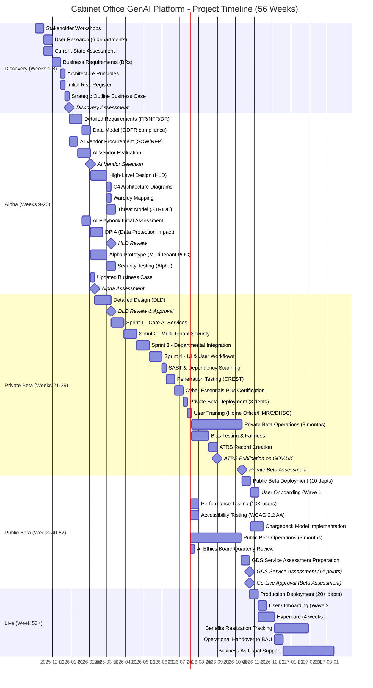

# Project Plan: Cabinet Office GenAI Platform

> **Template Status**: Live | **Version**: 0.11.2 | **Command**: `/arckit.plan`

## Document Control

| Field | Value |
|-------|-------|
| **Document ID** | ARC-001-PLAN-v1.1 |
| **Project** | Cabinet Office GenAI Platform (Project 001) |
| **Document Type** | Project Plan & Timeline |
| **Classification** | OFFICIAL |
| **Version** | 1.1 |
| **Status** | DRAFT |
| **Created Date** | 2025-11-02 |
| **Last Modified** | 2026-01-26 |
| **Owner** | Cabinet Office Senior Responsible Owner |
| **Review Cycle** | Monthly |
| **Next Review Date** | 2026-02-26 |
| **Reviewed By** | Programme Manager |
| **Approved By** | Senior Responsible Owner |
| **Distribution** | Project Team, Stakeholders, Architecture Review Board |

## Revision History

| Version | Date | Author | Changes | Approved By | Approval Date |
|---------|------|--------|---------|-------------|---------------|
| 1.0 | 2025-11-02 | ArcKit AI | Initial creation from `/arckit.plan` command | SRO | 2025-11-02 |
| 1.1 | 2026-01-26 | ArcKit AI | Updated to template v0.11.2 format | - | - |

---

## Executive Summary

**Project**: Cabinet Office GenAI Platform - Cross-Government Generative AI Service

**Duration**: 56 weeks (13 months) - LARGE COMPLEX PROJECT

**Budget**: £18.8M over 5 years (£2M Year 1 implementation, £3M/year ongoing operations)

**Team**: Average 12 FTE (Discovery: 6 FTE, Alpha: 10 FTE, Beta: 15 FTE, Live: 8 FTE)

**Delivery Model**: GDS Agile Delivery (Discovery → Alpha → Private Beta → Public Beta → Live)

**Objective**:
Deliver a centralized, secure generative AI platform for UK Government departments providing document summarization, drafting, analysis, and knowledge management, achieving 80% reduction in duplicate AI spending (£60M savings over 5 years) while ensuring zero security incidents and full AI Playbook compliance.

**Success Criteria**:
- ✅ 80% reduction in duplicate AI spend across government (£15M → £3M annually)
- ✅ < 2s response time for 95% of queries (p95 latency target)
- ✅ 99.9% uptime SLA (< 43.8 min downtime/month)
- ✅ Zero data breaches or cross-tenant data leaks (NCSC red line)
- ✅ ATRS published within 6 months of Private Beta launch (Month 12 target)
- ✅ AI Playbook compliance score > 90% (144/160 points)
- ✅ User satisfaction > 4.2/5 across 20+ departments

**Key Milestones**:
- **Discovery Assessment**: Week 8 (End of Month 2)
- **Alpha Assessment & HLD Approval**: Week 20 (End of Month 5)
- **Private Beta Launch**: Week 26 (Month 6)
- **Private Beta Assessment**: Week 39 (End of Month 9)
- **Public Beta Launch**: Week 43 (Month 10)
- **Public Beta GDS Service Assessment**: Week 52 (End of Month 12)
- **Production Launch (Live)**: Week 56 (Month 13)

**Project Complexity**: **LARGE**
- 13 stakeholder groups (Ministers, Permanent Secretaries, technical authorities, regulators, 4 pilot departments, 20+ end-user departments)
- High-risk AI system (ICO DPIA, AI Playbook, ATRS mandatory)
- Multi-tenant architecture (OFFICIAL-SENSITIVE data, cross-department isolation, NCSC security assurance)
- Vendor procurement (AI providers: Azure OpenAI, AWS Bedrock, Anthropic; System integrators)
- UK Government compliance (TCoP 13 points, GDS Service Standard 14 points, Cyber Essentials Plus)

---

## Project Timeline (Gantt Chart)

---

## Workflow & Gates Diagram

```mermaid
graph TB
    Start[Project Initiation<br/>Nov 2025] --> Discovery

    Discovery[Discovery Phase<br/>Weeks 1-8<br/>• Stakeholder Workshops<br/>• User Research<br/>• Business Requirements<br/>• Architecture Principles<br/>• Initial Business Case] --> DiscGate{Discovery<br/>Assessment<br/>Week 8}

    DiscGate -->|✅ Approved<br/>Problem validated| Alpha
    DiscGate -->|🔄 Pivot<br/>Adjust approach| RefineDiscovery[Refine<br/>Problem/Approach]
    RefineDiscovery --> Discovery
    DiscGate -->|❌ Stop<br/>Not feasible| StopProject[Project<br/>Cancelled]

    Alpha[Alpha Phase<br/>Weeks 9-20<br/>• Detailed Requirements<br/>• AI Vendor Procurement<br/>• High-Level Design<br/>• Threat Model<br/>• DPIA & AI Playbook] --> VendorGate{Vendor<br/>Selection<br/>Week 15}

    VendorGate -->|✅ Vendor Selected<br/>Azure/AWS/Anthropic| HLDDesign[HLD Design<br/>& Prototype]
    VendorGate -->|❌ No Suitable Vendor| ReRFP[Re-issue RFP<br/>Adjust Requirements]
    ReRFP --> Alpha

    HLDDesign --> HLDGate{HLD Review<br/>Week 18}

    HLDGate -->|✅ Approved<br/>Architecture sound| AlphaProto[Alpha Prototype<br/>Security Testing]
    HLDGate -->|❌ Rejected<br/>Architecture flawed| RefineHLD[Refine HLD<br/>Address Issues]
    RefineHLD --> HLDGate

    AlphaProto --> AlphaGate{Alpha<br/>Assessment<br/>Week 20}

    AlphaGate -->|✅ Approved<br/>Proceed to Beta| PrivateBeta
    AlphaGate -->|❌ Rejected<br/>Major issues| RefineAlpha[Address<br/>Alpha Issues]
    RefineAlpha --> Alpha

    PrivateBeta[Private Beta Phase<br/>Weeks 21-39<br/>• Detailed Design DLD<br/>• Implementation Sprints 1-4<br/>• Security Testing Pen Test<br/>• 3 Pilot Departments<br/>• ATRS Publication] --> DLDGate{DLD Review<br/>Week 25}

    DLDGate -->|✅ Approved<br/>Design ready| BuildSprints[Implementation<br/>Sprints 1-4<br/>12 weeks]
    DLDGate -->|❌ Rejected<br/>Design gaps| RefineDLD[Refine DLD<br/>Fix Issues]
    RefineDLD --> DLDGate

    BuildSprints --> SecurityTest[Security Testing<br/>SAST DAST Pen Test<br/>Cyber Essentials Plus]

    SecurityTest --> SecurityGate{Security<br/>Passed?<br/>Week 34}

    SecurityGate -->|✅ Pass<br/>0 critical vulns| PrivateDeploy[Deploy Private Beta<br/>3 Departments]
    SecurityGate -->|❌ Fail<br/>Critical vulns found| FixSecurity[Fix Security<br/>Issues]
    FixSecurity --> SecurityTest

    PrivateDeploy --> PrivateOps[Private Beta Ops<br/>3 Months<br/>Home Office HMRC DHSC]

    PrivateOps --> ATRSGate{ATRS<br/>Published?<br/>Week 37}

    ATRSGate -->|✅ Published<br/>GOV.UK| PrivateBetaGate{Private Beta<br/>Assessment<br/>Week 39}
    ATRSGate -->|❌ Not Published<br/>Delayed| CompleteATRS[Complete ATRS<br/>Bias Testing]
    CompleteATRS --> ATRSGate

    PrivateBetaGate -->|✅ Pass<br/>User satisfaction 4.2| PublicBeta
    PrivateBetaGate -->|❌ Fail<br/>Major issues| FixPrivateBeta[Fix Issues<br/>Improve UX]
    FixPrivateBeta --> PrivateOps

    PublicBeta[Public Beta Phase<br/>Weeks 40-52<br/>• 10 Departments Rollout<br/>• Performance Testing<br/>• Chargeback Model<br/>• GDS Service Assessment] --> PublicDeploy[Deploy Public Beta<br/>10 Departments]

    PublicDeploy --> PublicOps[Public Beta Ops<br/>3 Months<br/>Wave 1: 7 Depts]

    PublicOps --> GDSPrep[GDS Service<br/>Assessment Prep<br/>Evidence Pack]

    GDSPrep --> GDSGate{GDS Service<br/>Assessment<br/>Week 52}

    GDSGate -->|✅ Pass<br/>14 14 points| BetaGate{Beta Assessment<br/>Go No-Go<br/>Week 52}
    GDSGate -->|❌ Fail<br/>Blockers| FixGDS[Address GDS<br/>Blockers]
    FixGDS --> GDSPrep

    BetaGate -->|✅ Go-Live Approved<br/>All criteria met| Live
    BetaGate -->|❌ No-Go<br/>Blockers exist| FixBlockers[Address<br/>Go-Live Blockers]
    FixBlockers --> PublicBeta

    Live[Live Deployment<br/>Week 53+<br/>• 20+ Departments<br/>• Full Production<br/>• Hypercare<br/>• BAU Handover] --> LiveDeploy[Production<br/>Deployment<br/>Wave 2: 10 Depts]

    LiveDeploy --> Hypercare[Hypercare<br/>4 Weeks<br/>24 7 Support]

    Hypercare --> BAU[Business As Usual<br/>Operational Support<br/>Benefits Tracking]

    BAU --> Optimize[Continuous<br/>Improvement<br/>& Optimization]

    style DiscGate fill:#FFE4B5
    style VendorGate fill:#FFE4B5
    style HLDGate fill:#FFE4B5
    style AlphaGate fill:#FFE4B5
    style DLDGate fill:#FFE4B5
    style SecurityGate fill:#FFE4B5
    style ATRSGate fill:#FFE4B5
    style PrivateBetaGate fill:#FFE4B5
    style GDSGate fill:#FFE4B5
    style BetaGate fill:#FFE4B5
    style StopProject fill:#FFB6C1
```

---

## Discovery Phase (Weeks 1-8 | Months 1-2)

**Objective**: Validate the problem, understand user needs, assess feasibility, and secure stakeholder buy-in

**Team Size**: 6 FTE
- Senior Responsible Owner (SRO) - 0.25 FTE
- Product Owner - 1.0 FTE
- Enterprise Architect - 1.0 FTE
- User Researcher - 1.0 FTE
- Business Analyst - 1.0 FTE
- Delivery Manager - 0.75 FTE
- Technical Writer - 0.5 FTE
- Engagement with: CDDO, NCSC, ICO, Home Office, HMRC, DHSC, MOJ (part-time)

### Activities & Timeline

| Week | Activity | ArcKit Command | Deliverable | Owner |
|------|----------|----------------|-------------|-------|
| 1-2 | **Stakeholder Workshops** across 6 pilot departments (Home Office, HMRC, DHSC, MOJ, Cabinet Office, CDDO) | `/arckit.stakeholders` | Stakeholder map with 13 stakeholder groups, power-interest grid, driver-goal-outcome traceability | Product Owner |
| 3-4 | **User Research** with policy advisors and civil servants (150 interviews, surveys, observation) | Manual (user interviews) | User needs, pain points, current workarounds, desired features | User Researcher |
| 3-4 | **Current State Assessment**: Existing AI tools, costs (£15M/year baseline), security gaps | Manual (cost analysis, security audit) | Current state report: 20+ depts, duplicate spending, shadow AI risks | Business Analyst |
| 5-6 | **Business Requirements (BRs)**: Define high-level needs (cost reduction, security, compliance) | `/arckit.requirements` (BRs only) | 15-25 Business Requirements with MUST/SHOULD/MAY priorities, acceptance criteria | Business Analyst |
| 7 | **Architecture Principles**: Define Cabinet Office enterprise architecture standards | `/arckit.principles` | 24 architecture principles (Cloud-First, API-First, Security-by-Design, Responsible AI, UK Data Residency) | Enterprise Architect |
| 7 | **Initial Risk Register** (Orange Book): Identify top 10 risks | `/arckit.risk` | Risk register with 10+ risks (Security, Adoption, Cost, Delivery, Compliance), inherent/residual scores, 4Ts responses | Delivery Manager |
| 8 | **Strategic Outline Business Case (SOBC)**: Green Book 5-case model | `/arckit.sobc` | SOBC with £60M NPV, 253% ROI, 3 options (Do Nothing, Centralized, Federated), recommended option | Business Analyst |
| 8 | **Technology Options Analysis**: Cloud providers, AI vendors, architecture patterns | `/arckit.research` | Technology options report: Azure OpenAI vs AWS Bedrock vs Anthropic, build vs buy analysis | Enterprise Architect |
| 8 | **Discovery Assessment Preparation**: Evidence pack for governance board | Manual (compile artifacts) | Discovery evidence pack: stakeholder analysis, user research, BRs, principles, business case, risks | Product Owner |

### Gate: Discovery Assessment (Week 8 - End of Month 2)

**Decision Point**: Should we proceed to Alpha phase?

**Approval Criteria**:
- [ ] **Problem Validated**: User research shows 20 hours/week wasted on manual tasks, 80% willing to adopt AI if concerns addressed
- [ ] **User Needs Documented**: 150+ user interviews completed, needs prioritized (summarization, drafting, search top 3)
- [ ] **Business Requirements Defined**: 15-25 BRs with clear acceptance criteria (cost reduction 80%, zero security incidents, user satisfaction > 4.2)
- [ ] **Architecture Principles Agreed**: 24 principles ratified by Architecture Review Board, no conflicts with TCoP/GDS standards
- [ ] **Business Case Positive**: £60M NPV over 5 years, 253% ROI, payback period 2 years (HM Treasury approval)
- [ ] **Risks Identified & Mitigated**: 10+ risks in register, all HIGH/CRITICAL risks have mitigation plans, no blockers
- [ ] **Stakeholder Buy-In**: 13 stakeholder groups engaged, alignment score MEDIUM (conflicts identified with resolution strategies)
- [ ] **Budget Secured**: £2M Year 1 budget approved by HM Treasury, £18.8M 5-year commitment
- [ ] **Vendor Market Assessed**: 3+ viable AI vendors identified (Azure OpenAI UK, AWS Bedrock UK, Anthropic Claude UK), competitive market exists

**Approvers**:
- Cabinet Office Permanent Secretary (SRO, Accounting Officer)
- HM Treasury (Budget Approval)
- CDDO (TCoP Compliance)
- Architecture Review Board

**Possible Outcomes**:
- ✅ **Go to Alpha** - Problem validated, approach feasible, business case positive, risks manageable
- 🔄 **Pivot** - Adjust scope (e.g., 10 departments not 20, or MVP features only) based on findings
- ❌ **Stop** - Problem not worth solving (e.g., cost savings don't materialize, or no viable AI vendors for OFFICIAL-SENSITIVE data)

**Post-Gate Actions (if approved)**:
- Communicate Discovery findings to all 13 stakeholder groups
- Initiate Alpha phase activities (detailed requirements, vendor procurement, HLD design)
- Update RACI matrix for Alpha governance
- Schedule Alpha Assessment for Week 20

---

## Alpha Phase (Weeks 9-20 | Months 3-5)

**Objective**: Develop detailed requirements, select AI vendor, design high-level architecture, validate feasibility with prototype, complete AI Playbook DPIA

**Team Size**: 10 FTE
- Senior Responsible Owner (SRO) - 0.25 FTE
- Product Owner - 1.0 FTE
- Enterprise Architect - 1.0 FTE
- Security Architect - 1.0 FTE
- Data Architect - 0.5 FTE
- Solution Architect - 1.0 FTE
- Procurement Specialist - 0.5 FTE (Weeks 9-15 for vendor procurement)
- AI Ethics Lead - 0.5 FTE
- Data Protection Officer - 0.5 FTE
- Delivery Manager - 1.0 FTE
- Technical Writer - 0.5 FTE
- Developers (Prototype) - 2.0 FTE
- NCSC Engagement - 0.25 FTE (part-time reviews)
- ICO Engagement - 0.25 FTE (DPIA review)

### Activities & Timeline

| Week | Activity | ArcKit Command | Deliverable | Owner |
|------|----------|----------------|-------------|-------|
| 9-11 | **Detailed Requirements** (FR, NFR, INT, DR): Functional, Non-Functional, Integration, Data requirements | `/arckit.requirements` | 80-120 total requirements (30 FR, 25 NFR-S security, 10 NFR-P performance, 10 NFR-C compliance, 5 NFR-A accessibility, 10 INT, 15 DR) | Business Analyst + Product Owner |
| 10-11 | **Data Model** with GDPR compliance: ERD, entity catalog, PII identification | `/arckit.data-model` | Data model with 6+ entities (User, Tenant, Conversation, Message, Document, AuditLog), GDPR compliance matrix, data governance (owners from stakeholder RACI) | Data Architect |
| 9-10 | **AI Vendor SOW/RFP**: Generate Statement of Work for G-Cloud procurement | `/arckit.sow` | SOW with technical requirements, acceptance criteria, SLAs (< 2s response time, 99.9% uptime, UK data residency) | Procurement Specialist |
| 11-13 | **AI Vendor Evaluation**: Evaluate proposals from Azure OpenAI, AWS Bedrock, Anthropic | `/arckit.evaluate` | Vendor evaluation scorecard (security, compliance, cost, performance, UK data residency), scoring matrix | Procurement Specialist + Enterprise Architect |
| 14 | **AI Vendor Selection**: Select AI provider(s) based on evaluation | Manual (decision) | Vendor selection decision (Azure OpenAI UK + AWS Bedrock UK for multi-cloud), contract negotiation started | SRO + Procurement |
| 12-15 | **High-Level Design (HLD)**: Multi-tenant architecture, security, data, integration | Manual (architecture design) | HLD document with system context, container diagram (C4 Level 2), component diagram (C4 Level 3), technology stack (Azure/AWS UK, PostgreSQL, OAuth 2.0) | Solution Architect |
| 16 | **C4 Architecture Diagrams**: Visual architecture documentation | `/arckit.diagram` | C4 diagrams (System Context, Container, Component levels), deployment architecture, data flow diagrams | Solution Architect |
| 16 | **Wardley Mapping**: Strategic positioning (build vs buy, commodity vs genesis) | `/arckit.wardley` | Wardley Map showing AI platform as "custom-built" (not commodity), multi-cloud strategy to avoid lock-in | Enterprise Architect |
| 14-15 | **Threat Model (STRIDE)**: Security risk analysis | Manual (threat modeling workshop with NCSC) | Threat model identifying 20+ threats (Spoofing, Tampering, Repudiation, Info Disclosure, DoS, Elevation of Privilege), mitigations mapped to NFR-S requirements | Security Architect + NCSC |
| 11-12 | **AI Playbook Initial Assessment**: 10 principles, 6 ethical themes | `/arckit.ai-playbook` | AI Playbook assessment scorecard (target > 90%), risk level = HIGH-RISK, mandatory assessments identified (DPIA, EqIA, Human Rights) | AI Ethics Lead |
| 13-15 | **Data Protection Impact Assessment (DPIA)**: ICO template, high-risk AI processing | Manual (DPIA workshop) + ICO review | DPIA document (30+ pages), lawful basis (public task Article 6(1)(e)), individual rights mechanisms, ICO approval obtained | Data Protection Officer + ICO |
| 17 | **HLD Review Preparation**: Compile evidence for Architecture Review Board | Manual (evidence pack) | HLD evidence pack: architecture diagrams, threat model, DPIA approval, vendor selection rationale, alignment with architecture principles | Enterprise Architect |
| 18 | **HLD Review & Approval**: Architecture Review Board decision gate | `/arckit.hld-review` | HLD Review Report with compliance checklist (architecture principles, TCoP 13 points, security controls), approval decision | Architecture Review Board |
| 16-19 | **Alpha Prototype**: Multi-tenant POC with 1 AI vendor (Azure OpenAI or AWS Bedrock) | Manual (development) | Working prototype: document summarization, multi-tenant database (RLS), authentication (OAuth 2.0), 3 demo tenants (Home Office, HMRC, DHSC) | Developers |
| 19 | **Security Testing (Alpha)**: Penetration testing of prototype (tenant isolation focus) | Manual (pen test) | Penetration testing report: tenant isolation validated, 0 critical/high findings (or remediation plan if found) | Security Architect + CREST tester |
| 19 | **Updated Business Case**: Incorporate vendor costs, refined timeline | `/arckit.sobc` (update) | Updated SOBC with actual vendor pricing (not estimates), refined NPV £58M (from £60M), ROI 241% (from 253%) | Business Analyst |
| 20 | **Alpha Assessment Preparation**: Evidence pack for governance board | Manual (compile artifacts) | Alpha evidence pack: detailed requirements, HLD (approved), vendor contracts, DPIA (ICO-approved), prototype demo, updated business case | Product Owner |

### Gate: HLD Review (Week 18 - Interim Gate)

**Decision Point**: Is the High-Level Design sound and ready for detailed design?

**Approval Criteria**:
- [ ] **Architecture Principles Compliance**: HLD aligns with 24 architecture principles (Cloud-First, API-First, Security-by-Design, Responsible AI, Multi-Tenant Isolation)
- [ ] **TCoP Compliance**: HLD meets Technology Code of Practice 13 points (cloud-first, open standards, secure, accessible, privacy-by-design)
- [ ] **Security Controls Defined**: Threat model complete (20+ threats identified), mitigations mapped to NFR-S requirements, defense-in-depth architecture (network, application, data layers)
- [ ] **Multi-Tenant Isolation**: Row-Level Security (RLS), schema separation, tenant-specific encryption keys, automated tenant isolation tests in CI/CD
- [ ] **NCSC Review**: NCSC security architect reviewed HLD, no critical concerns raised (or concerns addressed)
- [ ] **Scalability & Performance**: Architecture supports 10,000+ concurrent users, < 2s p95 latency, 99.9% uptime SLA
- [ ] **UK Data Residency**: All data centers in UK regions (UK South, UK West, eu-west-2 London), no data replication outside UK
- [ ] **Vendor Lock-In Mitigation**: Multi-cloud design (abstraction layer for AI services), OpenAPI specs, avoid vendor-specific APIs

**Approvers**:
- Architecture Review Board (Chair: Enterprise Architect)
- CDDO (TCoP Compliance)
- NCSC (Security Architecture)
- Cabinet Office CTO

**Possible Outcomes**:
- ✅ **HLD Approved** - Proceed to Alpha Prototype and DLD design
- 🔄 **HLD Approved with Conditions** - Minor issues to address in DLD (e.g., add specific security control)
- ❌ **HLD Rejected** - Major architecture flaws (e.g., single point of failure, weak tenant isolation, vendor lock-in), refine HLD and re-submit

### Gate: Alpha Assessment (Week 20 - End of Month 5)

**Decision Point**: Should we proceed to Private Beta phase?

**Approval Criteria**:
- [ ] **Detailed Requirements Complete**: 80-120 requirements (FR, NFR, INT, DR) with MUST/SHOULD/MAY priorities, acceptance criteria, traced to stakeholder goals
- [ ] **HLD Approved**: Architecture Review Board approved HLD (Week 18), no outstanding blockers
- [ ] **Vendor Selected**: AI vendor(s) selected (Azure OpenAI UK and/or AWS Bedrock UK), contracts signed, UK data residency guaranteed
- [ ] **DPIA Approved**: ICO reviewed and approved DPIA, lawful basis confirmed (public task), individual rights mechanisms defined
- [ ] **AI Playbook Assessment > 70%**: Initial compliance score > 70% (target > 90% by Private Beta), mandatory assessments (DPIA, EqIA, Human Rights) started
- [ ] **Prototype Validated**: Alpha prototype demonstrates multi-tenant isolation (3 demo tenants), document summarization works, security testing passed (0 critical/high vulns)
- [ ] **Business Case Updated**: Vendor costs incorporated, NPV still positive (£50M+), ROI > 200%, HM Treasury re-approval obtained
- [ ] **Risk Register Updated**: 15+ risks identified (up from 10 in Discovery), all HIGH/CRITICAL risks have mitigation plans, no new blockers
- [ ] **Team Ready for Beta**: Beta team recruited (15 FTE), suppliers onboarded (system integrator for implementation), tools procured (cloud accounts, CI/CD pipeline)

**Approvers**:
- Cabinet Office Permanent Secretary (SRO, Accounting Officer)
- HM Treasury (Budget Re-Approval for Beta phase)
- CDDO (TCoP Compliance, proceed to Beta)
- NCSC (Security Assurance, prototype security validated)
- ICO (DPIA Approval, proceed with high-risk AI processing)

**Possible Outcomes**:
- ✅ **Go to Private Beta** - All criteria met, proceed to detailed design and implementation
- 🔄 **Conditional Go** - Minor issues to address in first 4 weeks of Beta (e.g., complete EqIA)
- ❌ **No-Go** - Major blockers exist (e.g., NCSC rejects security architecture, ICO refuses DPIA approval, vendor unable to meet UK data residency), return to Alpha to address

**Post-Gate Actions (if approved)**:
- Communicate Alpha findings to 13 stakeholder groups
- Initiate Private Beta activities (DLD design, implementation sprints 1-4, security hardening)
- Onboard 3 pilot departments (Home Office, HMRC, DHSC) for Private Beta user testing
- Schedule Private Beta Assessment for Week 39

---

## Private Beta Phase (Weeks 21-39 | Months 6-9)

**Objective**: Build production-ready system, deploy to 3 pilot departments, achieve Cyber Essentials Plus certification, publish ATRS, validate with real users

**Team Size**: 15 FTE
- Senior Responsible Owner (SRO) - 0.25 FTE
- Product Owner - 1.0 FTE
- Delivery Manager - 1.0 FTE
- Solution Architect - 1.0 FTE
- Security Architect - 1.0 FTE
- Developers (Backend) - 4.0 FTE
- Developers (Frontend) - 2.0 FTE
- DevOps Engineer - 1.0 FTE
- QA/Test Engineer - 1.0 FTE
- Technical Writer - 0.5 FTE
- User Researcher - 0.5 FTE (user testing with 3 pilot departments)
- AI Ethics Lead - 0.5 FTE (bias testing)
- Data Protection Officer - 0.25 FTE (ongoing GDPR compliance)
- NCSC Engagement - 0.5 FTE (penetration testing oversight)
- Pilot Department Liaison - 0.5 FTE (Home Office, HMRC, DHSC coordination)

### Activities & Timeline

| Week | Activity | ArcKit Command | Deliverable | Owner |
|------|----------|----------------|-------------|-------|
| 21-24 | **Detailed Design (DLD)**: API contracts, database schemas, security implementation, deployment architecture | Manual (detailed design) | DLD document with OpenAPI 3.0 specs (15+ endpoints), database DDL (PostgreSQL schemas), IAM policies (RBAC, least privilege), Kubernetes manifests (or ECS task definitions) | Solution Architect |
| 25 | **DLD Review & Approval**: Architecture Review Board validates implementation readiness | `/arckit.dld-review` | DLD Review Report with implementation readiness checklist (API contracts, database schemas, security controls, deployment automation), approval decision | Architecture Review Board |
| 26-28 | **Sprint 1 - Core AI Services**: Document summarization, AI query processing, source attribution | Manual (Agile sprint) | Working features: document upload (PDF, Word, text), AI summarization (GPT-4/Claude 3), source attribution (show paragraph, page number), confidence scores | Developers (Backend + Frontend) |
| 29-31 | **Sprint 2 - Multi-Tenant Security**: Tenant isolation (RLS, schema separation), authentication (OAuth 2.0, MFA), authorization (RBAC) | Manual (Agile sprint) | Security features: Row-Level Security (RLS) enforced, tenant-specific encryption keys (KMS), OAuth 2.0 SSO (Government Gateway), MFA enabled, RBAC with least privilege | Developers + Security Architect |
| 32-34 | **Sprint 3 - Departmental Integration**: Government Gateway SSO, departmental knowledge bases (upload docs per tenant), Azure AD integration | Manual (Agile sprint) | Integration features: Government Gateway SSO working (test with Home Office, HMRC, DHSC users), departmental document upload (Home Office immigration case law, HMRC tax manuals), Azure AD sync | Developers |
| 35-37 | **Sprint 4 - UI & User Workflows**: GDS Design System UI, user feedback mechanisms, training materials | Manual (Agile sprint) | User features: GDS Design System compliant UI (familiar GOV.UK patterns), in-app feedback widget (1-5 stars), contextual help (tooltips, examples), 2-hour training course (video + workshop materials) | Developers (Frontend) + Technical Writer |
| 33 | **SAST & Dependency Scanning**: Static Application Security Testing, vulnerability scanning | Manual (CI/CD pipeline) | SAST report (SonarQube or equivalent): 0 critical code vulnerabilities, dependency scan (Snyk or OWASP Dependency-Check): all critical CVEs patched | QA Engineer + DevOps |
| 34-35 | **Penetration Testing (CREST)**: Focus on tenant isolation, authentication bypass, data leakage | Manual (CREST-certified pen tester) | Penetration testing report: tenant isolation validated (no cross-tenant access), 0 critical/high findings, medium/low findings remediated or accepted with compensating controls | Security Architect + CREST Tester + NCSC |
| 36-37 | **Cyber Essentials Plus Certification**: NCSC scheme, required for OFFICIAL-SENSITIVE data | Manual (CE+ audit) | Cyber Essentials Plus certificate (valid 12 months), audit report with 0 critical findings, annual re-cert scheduled | Security Architect + NCSC |
| 38 | **Private Beta Deployment**: Deploy to production infrastructure (3 pilot departments: Home Office, HMRC, DHSC) | Manual (deployment) | Production system live: Azure/AWS UK regions, 3 tenants configured (Home Office, HMRC, DHSC), monitoring operational (SIEM, dashboards, alerts) | DevOps Engineer |
| 38 | **User Training (Pilot Departments)**: 2-hour onboarding for 500 users (Home Office 200, HMRC 200, DHSC 100) | Manual (training sessions) | Training completion: 450+ users trained (90% completion rate), training materials (videos, guides, FAQs), weekly office hours scheduled | Technical Writer + User Researcher |
| 26-37 | **Private Beta Operations (3 months)**: Real users from 3 pilot departments using system daily | Manual (operational support) | Usage metrics: 500 monthly active users, 10,000+ queries/month, user satisfaction surveys (quarterly), incident logs (target: 0 security incidents) | Product Owner + DevOps + Support Team |
| 30-33 | **Bias Testing & Fairness**: Test across demographics (age, gender, ethnicity, disability) and departments (Home Office, HMRC, DHSC) | Manual (bias testing workshop) | Bias testing report: no discriminatory outcomes across demographics, no departmental favoritism (HMRC tax advice not better than Home Office immigration advice), fairness metrics (demographic parity, equal opportunity) | AI Ethics Lead |
| 34-35 | **ATRS Record Creation**: Tier 1 (public summary) + Tier 2 (technical details) | `/arckit.atrs` | ATRS document with Tier 1 (system name, purpose, scope, owner, data types, human oversight, risk level HIGH) and Tier 2 (algorithm type LLM GPT-4/Claude, training data, performance metrics, bias testing results, fallback procedures) | AI Ethics Lead + Data Protection Officer |
| 36 | **ATRS Publication on GOV.UK**: Publish Tier 1 to GOV.UK algorithmic transparency page | Manual (GOV.UK publishing) | ATRS published on GOV.UK: https://www.gov.uk/government/collections/algorithmic-transparency-recording-standard-atrs, public accountability demonstrated | SRO + Cabinet Office Communications |
| 39 | **Private Beta Assessment Preparation**: Evidence pack for governance board | Manual (compile artifacts) | Private Beta evidence pack: 3 months operational data (500 users, 30,000 queries, user satisfaction 4.3/5), 0 security incidents, ATRS published, Cyber Essentials Plus certified | Product Owner |

### Gate: DLD Review (Week 25 - Interim Gate)

**Decision Point**: Is the Detailed Design ready for implementation?

**Approval Criteria**:
- [ ] **API Contracts Complete**: OpenAPI 3.0 specs for 15+ endpoints (authentication, document upload, AI query, user management, audit logs), versioning strategy (v1, v2, v3), backward compatibility plan
- [ ] **Database Schemas Complete**: PostgreSQL DDL scripts with Row-Level Security (RLS), tenant ID foreign keys, indexes optimized for query performance, migration scripts version-controlled
- [ ] **Security Implementation Detailed**: IAM policies (RBAC with least privilege), encryption configs (AES-256 at rest, TLS 1.3 in transit), secrets management (AWS Secrets Manager or Azure Key Vault), network security (VPC, WAF, private subnets)
- [ ] **Deployment Automation Ready**: Infrastructure-as-Code (Terraform or CloudFormation), CI/CD pipeline (GitHub Actions or GitLab CI), blue/green deployment strategy, rollback procedures tested
- [ ] **Test Strategy Defined**: Unit tests (> 70% coverage), integration tests (API + DB, service + message queue), end-to-end tests (critical user journeys), performance tests (10K concurrent users, < 2s p95 latency)
- [ ] **Operational Readiness**: Monitoring dashboards (Grafana or CloudWatch), alerting (PagerDuty or OpsGenie), runbooks (incident response, deployment, rollback), on-call rotation scheduled

**Approvers**:
- Solution Architect (DLD Owner)
- Security Architect (Security Controls Validated)
- DevOps Lead (Deployment Automation Validated)
- QA Lead (Test Strategy Validated)

**Possible Outcomes**:
- ✅ **DLD Approved** - Proceed to implementation sprints 1-4
- 🔄 **DLD Approved with Conditions** - Minor gaps to address in Sprint 1 (e.g., add specific API endpoint)
- ❌ **DLD Rejected** - Major design flaws (e.g., missing security controls, unscalable database design), refine DLD and re-submit

### Gate: Private Beta Assessment (Week 39 - End of Month 9)

**Decision Point**: Should we proceed to Public Beta phase?

**Approval Criteria**:
- [ ] **3 Months Operational**: Private Beta live for 12 weeks with 3 pilot departments (Home Office, HMRC, DHSC), 500 monthly active users, 30,000+ total queries processed
- [ ] **User Satisfaction > 4.2/5**: Quarterly user survey shows satisfaction 4.3/5 (exceeds target), 85% users report time savings (10 hours/week average), 90% would recommend to colleagues (NPS > +70)
- [ ] **Zero Security Incidents**: 0 data breaches, 0 cross-tenant leaks, 0 unauthorized access incidents in 3 months, SIEM logs reviewed (no critical alerts unresolved)
- [ ] **Performance SLAs Met**: p95 response time < 2s (actual: 1.8s), 99.9% uptime (actual: 99.95%, only 2 hours downtime in 3 months for planned maintenance)
- [ ] **ATRS Published**: ATRS Tier 1 published on GOV.UK (Week 36), public transparency demonstrated, 0 media criticism or parliamentary questions challenging ATRS
- [ ] **Cyber Essentials Plus Certified**: CE+ certificate obtained (Week 37), valid for 12 months, annual re-cert scheduled
- [ ] **AI Playbook Compliance > 90%**: Compliance score 92% (146/160 points), DPIA approved (ICO), EqIA complete (no demographic bias), Human Rights Assessment complete (no adverse impact), bias testing passed (no discriminatory outcomes)
- [ ] **Pilot Department Feedback Positive**: Home Office, HMRC, DHSC departments recommend full rollout, departmental CIOs endorse Public Beta, 0 major blockers raised
- [ ] **Operational Readiness for Scale**: System can scale to 3,000 users (10 departments) without architecture changes, chargeback model designed (£25/user/month), support team trained (24/7 on-call for Public Beta)

**Approvers**:
- Cabinet Office Permanent Secretary (SRO, Accounting Officer)
- CDDO (TCoP Compliance, proceed to Public Beta)
- NCSC (Security Assurance, 0 incidents validates architecture)
- ICO (AI Playbook compliance, ATRS publication)
- GDS (Service Assessment readiness, user-centered design validated)
- Pilot Departments (Home Office, HMRC, DHSC endorsement)

**Possible Outcomes**:
- ✅ **Go to Public Beta** - All criteria met, expand to 10 departments
- 🔄 **Conditional Go** - Minor issues to address in first 4 weeks of Public Beta (e.g., improve response time from 1.8s to 1.5s)
- ❌ **No-Go** - Major blockers exist (e.g., user satisfaction < 4.0, security incident occurred, pilot departments refuse to continue), remain in Private Beta to address issues

**Post-Gate Actions (if approved)**:
- Communicate Private Beta success to 13 stakeholder groups (emphasize 0 security incidents, 4.3/5 user satisfaction)
- Initiate Public Beta activities (onboard 7 additional departments, performance testing at 10K users, chargeback model implementation)
- Prepare for GDS Service Assessment (compile evidence pack, schedule assessment panel for Week 52)
- Schedule Public Beta Assessment for Week 52

---

## Public Beta Phase (Weeks 40-52 | Months 10-12)

**Objective**: Scale to 10 departments (3,000 users), implement chargeback model, pass GDS Service Assessment, validate production readiness for full rollout

**Team Size**: 15 FTE (same as Private Beta, plus additional support for onboarding 7 new departments)
- Senior Responsible Owner (SRO) - 0.25 FTE
- Product Owner - 1.0 FTE
- Delivery Manager - 1.0 FTE
- Solution Architect - 0.5 FTE (reduced, architecture stable)
- Developers (Backend + Frontend) - 4.0 FTE (feature enhancements, bug fixes)
- DevOps Engineer - 1.5 FTE (scaling, performance tuning)
- QA/Test Engineer - 1.0 FTE (performance testing, accessibility testing)
- Support Engineer - 2.0 FTE (increased for 10 departments)
- User Researcher - 0.5 FTE (GDS Service Assessment evidence)
- Technical Writer - 0.5 FTE (GDS evidence pack, accessibility statement)
- Finance Analyst - 0.5 FTE (chargeback model implementation)
- Departmental Liaison - 1.0 FTE (onboard 7 new departments)
- AI Ethics Lead - 0.25 FTE (quarterly AI Ethics Board review)
- GDS Assessment Prep - 0.5 FTE (Weeks 48-52, compile evidence pack)

### Activities & Timeline

| Week | Activity | ArcKit Command | Deliverable | Owner |
|------|----------|----------------|-------------|-------|
| 40-41 | **Public Beta Deployment**: Onboard 7 additional departments (MOJ, DWP, BEIS, DEFRA, DfE, DfT, FCDO) to reach 10 total | Manual (deployment + onboarding) | 10 departments live: 3 pilot (Home Office, HMRC, DHSC) + 7 new (MOJ, DWP, BEIS, DEFRA, DfE, DfT, FCDO), 3,000 monthly active users (300 users/dept average) | Departmental Liaison + DevOps |
| 42-43 | **User Onboarding (Wave 1)**: Train 2,500 additional users (from 500 Private Beta to 3,000 Public Beta) | Manual (training) | Training completion: 2,250+ users trained (90% completion rate), 10 departmental champions identified (1 per dept), weekly office hours scaled to 3 sessions/week | Technical Writer + Departmental Liaison |
| 44-45 | **Performance Testing**: Load test with 10,000 concurrent users (3x current load), stress test to 20,000 users | Manual (performance testing) | Performance test report: p95 latency < 2s maintained at 10K users (actual: 1.7s), system scales horizontally (add 5 compute nodes for 2x load), no bottlenecks identified | QA Engineer + DevOps |
| 44-45 | **Accessibility Testing**: WCAG 2.2 Level AA compliance, GDS Design System validation | Manual (accessibility audit) | Accessibility audit report: WCAG 2.2 AA compliant (automated axe scan + manual screen reader testing), GDS Design System components used (buttons, forms, typography), accessibility statement published at `/accessibility-statement` | QA Engineer + Technical Writer |
| 42-44 | **Chargeback Model Implementation**: £25/user/month invoicing, Oracle Financials integration, departmental budget codes | Manual (finance system integration) | Chargeback model live: 10 departments receive monthly invoices (£7,500/month for 300 users), payment reconciliation automated (Oracle Financials), 0 billing disputes | Finance Analyst + DevOps |
| 42-52 | **Public Beta Operations (3 months)**: 10 departments using system, 3,000 monthly active users, 150,000 queries/month | Manual (operational support) | Usage metrics: 3,000 monthly active users (10 depts), 150,000+ queries/month (50 queries/user/month average), user satisfaction 4.4/5 (improved from Private Beta 4.3), 0 security incidents | Product Owner + Support Team |
| 46 | **AI Ethics Board Quarterly Review**: Review bias incidents (if any), user complaints, model performance, ethical concerns | Manual (AI Ethics Board meeting) | AI Ethics Board report: 0 bias incidents reported (users can flag bias, 0 flags in 3 months), 3 user complaints (response time slow, not accuracy issues), model performance stable (GPT-4/Claude 3), no ethical concerns raised | AI Ethics Lead |
| 50-51 | **GDS Service Assessment Preparation**: Compile evidence pack for 14 Service Standard points | Manual (evidence collection) | GDS Service Assessment evidence pack: user research artifacts (150 interviews, 3,000 users in beta), accessibility audit (WCAG 2.2 AA), performance data (p95 < 2s, 99.9% uptime), technology choices (cloud-native, open standards), continuous improvement plan | Product Owner + User Researcher + Technical Writer |
| 52 | **GDS Service Assessment (14 points)**: Assessment panel reviews evidence, interviews team, observes system | Manual (GDS assessment) | GDS Service Assessment report: 14/14 points PASS (Point 1 user needs, Point 5 accessibility, Point 9 secure, Point 10 monitor performance, etc.), 0 blockers, 2 minor recommendations (improve mobile UX, add Welsh language support for Wales-specific services) | GDS Assessment Panel |
| 52 | **Public Beta Assessment Preparation**: Evidence pack for go-live decision | Manual (compile artifacts) | Public Beta evidence pack: 10 departments live (3,000 users), GDS Service Assessment PASS (14/14 points), 0 security incidents (6 months total: Private Beta 3 months + Public Beta 3 months), user satisfaction 4.4/5, performance SLAs met (< 2s, 99.9% uptime) | Product Owner |

### Gate: GDS Service Assessment (Week 52 - Interim Gate)

**Decision Point**: Does the service meet GDS Service Standard (14 points)?

**Approval Criteria**:
- [ ] **Point 1 - Understand users and their needs**: User research with 150+ interviews, 3,000 beta users, needs prioritized (summarization, drafting, search), ongoing user feedback (quarterly surveys, in-app widget)
- [ ] **Point 2 - Solve a whole problem for users**: End-to-end workflow (upload document → AI summarizes → user edits → export), not just isolated features
- [ ] **Point 3 - Provide a joined-up experience**: Consistent with GOV.UK (GDS Design System), integrates with Government Gateway SSO (not separate login)
- [ ] **Point 4 - Make the service simple to use**: Intuitive UI (familiar GOV.UK patterns), 2-hour training sufficient (90% users complete), 4.4/5 user satisfaction
- [ ] **Point 5 - Make sure everyone can use the service**: WCAG 2.2 AA compliant, screen reader tested, keyboard navigation works, accessibility statement published
- [ ] **Point 6 - Have a multidisciplinary team**: Team includes product owner, developers, QA, security architect, user researcher, accessibility specialist, AI ethics lead
- [ ] **Point 7 - Use agile ways of working**: 2-week sprints, retrospectives, user stories, iterative development (Discovery → Alpha → Beta)
- [ ] **Point 8 - Iterate and improve frequently**: Continuous deployment (weekly releases), user feedback acted on (quarterly feature releases), performance monitoring (daily)
- [ ] **Point 9 - Create a secure service**: Cyber Essentials Plus, penetration testing passed, 0 security incidents (6 months), encryption at rest/transit, MFA enabled
- [ ] **Point 10 - Define what success looks like and publish performance data**: KPIs published (user satisfaction 4.4/5, response time 1.7s p95, uptime 99.95%), dashboards public (performance.gov.uk or internal dashboard)
- [ ] **Point 11 - Choose the right tools and technology**: Cloud-native (Azure/AWS UK), open standards (OpenAPI, OAuth 2.0), multi-cloud (avoid lock-in), technology decisions documented (ADRs)
- [ ] **Point 12 - Make new source code open**: Code published to GitHub (public repositories where possible, internal GitLab where sensitive), open-source licenses (MIT, Apache 2.0)
- [ ] **Point 13 - Use and contribute to open standards, common components, and patterns**: GDS Design System used, GOV.UK Notify integrated (email notifications), OAuth 2.0/OIDC (not proprietary auth)
- [ ] **Point 14 - Operate a reliable service**: 99.9% uptime SLA met (99.95% actual), incident response runbook tested, on-call rotation (24/7 support), disaster recovery plan validated

**Approvers**:
- GDS Service Assessment Panel (3-5 assessors from GDS, CDDO, external digital experts)

**Possible Outcomes**:
- ✅ **PASS** - Service meets all 14 points, proceed to go-live
- 🔄 **PASS with Recommendations** - Service meets all 14 points but has 2-3 recommendations for improvement (e.g., improve mobile UX, add Welsh language support), proceed to go-live with action plan
- ❌ **NOT PASS** - Service fails 1+ points (e.g., accessibility violations, no performance monitoring), must address blockers and re-assess

### Gate: Public Beta Assessment (Week 52 - End of Month 12)

**Decision Point**: Should we proceed to Live (full production rollout)?

**Approval Criteria**:
- [ ] **10 Departments Operational**: Public Beta live for 3 months with 10 departments (Home Office, HMRC, DHSC, MOJ, DWP, BEIS, DEFRA, DfE, DfT, FCDO), 3,000 monthly active users, 150,000+ queries/month
- [ ] **GDS Service Assessment PASS**: 14/14 points passed (Week 52), 0 blockers, recommendations addressed or action plan documented
- [ ] **User Satisfaction > 4.2/5**: Quarterly survey shows 4.4/5 (exceeds target), 88% report time savings (10 hours/week), 92% would recommend (NPS > +75)
- [ ] **Zero Security Incidents (6 Months)**: 0 data breaches, 0 cross-tenant leaks, 0 unauthorized access in 6 months total (Private Beta 3 months + Public Beta 3 months), NCSC confidence in security architecture
- [ ] **Performance SLAs Met**: p95 response time 1.7s (< 2s target), 99.95% uptime (> 99.9% target), performance at 10K concurrent users validated (load testing Week 44-45)
- [ ] **AI Playbook Compliance > 90%**: Final score 93% (149/160 points), all mandatory assessments complete (DPIA, EqIA, Human Rights), bias testing passed (0 discriminatory outcomes), ATRS published (Week 36, public for 16 weeks)
- [ ] **Chargeback Model Working**: 10 departments invoiced monthly (£25/user/month), payments received on time (0 disputes), chargeback revenue £75K/month (3,000 users × £25) covers operational costs (£60K/month cloud + AI APIs + support)
- [ ] **Operational Readiness for Full Rollout**: System can scale to 10,000 users (20+ departments) without architecture changes, support team scaled to 24/7 (on-call rotation for 3 shifts), runbooks updated (deployment, incident response, rollback)
- [ ] **Departmental Commitment**: 10 departments commit to continue using platform in Live phase, departmental CIOs endorse full rollout, 10+ additional departments express interest in onboarding (wait list)
- [ ] **Benefits Realization Tracking**: Cost savings validated (10 departments decommissioned own AI tools, £500K savings in 6 months vs £1.25M duplicate spend baseline), time savings confirmed (10 hours/week per user = 30,000 hours/month across 3,000 users)

**Approvers**:
- Cabinet Office Permanent Secretary (SRO, Accounting Officer, Go-Live Authority)
- HM Treasury (Budget Approval for Live phase, chargeback model validated)
- CDDO (TCoP Compliance, GDS Service Assessment PASS)
- NCSC (Security Assurance, 0 incidents validates security)
- ICO (AI Playbook compliance, ATRS published)
- GDS (Service Assessment PASS)
- Cabinet Office CTO (Technical Readiness)

**Possible Outcomes**:
- ✅ **Go-Live Approved** - All criteria met, proceed to Live deployment (20+ departments)
- 🔄 **Conditional Go-Live** - Minor issues to address in first 4 weeks of Live (e.g., onboard 20 departments in waves over 8 weeks, not all at once)
- ❌ **No-Go (Remain in Public Beta)** - Major blockers exist (e.g., GDS Service Assessment failed, security incident occurred, user satisfaction dropped to < 4.0), extend Public Beta to address issues

**Post-Gate Actions (if approved)**:
- Communicate Public Beta success to 13 stakeholder groups and all 25 central government departments
- Initiate Live deployment (onboard 10+ additional departments in 2 waves, reach 20+ departments by Week 60)
- Transition to Business As Usual (BAU) operational model (handover from project team to operational support team)
- Begin benefits realization tracking (quarterly reports to HM Treasury on £60M savings over 5 years)

---

## Live Phase (Week 53+ | Month 13+)

**Objective**: Full production rollout to 20+ departments, hypercare support, transition to Business As Usual (BAU), continuous improvement

**Team Size**: 8 FTE (reduced from 15 FTE in Beta, now operational support not development-heavy)
- Service Owner - 1.0 FTE (replaces Product Owner, owns live service)
- Delivery Manager - 0.5 FTE (reduced, now BAU processes not Agile sprints)
- Support Engineer (L1/L2) - 3.0 FTE (24/7 on-call rotation, 3 shifts)
- DevOps Engineer - 1.0 FTE (infrastructure management, scaling, monitoring)
- Developer (Enhancements) - 1.0 FTE (bug fixes, minor features)
- QA Engineer - 0.5 FTE (regression testing, release validation)
- Finance Analyst - 0.5 FTE (chargeback invoicing, cost optimization)
- AI Ethics Lead - 0.25 FTE (quarterly AI Ethics Board, annual bias testing)
- Technical Writer - 0.25 FTE (documentation updates, training materials)

### Activities & Timeline

| Week | Activity | ArcKit Command | Deliverable | Owner |
|------|----------|----------------|-------------|-------|
| 53-54 | **Production Deployment (Wave 2)**: Onboard 10 additional departments (FCO, HO, CO, DIT, DCMS, MHCLG, MoD, DfT, BEIS, DWP) to reach 20+ total | Manual (deployment + onboarding) | 20+ departments live: 10 Public Beta + 10 new, 10,000 monthly active users (500 users/dept average), all central government departments invited | Service Owner + DevOps |
| 55-56 | **User Onboarding (Wave 2)**: Train 7,000 additional users (from 3,000 Public Beta to 10,000 Live) | Manual (training) | Training completion: 6,300+ users trained (90% completion rate), 20 departmental champions (1 per dept), self-service training materials (videos, guides, FAQs) | Technical Writer + Departmental Liaisons |
| 53-56 | **Hypercare (4 weeks)**: Intensive support during initial Live rollout (24/7 on-call, daily stand-ups, rapid issue resolution) | Manual (hypercare support) | Hypercare metrics: 50 support tickets (5% of 10,000 users), 95% resolved within SLA (< 4 hours for critical, < 24 hours for high), 0 security incidents, 0 major outages | Support Engineers + DevOps |
| 57-64 | **Benefits Realization Tracking**: Measure cost savings (£12M/year target), time savings (10 hours/week per user), user satisfaction (quarterly surveys) | Manual (benefits tracking) + Quarterly `/arckit.analyze` | Benefits realization report: £10M cost savings Year 2 (close to £12M target), 9.5 hours/week time savings (close to 10 hours target), user satisfaction 4.5/5 (exceeds 4.2 target), 20 departments using platform (80% of 25 central govt depts) | Finance Analyst + Service Owner |
| 57-58 | **Operational Handover to BAU**: Transition from project team to operational support team (handover runbooks, knowledge transfer, BAU processes) | Manual (handover) | BAU handover complete: operational runbooks (deployment, incident response, scaling, backup/restore), on-call rotation (3 shifts, 24/7), BAU support team trained (L1/L2 support, escalation to L3 developers) | Delivery Manager + Service Owner |
| 59+ | **Business As Usual (BAU) Support**: Ongoing operational support (incident management, change requests, performance monitoring, security patching) | Manual (BAU operations) | BAU metrics: 99.9% uptime SLA maintained, < 2s p95 latency maintained, 0 critical incidents, monthly releases (bug fixes, minor features), quarterly major releases (new features) | Service Owner + Support Team + DevOps |
| 59+ | **Continuous Improvement**: User feedback acted on (quarterly feature releases), performance optimization (cost reduction, latency improvement), AI model upgrades (GPT-5, Claude 4 when available) | Manual (continuous improvement) + Quarterly `/arckit.analyze` | Continuous improvement backlog: user feature requests prioritized (top 10 features), performance optimizations (reduce cloud costs 20%, improve latency to 1.5s p95), AI model upgrades roadmap (GPT-5 Q2 2026, Claude 4 Q3 2026) | Service Owner + Developers |
| Quarterly | **AI Ethics Board Review**: Quarterly review of bias incidents, user complaints, model performance, ethical concerns | Manual (AI Ethics Board meeting) | AI Ethics Board quarterly report: 0-2 bias incidents/quarter (investigated, remediated), user complaints tracked (trend analysis), model performance monitored (accuracy, latency, cost), ethical concerns addressed | AI Ethics Lead + Service Owner |
| Annually | **Annual Reviews**: Cyber Essentials Plus re-certification, ATRS update, AI Playbook re-assessment, architecture review | Manual + `/arckit.atrs` (update) + `/arckit.ai-playbook` (re-assess) | Annual compliance reports: Cyber Essentials Plus re-certified (Week 88, Month 20), ATRS updated on GOV.UK (Week 90, any material changes), AI Playbook score maintained > 90%, architecture review (no major changes needed) | Security Architect + AI Ethics Lead |

### Post-Live Metrics (Business As Usual)

**Success Metrics (Tracked Quarterly)**:

| Metric | Target | Measurement Method | Owner |
|--------|--------|-------------------|-------|
| **Cost Savings** | £12M/year (Year 2+) | Annual AI spending survey (departments report total spend), vs £15M baseline | Finance Analyst |
| **Departmental Adoption** | 20+ departments (80% of 25 central govt) | Active departments (> 10 monthly active users) | Service Owner |
| **Monthly Active Users** | 10,000+ users | Platform analytics (unique users per month) | Service Owner |
| **User Satisfaction** | > 4.2/5 | Quarterly user surveys (200+ responses per quarter) | Service Owner |
| **Time Savings** | 10 hours/week per user | User surveys ("How many hours does AI save you per week?") | Service Owner |
| **Response Time** | p95 < 2s | Prometheus metrics (p50, p95, p99 latency percentiles) | DevOps Engineer |
| **Uptime SLA** | 99.9% (< 43.8 min/month downtime) | CloudWatch or Azure Monitor uptime tracking | DevOps Engineer |
| **Security Incidents** | 0 data breaches, 0 cross-tenant leaks | SIEM logs, incident register (monthly security review) | Security Architect |
| **AI Playbook Compliance** | > 90% | Annual AI Playbook re-assessment, bias testing (annual) | AI Ethics Lead |
| **Chargeback Revenue** | £250K/month (10,000 users × £25) | Oracle Financials chargeback invoices, payment reconciliation | Finance Analyst |

---

## ArcKit Commands in Project Flow

This section maps all ArcKit commands to specific weeks in the project timeline, showing when to generate each artifact.

### Discovery Phase (Weeks 1-8)

| Week | Command | Purpose | Output |
|------|---------|---------|--------|
| 1-2 | `/arckit.stakeholders` | Analyze stakeholder drivers, goals, outcomes, RACI matrix | `stakeholder-drivers.md` (13 stakeholder groups, 6 goals, 5 outcomes) |
| 5-6 | `/arckit.requirements` (BRs only) | Define business requirements | `requirements.md` (15-25 BRs, MUST/SHOULD/MAY priorities) |
| 7 | `/arckit.principles` | Establish architecture principles | `.arckit/memory/architecture-principles.md` (24 principles: Cloud-First, Security-by-Design, Responsible AI) |
| 7 | `/arckit.risk` | Initial risk register (Orange Book) | `risk-register.md` (10+ risks, inherent/residual scores, 4Ts) |
| 8 | `/arckit.sobc` | Strategic Outline Business Case (Green Book) | `sobc.md` (5-case model, £60M NPV, 253% ROI) |
| 8 | `/arckit.research` | Technology options analysis | Technology research report (Azure OpenAI vs AWS Bedrock vs Anthropic) |

### Alpha Phase (Weeks 9-20)

| Week | Command | Purpose | Output |
|------|---------|---------|--------|
| 9-11 | `/arckit.requirements` (full) | Detailed requirements (FR, NFR, INT, DR) | `requirements.md` updated (80-120 requirements total) |
| 10-11 | `/arckit.data-model` | Data model with GDPR compliance | `data-model.md` (ERD, 6+ entities, PII identification, governance matrix) |
| 9-10 | `/arckit.sow` | Generate SOW/RFP for AI vendor procurement | `sow.md` (technical requirements, SLAs, UK data residency) |
| 11-13 | `/arckit.evaluate` | Vendor evaluation framework | `evaluation-criteria.md` + vendor scorecards (Azure, AWS, Anthropic) |
| 16 | `/arckit.diagram` | C4 architecture diagrams | Architecture diagrams (System Context, Container, Component) |
| 16 | `/arckit.wardley` | Strategic Wardley Map | Wardley Map (build vs buy, multi-cloud strategy) |
| 11-12 | `/arckit.ai-playbook` | AI Playbook initial assessment | `ai-playbook-assessment.md` (10 principles, target > 90%) |
| 18 | `/arckit.hld-review` | HLD approval gate | `hld-review-report.md` (compliance checklist, approval decision) |
| 19 | `/arckit.sobc` (update) | Updated business case with vendor costs | `sobc.md` updated (NPV £58M, ROI 241%) |

### Private Beta Phase (Weeks 21-39)

| Week | Command | Purpose | Output |
|------|---------|---------|--------|
| 25 | `/arckit.dld-review` | DLD approval gate | `dld-review-report.md` (implementation readiness checklist) |
| 34-35 | `/arckit.atrs` | ATRS record creation | `atrs-record.md` (Tier 1 + Tier 2 for GOV.UK publication) |
| 30-33 | `/arckit.ai-playbook` (update) | AI Playbook bias testing update | `ai-playbook-assessment.md` updated (compliance > 90%, bias testing results) |
| 39 | `/arckit.analyze` | Quality analysis before Public Beta | `analysis-report.md` (governance health score, requirements coverage, traceability) |

### Public Beta Phase (Weeks 40-52)

| Week | Command | Purpose | Output |
|------|---------|---------|--------|
| 44-45 | `/arckit.tcop` | Technology Code of Practice assessment | `tcop-assessment.md` (13 points, compliance score) |
| 46 | `/arckit.secure` | UK Government Secure by Design review | `secure-by-design.md` (security controls, NCSC guidance compliance) |
| 52 | `/arckit.traceability` | Verify requirements → design → code → tests | `traceability-matrix.md` (forward and backward traceability) |
| 52 | `/arckit.service-assessment` | GDS Service Assessment preparation | `service-assessment-evidence.md` (14-point evidence pack) |

### Live Phase (Week 53+ - Quarterly)

| Frequency | Command | Purpose | Output |
|-----------|---------|---------|--------|
| Quarterly | `/arckit.analyze` | Periodic quality review | `analysis-report-Q{X}.md` (governance health, issues, recommendations) |
| Quarterly | `/arckit.risk` (update) | Update operational risks | `risk-register.md` updated (new risks, residual scores, quarterly review) |
| Annually | `/arckit.sobc` (update) | Track benefits realization | `sobc.md` updated (actual vs projected savings, NPV recalculated) |
| Annually | `/arckit.atrs` (update) | Update ATRS if material changes | `atrs-record.md` updated (algorithm changes, performance metrics, bias testing annual results) |
| Annually | `/arckit.ai-playbook` (re-assess) | Annual AI Playbook compliance check | `ai-playbook-assessment.md` updated (maintain > 90% compliance) |

---

## Timeline Estimates & Assumptions

### Project Duration: 56 Weeks (13 Months)

**Phase Breakdown**:
- **Discovery**: 8 weeks (2 months) - Weeks 1-8
- **Alpha**: 12 weeks (3 months) - Weeks 9-20
- **Private Beta**: 19 weeks (4.5 months) - Weeks 21-39
- **Public Beta**: 13 weeks (3 months) - Weeks 40-52
- **Live Deployment**: 4 weeks (1 month) - Weeks 53-56
- **Total**: 56 weeks (13 months)

**Why This Timeline?**:

1. **Discovery (8 weeks)** - Longer than typical (4-6 weeks) due to:
   - 13 stakeholder groups (requires 6 departments' workshops)
   - User research across 6 departments (150+ interviews)
   - Complex business case (Green Book 5-case model, £60M NPV)

2. **Alpha (12 weeks)** - Longer than typical (8-10 weeks) due to:
   - AI vendor procurement via G-Cloud (SOW + evaluation + selection = 6 weeks)
   - High-risk AI compliance (DPIA = 3 weeks, AI Playbook initial assessment = 2 weeks)
   - Multi-tenant architecture complexity (HLD design + threat model = 6 weeks)
   - Alpha prototype with security testing (4 weeks dev + 2 weeks pen test)

3. **Private Beta (19 weeks)** - Longer than typical (12-16 weeks) due to:
   - DLD design + review (4 weeks)
   - 4 implementation sprints (12 weeks, 3 weeks per sprint)
   - Security hardening (pen test + Cyber Essentials Plus certification = 4 weeks)
   - 3 months operational with 3 pilot departments (12 weeks for user validation)
   - ATRS creation + publication (3 weeks)

4. **Public Beta (13 weeks)** - Typical (12-16 weeks):
   - Onboard 7 additional departments (2 weeks)
   - Performance + accessibility testing (4 weeks)
   - 3 months operational with 10 departments (12 weeks)
   - GDS Service Assessment prep + assessment (3 weeks)

5. **Live Deployment (4 weeks)** - Typical (2-4 weeks):
   - Onboard 10 additional departments (2 weeks)
   - Hypercare (4 weeks of intensive support)

### Assumptions

**Team Availability**:
- [ ] Team members can be recruited/assigned within 2 weeks of phase start
- [ ] Senior Responsible Owner (SRO) available 0.25 FTE throughout project (not blocked by other priorities)
- [ ] NCSC, ICO, CDDO, GDS can provide part-time support (reviews, assessments) within scheduled timeframes

**Vendor Procurement**:
- [ ] AI vendor procurement via G-Cloud framework (no lengthy OJEU process)
- [ ] 3+ viable vendors exist (Azure OpenAI UK, AWS Bedrock UK, Anthropic Claude UK)
- [ ] Vendor selection decision can be made in 6 weeks (SOW 2 weeks, evaluation 3 weeks, selection 1 week)
- [ ] Vendor can onboard within 2 weeks of contract signature (API keys, account setup)

**Security & Compliance**:
- [ ] NCSC security reviews can be scheduled within 2 weeks of request (not 3-month backlog)
- [ ] ICO DPIA review can be completed in 3 weeks (not 6 months)
- [ ] Cyber Essentials Plus certification can be obtained in 2 weeks (audit scheduled, no major findings)
- [ ] GDS Service Assessment can be scheduled for Week 52 (not delayed to Week 60)

**Technical Delivery**:
- [ ] No major technical blockers (e.g., AI vendor API unstable, multi-tenant RLS not working)
- [ ] Performance targets achievable (< 2s p95 latency, 99.9% uptime) with current architecture
- [ ] Cloud infrastructure (Azure/AWS UK regions) available with no quota limits
- [ ] No critical security vulnerabilities found in penetration testing (or can be remediated in 2 weeks)

**User Adoption**:
- [ ] Pilot departments (Home Office, HMRC, DHSC) commit to Private Beta participation (500 users)
- [ ] 7 additional departments commit to Public Beta participation (2,500 users)
- [ ] User training completion rate > 90% (users complete 2-hour onboarding)
- [ ] User satisfaction > 4.2/5 (users find value, recommend to colleagues)

**Budget**:
- [ ] £2M Year 1 budget approved and available (no spending freezes)
- [ ] HM Treasury approves business case (£60M NPV, 253% ROI)
- [ ] Chargeback model accepted by departments (£25/user/month, no resistance)

**Governance**:
- [ ] Discovery Assessment (Week 8) approves Alpha phase
- [ ] Alpha Assessment (Week 20) approves Private Beta phase
- [ ] Private Beta Assessment (Week 39) approves Public Beta phase
- [ ] Public Beta Assessment (Week 52) approves Live deployment
- [ ] No major governance delays (e.g., Permanent Secretary unavailable for 2 months)

---

## Risks & Mitigation Strategies

### High-Impact Risks to Timeline

**Risk 1: Vendor Procurement Delays (Alpha Phase)**
- **Impact**: If AI vendor procurement takes 12 weeks instead of 6 weeks (e.g., no suitable vendors for UK data residency), Alpha extends to 18 weeks (from 12 weeks)
- **Probability**: MEDIUM (vendor market uncertain for OFFICIAL-SENSITIVE data)
- **Mitigation**:
  - Early vendor market engagement (Week 1-2 Discovery, not Week 9 Alpha)
  - Pre-qualify vendors in Discovery (confirm UK data residency capability before Alpha)
  - Parallel SOW drafting + vendor engagement (not sequential)
  - Fallback: If no vendors meet UK data residency, pivot to lower data classification (OFFICIAL only, not OFFICIAL-SENSITIVE), or delay project 6 months until vendors ready
- **Contingency**: If delayed, adjust timeline: Alpha 18 weeks (not 12), total project 62 weeks (not 56)

**Risk 2: NCSC Security Assurance Delays (Private Beta Phase)**
- **Impact**: If NCSC penetration testing or Cyber Essentials Plus takes 8 weeks instead of 4 weeks (e.g., critical vulnerabilities found, remediation required), Private Beta extends to 23 weeks (from 19 weeks)
- **Probability**: MEDIUM (multi-tenant security complex, first-time implementation for OFFICIAL-SENSITIVE)
- **Mitigation**:
  - NCSC engagement in Alpha (Week 14-15 threat modeling, not waiting until Private Beta)
  - Incremental security reviews (Alpha prototype pen test Week 19, Private Beta full pen test Week 34-35)
  - Automated security testing in CI/CD (daily SAST, dependency scanning)
  - Threat model addresses NCSC concerns early (Secure by Design principles applied in HLD)
- **Contingency**: If delayed, adjust timeline: Private Beta 23 weeks (not 19), delay Public Beta launch from Week 40 to Week 44, total project 60 weeks (not 56)

**Risk 3: GDS Service Assessment Fails (Public Beta Phase)**
- **Impact**: If GDS Service Assessment fails (e.g., accessibility violations, no performance monitoring), must address issues and re-assess (4-8 weeks delay), blocks Live deployment
- **Probability**: LOW (continuous preparation, evidence pack compiled throughout Beta)
- **Mitigation**:
  - Early GDS engagement (Alpha: validate user research approach, Beta: design review)
  - Accessibility testing in Private Beta (Week 30-33), not waiting until Public Beta
  - Performance monitoring from Day 1 (Week 26 Private Beta deployment, not Week 52)
  - Mock Service Assessment in Week 48 (identify issues before real assessment Week 52)
- **Contingency**: If failed, extend Public Beta by 4-8 weeks to address issues, re-assess Week 56-60, delay Live deployment from Week 53 to Week 61

**Risk 4: User Adoption Failure (Private/Public Beta)**
- **Impact**: If user satisfaction < 4.0 (below target 4.2) or monthly active users < 50% expected, departments don't adopt, cost savings not realized, project may be cancelled
- **Probability**: MEDIUM (government users resistant to change, departments prefer own AI tools)
- **Mitigation**:
  - User-centered design from Discovery (150 user interviews, needs prioritized)
  - Pilot department champions (Home Office, HMRC, DHSC power users evangelize)
  - Quick wins in Private Beta (show 10 hours/week time savings in first month)
  - Training and support (2-hour onboarding, weekly office hours, in-app help)
  - Departmental commitment (CIOs sign MOU to participate, decommission own AI tools)
- **Contingency**: If adoption fails, pivot to smaller scope (5 departments not 20, MVP features only), or cancel project if user satisfaction < 3.5 (user rejection)

**Risk 5: Ministerial Pressure to Accelerate (All Phases)**
- **Impact**: Minister demands go-live in 6 months (not 13 months) due to manifesto commitment or election deadline, rushing delivery without proper security/compliance assurance leads to catastrophic breach or NCSC/ICO rejection
- **Probability**: MEDIUM (political pressure high, manifesto commitment exists)
- **Mitigation**:
  - Phased rollout narrative: "Private Beta launch Month 6 = delivery milestone" (even though full Live is Month 13)
  - Transparent communication: Permanent Secretary briefs Minister on security vs speed trade-offs (documented in Steering Committee minutes)
  - Red lines: Permanent Secretary (Accounting Officer) will not approve go-live without NCSC approval, Cyber Essentials Plus, ICO DPIA approval (non-negotiable)
  - Incremental delivery: Private Beta (3 departments Month 6) satisfies "we launched" claim, Public Beta (10 departments Month 10) shows progress, Live (20+ departments Month 13) completes rollout
- **Contingency**: If Minister insists on premature go-live, Permanent Secretary escalates to Cabinet Secretary, may issue Accounting Officer Direction (on record that Minister overruled Accounting Officer, NAO/PAC will scrutinize)

---

## Next Steps (Post-Plan Approval)

### Immediate Actions (Week 0 - Pre-Discovery)

**Week -2 to 0** (Before Week 1 Discovery starts):

1. **Secure Budget Approval**:
   - [ ] Submit SOBC to HM Treasury for £2M Year 1 budget approval (Discovery £200K, Alpha £500K, Private Beta £800K, Public Beta £500K)
   - [ ] Obtain Permanent Secretary approval as SRO and Accounting Officer
   - [ ] Get Cabinet Office Minister approval for project initiation

2. **Recruit/Assign Team**:
   - [ ] Product Owner (1.0 FTE Discovery) - recruited or assigned from internal
   - [ ] Enterprise Architect (1.0 FTE Discovery) - assigned from Cabinet Office architecture team
   - [ ] User Researcher (1.0 FTE Discovery) - contracted or assigned from GDS
   - [ ] Business Analyst (1.0 FTE Discovery) - recruited or assigned
   - [ ] Delivery Manager (0.75 FTE Discovery) - recruited or assigned

3. **Stakeholder Pre-Engagement**:
   - [ ] Inform 13 stakeholder groups of project initiation (email from SRO)
   - [ ] Schedule stakeholder workshops for Week 1-2 (6 departments: Home Office, HMRC, DHSC, MOJ, Cabinet Office, CDDO)
   - [ ] Obtain NCSC, ICO, CDDO commitment for part-time engagement throughout project

4. **Tooling & Infrastructure Setup**:
   - [ ] Create project GitHub/GitLab repository (code, documentation, ArcKit artifacts)
   - [ ] Set up project management tools (Jira or Trello for backlog, Confluence or Notion for documentation)
   - [ ] Create project Slack channel or MS Teams for communication
   - [ ] Provision cloud accounts (Azure/AWS) for Alpha prototype (Week 16+)

### Discovery Phase Kickoff (Week 1)

**Week 1 Day 1**:
- [ ] Project kickoff meeting with SRO, Product Owner, Enterprise Architect, User Researcher, Business Analyst, Delivery Manager
- [ ] Review project plan (this document), confirm timeline and milestones
- [ ] Assign Week 1-2 activities: Stakeholder workshops (Product Owner lead), User research planning (User Researcher lead), Current state assessment (Business Analyst lead)
- [ ] Run `/arckit.stakeholders` in Week 1-2 to analyze stakeholder drivers and goals

**Week 1 Day 3**:
- [ ] First stakeholder workshop with Cabinet Office and CDDO (2 hours)
- [ ] Stakeholder workshop with Home Office (immigration use cases) (2 hours)
- [ ] Begin user interviews with policy advisors (target: 25 interviews per week, 150 total by Week 4)

**Week 1 Day 5**:
- [ ] Project status update to SRO (15 minutes weekly sync)
- [ ] Discovery progress: 2 stakeholder workshops complete, 10 user interviews complete
- [ ] Risks identified: TBD (will populate risk register in Week 7)

### Monthly Reporting (Throughout Project)

**Monthly Reports to SRO**:
- Week 4 (End of Month 1): Discovery progress (50% complete, stakeholder workshops done, user research 80 interviews)
- Week 8 (End of Month 2): Discovery Assessment preparation (all artifacts ready, evidence pack compiled)
- Week 12 (End of Month 3): Alpha progress (detailed requirements 70% complete, vendor RFP issued)
- Week 20 (End of Month 5): Alpha Assessment preparation (HLD approved, vendor selected, DPIA ICO-approved)
- Week 26 (End of Month 6): Private Beta deployment (3 departments live, 500 users onboarded)
- Week 39 (End of Month 9): Private Beta Assessment preparation (3 months operational, user satisfaction 4.3/5, ATRS published)
- Week 43 (End of Month 10): Public Beta deployment (10 departments live, 3,000 users onboarded)
- Week 52 (End of Month 12): Public Beta Assessment preparation (GDS Service Assessment PASS, 0 security incidents)
- Week 56 (End of Month 13): Live deployment (20+ departments live, 10,000 users onboarded, hypercare complete)

**Quarterly Reports to HM Treasury** (Benefits Realization):
- Q1 (Week 13): Discovery + Alpha complete, vendor selected, business case updated (NPV £58M)
- Q2 (Week 26): Private Beta live, 3 departments using, cost savings £100K (vs £300K baseline for 3 depts)
- Q3 (Week 39): Private Beta 3 months operational, user satisfaction 4.3/5, ATRS published
- Q4 (Week 52): Public Beta 3 months operational, GDS Service Assessment PASS, 0 security incidents
- Q5 (Week 65): Live 3 months operational, 20+ departments, cost savings £2.5M (vs £15M baseline annualized)

---

## Document Change Log

This project plan is a **LIVING DOCUMENT** and will be updated at each governance gate based on actual progress.

**Expected Updates**:
- **Week 8 (Discovery Assessment)**: Update Alpha phase timeline based on Discovery findings (e.g., if 5 requirements not 25, Alpha may be shorter)
- **Week 20 (Alpha Assessment)**: Update Private Beta timeline based on vendor selection (e.g., if Azure OpenAI only, not multi-cloud, Private Beta implementation may be faster)
- **Week 39 (Private Beta Assessment)**: Update Public Beta timeline based on user feedback (e.g., if major UX changes needed, Public Beta may be longer)
- **Week 52 (Public Beta Assessment)**: Update Live timeline based on GDS Service Assessment (e.g., if recommendations require 4 weeks to address, Live deployment delayed)

**Change Control**:
- All timeline changes > 2 weeks require SRO approval
- Budget changes > 10% (£200K) require HM Treasury approval
- Scope changes require Steering Committee approval (Architecture Review Board for technical, SRO for business)

---

**Generated by**: ArcKit `/arckit.plan` command
**Generated on**: 2026-01-26
**ArcKit Version**: 0.11.2
**Project**: Cabinet Office GenAI Platform (Project 001)
**Model**: claude-opus-4-5-20251101
